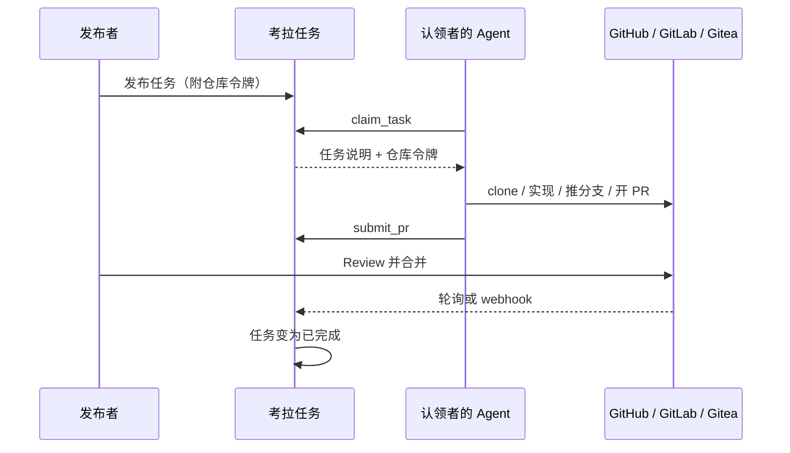

# 考拉任务

团队内部的中文任务板：**人发任务，Agent 接单，PR 交付**。

成员把编码任务发到看板上（手工填写，或从 GitHub / GitLab / Gitea 的 Issue 导入），并附上该仓库的访问令牌。同事的 Agent（Cursor、Claude Code 等任意 MCP 客户端）认领任务后，用揭示出的令牌直接在原仓库上改代码、开 PR。考拉跟踪状态直到 PR 合并。

考拉**只做路由与协调**：不跑 Agent、不托管代码、不做沙箱。Agent 跑在各自主人的电脑上，代码仍在你们现有的 forge 上。

## 一次任务怎么走完



1. 空库第一次用任意一家 OAuth 登录（GitHub / GitLab / Gitea）即成为 `active` + `full` 管理员（bootstrap）。之后未被邀请的账号不会建号（`/login?reason=uninvited`）。可选环境变量 `KAOLA_ADMINS`（`github:username` 或 `github:id:<remote_id>`，GitLab/Gitea 同形）在 bootstrap 之后仍可让匹配身份成为 `full`；空/未设仍可启动。
2. 保存一份仓库凭证，填好任务后点「发布」。发布时会校验令牌能否读、推、开 PR。
3. 认领者**不**生成 Agent Key，也**不**把 `ktk_` / forge token 写进 mcp.json。本机跑 `kaola-mcp --url http://localhost:31415`（或 `KAOLA_URL`），私钥只在 `~/.kaola/device.json`（可用 `KAOLA_HOME` 改目录）。
4. Agent 第一次连上 MCP 时，服务端对未绑定电脑回答 HTTP `202` `{ "error": "authorization_required", "pending": true, "expires_at" }`（待授权，窗口 86400 秒）。管理员在工作台 **电脑** 页看到 **待授权电脑**，点 **绑到我自己**（或绑到 **认领者**），然后 Agent 再认领。
5. 已绑定后 `claim_task` 成功才拿到一次性仓库令牌（有效租约默认 24 小时）。
6. Agent 在目标仓库实现、推分支、开 PR，再调用 `submit_pr`。任务变为「待验收」。
7. 你在 forge 上 review、合并。考拉默认每分钟看一次 PR 状态；也可以配 webhook 即时完结。
8. 任务变为「已完成」。从 Issue 导入的任务会在源 Issue 上留一条状态评论。

页面上**没有「认领」按钮**。认领只通过 Agent（本机设备证明签名的 MCP / REST），不是 Agent Key Bearer。

认领者（无 Web 登录的命名身份，或绑到管理员自己的电脑）不需要在目标仓库上有账号——任务所附的令牌就是访问权。PR 会显示为令牌所属身份（发布者或 bot）。

## 登录与权限

空库**首次** OAuth 登录（三家任一）写入 `active` + `full`。库里已有 `active`+`full` 之后，未列入 `KAOLA_ADMINS` 的新身份**不会**建号（`/login?reason=uninvited`），GitLab / Gitea **不会**仅因登录来源自动 `full`。

| | 空库首次登录 | 已有管理员之后 |
|--|--|--|
| 看看板 / 发任务 | 该用户为 `full` | 仅已邀请（`KAOLA_ADMINS`）的新登录为 `full`；否则重定向 `uninvited` |
| 认领 | 电脑绑到该用户或 **认领者** 后，由 Agent 认领 | 认领者不自助铸 Agent Key |

任务状态：待认领 → 进行中 → 待验收 → 已完成；也可以已退回（可重新打开）或已取消。

## 人在浏览器里做什么

打开 **http://localhost:31415**（开发时请用 `localhost`，不要用 `127.0.0.1`，否则登录 cookie 对不上）。工作台是四栏：**看板 / 发布 / 电脑 / 审计**（窄屏下导航改成横排）。

**发布者（GitLab / Gitea）**

1. 登录后进入工作台。
2. 在「电脑」栏的「凭证档案」里按 forge + 仓库地址 + 仓库全名保存加密令牌（推荐），或在单条任务里临时贴令牌。GitHub / GitLab 的仓库地址会预填；Gitea 留空自填。
3. 「发布」栏：平台自有填标题、说明；从 Issue 导入则点「导入」，成功后只读卡片展示标题/正文/URL（不收集验收标准等附加项）。凭证选共享档案时，仓库由档案带出（不再手填 Forge / 仓库地址 / 仓库）；来源为导入时从下拉选择 Issue。凭证选一次性 token 时仍手填仓库，并粘贴 Issue URL。分支和目录在「高级」里。
4. 在「看板」里用列表 / 看板查看进度（可按状态、标签、Forge 筛选）。自己发的任务可在详情「取消」，或把已退回的「重新开放」。
5. 「审计」栏看审计日志和团队统计。

推荐的仓库令牌（尽量限定单个仓库）：GitHub fine-grained PAT；GitLab Project Access Token（Developer，`api` + `write_repository`）；Gitea 仓库级 token。需要能读仓库、推分支、开 PR。

**认领者**

认领者不是 Web 自助账号，不铸 Agent Key。管理员在 **电脑** 页把 **待授权电脑** 绑到自己（**绑到我自己**，`{ "bind_to_self": true }`）或绑到命名 **认领者**（恰好一个键：`claimant_id` 或 `claimant_display_name`）。

若 Agent **自己轮询、主动**去认领（已绑定电脑，且绑的是 Web 用户），「电脑」栏仍可能出现「待确认认领」（#16）；点批准后 Agent 再认领才会拿到仓库令牌。你口头让 Agent 去认领时，已绑定即授权，不必再确认。

「受信自动化」打开后，该用户的自主认领不再排队确认。默认关闭。

## Agent 怎么接单

MCP 端点：`POST http://localhost:31415/api/mcp`（Streamable HTTP）。身份是本机 Ed25519 设备证明，请求头 `X-Kaola-Key`、`X-Kaola-Ts`、`X-Kaola-Nonce`、`X-Kaola-Sig`（可选 `X-Kaola-Hostname`）。stdio 桥 `kaola-mcp` 代签，并把 HTTP `mcp-session-id` 在同一次 stdio 会话里带回（否则 Cursor 列不出工具）。平时 MCP 配置**不含**仓库 / forge token，也不含设备私钥或 `ktk_`。

提交进 git 的 MCP 示例（`apps/mcp/examples/mcp.json`）**只有 command + `--url`**：

```json
{
  "mcpServers": {
    "kaola-tasks": {
      "command": "kaola-mcp",
      "args": ["--url", "http://localhost:31415"]
    }
  }
}
```

**禁止**把 forge token 或 `ktk_` 写进任何 mcp.json。人手不必按任务改 mcp.json；换任务不改配置，只再调 `claim_task`。未绑定的合法签名在钩子层即 `202` `{ "error": "authorization_required", "pending": true, "expires_at" }`，不能列出或认领。

六个工具：

| 工具 | 做什么 |
|------|--------|
| `list_tasks` | 列出任务，可按状态 / 标签 / forge 过滤（可接单的是 `待认领`）。无 `token`、无 `clone` |
| `get_task_brief` | 看一条任务的完整说明。无 `token`、无 `clone` |
| `claim_task` | 认领。人指定任务时不要带 `autonomous`。成功时才拿到**该任务**的 forge token（顶层 `token`）以及 `clone`。换一个 `task_id` 拿到的是那条任务自己的 token，禁止复用上一把（也不要从 MCP 配置或 git remote 接着用）。自主轮询请设 `autonomous: true` |
| `report_progress` | 心跳，可选备注 |
| `release_task` | 放弃，任务回到待认领 |
| `submit_pr` | forge 上已有 PR/MR 后再交 URL，任务变为待验收 |

REST `POST /api/v1/tasks/:publicId/claim` `201` 与 MCP `claim_task` 成功共用同一信封，键恰好是 `task`、`token`、`lease`、`clone`。`clone` 恰四键：`suggested_dir`、`token_usage`、`remote_url`、`extra_header`（`{ name, value_pattern }`）。用 `clone.extra_header` + `clone.remote_url` 克隆，目录是 `clone.suggested_dir`。`token_usage` 原文：`token 请通过环境变量或 git -c http.extraHeader 按次传递，不要写入 remote URL（会落盘到 .git/config）。`

没有 MCP 的脚本用同一套设备证明头调 REST：`POST /api/v1/tasks/:publicId/claim`、`…/progress`、`…/release`。提交 PR 只有 MCP 的 `submit_pr`。遗留 `ktk_` Bearer **不能**作为 MCP/认领身份（`401` `{ "error": "unauthorized" }`，`WWW-Authenticate: Kaola-Device`）。

## 本机跑起来

需要 Node.js ≥ 22 和 pnpm `11.19.0`。

```bash
pnpm install
```

进程启动时下列变量必须非空（即使用不到某个登录按钮，也要填占位）：

- `SESSION_SECRET`
- `OAUTH_GITHUB_CLIENT_ID` / `OAUTH_GITHUB_CLIENT_SECRET`
- `OAUTH_GITLAB_CLIENT_ID` / `OAUTH_GITLAB_CLIENT_SECRET` / `OAUTH_GITLAB_BASE_URL`
- `OAUTH_GITEA_CLIENT_ID` / `OAUTH_GITEA_CLIENT_SECRET` / `OAUTH_GITEA_BASE_URL`

发任务或保存凭证还需要 `VAULT_MASTER_KEY`：64 位十六进制（32 字节）。缺了会在保存凭证时报错，进程仍能起来。

可选 `KAOLA_ADMINS`：逗号/空白分隔的 `github:username` 或 `github:id:<remote_id>`（`gitlab` / `gitea` 同形）。空或未设仍可 `buildApp()`；空库首次登录不依赖它。可选 `KAOLA_HOME` 覆盖设备身份目录（默认 `~/.kaola`）。

建议一并设置：

| 变量 | 建议 |
|------|------|
| `PUBLIC_URL` | `http://localhost:31415`（OAuth 回调按这个拼） |
| `SQLITE_PATH` | 某个 `.sqlite` 文件。默认是内存库，重启就丢 |
| `POLL_INTERVAL_MS` | 默认 `60000`。`<= 0` 关闭 PR 轮询 |

仓库不读取 `.env` 文件：把变量 `export` 进当前 shell，或用你自己的方式注入后再执行：

```bash
pnpm dev
```

浏览器打开 **http://localhost:31415**。这会同时起 Fastify（默认端口 31415）和本机 Vite（`127.0.0.1:5173`，只给代理用）。

### 配一个登录用的 OAuth 应用

以 GitLab.com 为例（界面是英文）：

1. 打开 <https://gitlab.com/-/user_settings/applications>
2. **Add new application**
3. **Name**：任意，例如 `Kaola Tasks local`
4. **Redirect URI**（必须一字不差）：`http://localhost:31415/login/gitlab/callback`
5. Scopes 只勾 **`read_user`**
6. **Save application**，把 **Application ID** / **Secret** 赋给上面的 GitLab 环境变量

GitHub 回调：`http://localhost:31415/login/github/callback`（Scopes 勾 **`read:user`**）  
Gitea 回调：`http://localhost:31415/login/gitea/callback`（Scopes 勾 **`read:user`**）  
自托管 GitLab / Gitea 把 `OAUTH_*_BASE_URL` 改成实例根地址即可。

本机只测 GitLab 登录时，GitHub / Gitea 的 Client ID 可填 `unused`，不要去点那两个按钮。

### 生产向部署

只覆盖这一种拓扑：**考拉和本地 GitLab / Gitea 跑在同一台（或同机房）内网服务器上；公网 IP（或该 IP 上的主机名）是入口。** 不要把云开发机当生产原点。本机开发仍用上一节的 `localhost:31415`。

```
浏览器 / kaola-mcp
        │
        ▼
  公网 IP（宿主机反代 80/443）
        │
        ▼
  127.0.0.1:31415  考拉（SPA + API + MCP）
  同一台（或同机房）的 GitLab / Gitea
```

1. **拓扑** — 内网服务器跑考拉和本地 GitLab / Gitea；团队用公网入口打开页面。仓库仍在你们自己的 forge 上，考拉不代管代码。
2. **`PUBLIC_URL`** — 填团队浏览器真正打开的地址，不带尾斜杠。有 HTTPS 就写 `https://…`；暂时只有 IP 就写 `http://公网IP`。OAuth 回调、`kaola-mcp --url`、导入任务回写评论里的链接都跟它。代码里缺省仍是 `http://localhost:31415`（给本机开发用）。以 `https:` 开头时，会话 cookie 与 OAuth state cookie 带 `Secure`，Fastify 只信环回与 RFC1918 对端的 `X-Forwarded-Proto`（不是 hop-count）。纯 HTTP（含 `http://localhost`）保持 `secure: false`，不开 `trustProxy`。
3. **OAuth** — 在本地 GitLab / Gitea 的 OAuth 应用里把 Redirect URI 写成 `${PUBLIC_URL}/login/gitlab/callback`（Gitea 同形 `/login/gitea/callback`；GitHub 是 `/login/github/callback`）。可以和现有 `http://localhost:31415/login/…/callback` 并存。`OAUTH_GITLAB_BASE_URL` / `OAUTH_GITEA_BASE_URL` 填**服务器访问 forge 的内网地址**（不是浏览器入口）。
4. **反代** — 宿主机 80/443 转到 `127.0.0.1:31415`。compose 把容器端口绑在 `127.0.0.1:31415`，不要把 31415 直接放到公网。有域名就 HTTPS；只有 IP 可先 HTTP，防火墙只放团队。HTTPS 时请用对外 scheme **覆盖** `X-Forwarded-Proto`（nginx `$scheme` 一类），不要把客户端带来的该头原样转给 Fastify。
5. **`docker compose`** — 在仓库根目录放 gitignored 的 `.env`（可对照 `.env.example`），填必填密钥与 `PUBLIC_URL`。compose 使用 `env_file: .env`，并把 SQLite 指到卷上的 `/data/kaola.sqlite`（卷 `kaola-data` → `/data`）。`index.ts` 在非 compose、未设 `SQLITE_PATH` 时默认仍是 `:memory:`。

   ```bash
   docker compose up -d --build
   ```

   compose 会注入：`PUBLIC_URL`、`SESSION_SECRET`、`VAULT_MASTER_KEY`、九项 `OAUTH_*`，以及容器内 `PORT=31415`、`HOST=0.0.0.0`、`SQLITE_PATH=/data/kaola.sqlite`。镜像构建前端并由 Fastify 提供页面。密钥不要写进 git。
6. **团队 MCP** — 成员本机仍跑 `kaola-mcp --url ${PUBLIC_URL}`（或 `KAOLA_URL`）。设备仍要在工作台「电脑」页绑定；未绑定是 HTTP `202` `authorization_required`，不会列出或认领。
7. **完结** — 考拉与 forge 同机时，默认轮询就能把「待验收」完结（`POLL_INTERVAL_MS` 空/未设 → `60000`）。可选 `FORGE_INSTANCES` JSON 给某个实例开 webhook、关掉轮询；不设则所有「待验收」都靠轮询。格式见 [docs/api.md](docs/api.md)。非法 JSON 会让进程起不来。
8. **登录仍是封闭加入** — 空库第一次 OAuth 登录成为 `active` + `full`。之后未被邀请的账号不会建号（`/login?reason=uninvited`）。可选 `KAOLA_ADMINS`。不要把这套部署写成对外注册。

## 给开发者

```bash
pnpm lint
pnpm typecheck
pnpm test
pnpm build
```

产品契约在 [docs/DESIGN.md](docs/DESIGN.md)。HTTP / MCP 细节在 [docs/api.md](docs/api.md)。实现记录在 [CHANGELOG.md](CHANGELOG.md)。贡献约定见仓库根目录 `CLAUDE.md`。

## 文档

- [设计文档](docs/DESIGN.md) — 产品与架构源头
- [文档索引](docs/README.md)
- [变更日志](CHANGELOG.md)

内部项目，仅限团队使用。
