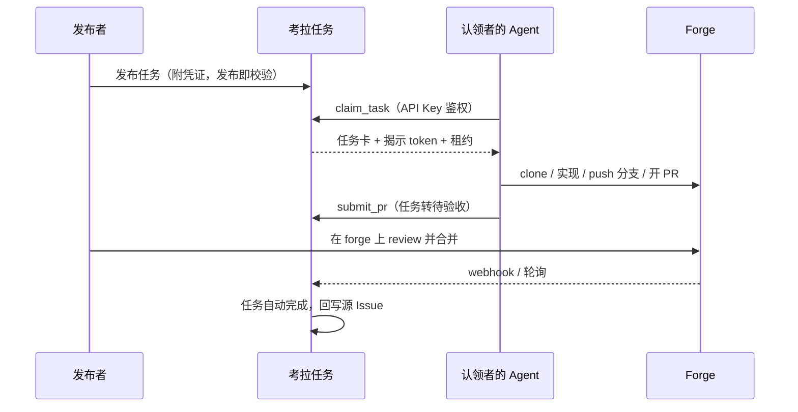

# 考拉任务 Kaola Tasks

> 团队内部任务协作平台：人发任务，Agent 接单，PR 交付。
>
> **状态**：M0 脚手架已落地（`@kaola/shared` 已导出任务卡 schema 与状态机；HTTP 仍为占位；登录 / MCP / 看板尚未实现）。设计文档 [v0.2](docs/DESIGN.md)。Backlog 见 [Issues](https://github.com/KaolaBrother/KaolaTasks/issues)。

## 这是什么

考拉任务是一个**只做路由与协调**的内部平台：成员把编码任务发布到任务板（手工创建，或从 GitHub / GitLab / Gitea 的 Issue 导入）并附上 forge 访问令牌；其他成员的 Agent（Claude Code 等任意 MCP 运行时）认领任务、直接访问仓库完成实现，以 PR 形式交付回目标 forge。平台跟踪任务闭环直至 PR 合并。

平台**不跑 Agent、不托管代码、不做沙箱**——Agent 运行在各自主人的机器上，代码在团队既有的 forge 上。

## 核心特性

以下为产品设计（见 [设计文档](docs/DESIGN.md)），M0 **尚未实现**：

- **任务广场（中文界面）**：列表 / 看板双视图，任务详情含事件时间线
- **三 forge 统一接入**：GitHub / GitLab（自托管）/ Gitea（自托管），一套适配层
- **MCP 优先**：Agent 配置一次 MCP 端点，一句"去考拉接单"走完认领 → 实现 → 交付
- **发布即校验**：任务上板前实测 token 权限（可读 / 可推分支 / 可开 PR）
- **凭证纪律**：token 加密存储、认领时才揭示、全程审计、一键吊销
- **租约认领**：TTL + 心跳，Agent 掉线任务自动回板，不会被挂死
- **自动闭环**：PR 合并 → 任务自动完成（webhook，轮询兜底），状态回写源 Issue

## 工作原理



认领者**不需要**在目标 forge 上有账号——任务所附 token 即访问权（详见设计文档 §7）。该流程为设计目标，M0 尚未提供 MCP 或任务 API。

## 快速开始

需要 Node.js `>=22`（`package.json` `engines.node`）与 pnpm `11.19.0`（`packageManager`）。

```bash
pnpm install
pnpm --filter @kaola/server start
```

`@kaola/server` 默认 `HOST=0.0.0.0`、`PORT=3000`（可用环境变量覆盖）。`GET /` 响应 `text/plain; charset=utf-8`，正文为 `考拉任务服务占位`（由 `getPlaceholderBody()` 返回）。

前端占位界面：

```bash
pnpm --filter @kaola/web dev
```

页面标题为「考拉任务」，卡片文案为「占位界面」。

热重载服务：`pnpm --filter @kaola/server dev`（`node --watch --experimental-strip-types src/index.ts`）。根目录没有 `pnpm dev`。

### 部署（管理员）

仓库含 `docker-compose.yml` 骨架：服务名 `server`，端口 `3000:3000`，环境变量 `PORT=3000`、`HOST=0.0.0.0`，卷 `kaola-data:/data`。镜像由 `apps/server/Dockerfile` 构建（基础镜像 `node:22-bookworm-slim`），`CMD` 为 `pnpm --filter @kaola/server start`。

```bash
docker compose up -d --build
```

该命令需要本机 Docker daemon。仓库没有 `.env.example`；主密钥 / OAuth 尚未实现，compose 也未注入它们。卷已声明，但服务默认 SQLite 路径仍是代码里的 `:memory:`，compose 未设置 `SQLITE_PATH`。

### 首次使用 / 发布 / 认领

尚未实现（无登录、无 Agent Key、无 MCP 端点、无任务卡）。目标流程见 [设计文档](docs/DESIGN.md) §3、§7、§9。设计中的登录分级：

| 登录方式 | 查看 | 发布 / 凭证管理 | 认领 |
|----------|------|----------------|------|
| GitLab / Gitea（自托管） | ✓ | ✓ | ✓ |
| GitHub | ✓ | ✗ | ✓（首次登录需成员批准） |

## 项目结构

pnpm workspaces（`pnpm-workspace.yaml`：`apps/*` + `packages/*`）：

```text
apps/
  web/             # @kaola/web — Vue 3 + Vite + Naive UI（占位「考拉任务」）
  server/          # @kaola/server — Fastify + drizzle-orm + better-sqlite3
packages/
  shared/          # @kaola/shared — 任务卡 zod schema + 状态机；getSharedHealth() → kaola-shared-ready
  forge-adapters/  # @kaola/forge-adapters — getForgeAdaptersHealth() → kaola-forge-adapters-ready
docs/              # 设计与文档（DESIGN.md 为产品源头）
docker-compose.yml
.github/workflows/ci.yml
```

`@kaola/shared` 导出任务卡 zod schema（`taskBriefSchema` / `parseTaskBrief`）与状态机（`transitionTaskStatus`），并保留 `getSharedHealth()` → `kaola-shared-ready`。依赖 `zod` `^4.4.3`。`@kaola/forge-adapters` 仍只有健康检查占位导出（`getForgeAdaptersHealth()` → `kaola-forge-adapters-ready`），没有 forge 适配实现。

## 开发

```bash
pnpm install
pnpm lint          # eslint .
pnpm typecheck     # pnpm -r --if-present typecheck
pnpm test          # node --experimental-strip-types --test packages/shared/src/index.test.ts packages/forge-adapters/src/index.test.ts apps/server/src/placeholder.test.ts
pnpm build         # pnpm -r --if-present build

pnpm --filter @kaola/server start    # node --experimental-strip-types src/index.ts
pnpm --filter @kaola/server dev      # node --watch --experimental-strip-types src/index.ts
pnpm --filter @kaola/web dev         # vite
pnpm --filter @kaola/web preview     # vite preview
```

CI：`.github/workflows/ci.yml` job `lint-test` 在 Node 22 上执行 `pnpm install --frozen-lockfile`、`pnpm lint`、`pnpm test`。远程 Actions 尚未跑过，不要把 GitHub 上的 CI 当成已绿。

贡献流程遵循仓库根目录 `CLAUDE.md`（Kaola-Workflow：Issues 即 backlog，comments 覆盖正文）。

## 文档

- [设计文档（源头，v0.2）](docs/DESIGN.md)
- [文档索引](docs/README.md)
- [变更日志](CHANGELOG.md)

## 路线图

| 里程碑 | 内容 | Issues |
|--------|------|--------|
| M0 脚手架 | monorepo、共享 schema 与状态机、CI | #1–#2 |
| M1 核心闭环 | 登录、凭证库、任务板、租约认领、MCP Server、PR 轮询 | #3–#11 |
| M2 导入与自动闭环 | Issue 导入、webhook、状态回写 | #12–#14 |
| M3 打磨 | 审计界面、统计、认领确认策略 | #15–#16 |

当前仓库已落地 issue #1 的 M0 脚手架与 issue #2 的任务卡 schema / 状态机（`@kaola/shared`）。登录 / MCP / 看板仍未实现。

## 许可

内部项目，仅限团队使用。
