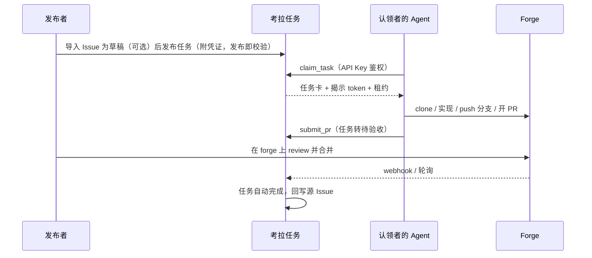

# 考拉任务 Kaola Tasks

> 团队内部任务协作平台：人发任务，Agent 接单，PR 交付。
>
> **状态**：M0 脚手架已落地；M1 切片 #3（多源 OAuth + `users`）、#4（Agent API Key）、#5（凭证档案 / vault）、#6（`ForgeAdapter` + `validateToken`）、#7（任务 CRUD / 发布即校验）、#8（任务看板 UI）、#9（REST 租约认领）、#10（MCP Server）、#11（PR 轮询）、#17（单端口 31415）已落地；M2 全部三个切片 #12（三 forge Issue 导入 + UI「导入内容」来源标记）、#13（webhook 签名校验 + 轮询兜底配置化）、#14（认领 / 提交 PR / 完成时状态回写源 Issue）均已落地；M3 两个切片 #15（审计日志 HTTP + 团队统计）、#16（自主认领确认闸门 + 受信自动化设置）均已落地；#18（Eucalyptus Ink 四栏工作台）已落地。设计文档 [v0.2](docs/DESIGN.md)。Backlog 见 [Issues](https://github.com/KaolaBrother/KaolaTasks/issues)。

## 这是什么

考拉任务是一个**只做路由与协调**的内部平台：成员把编码任务发布到任务板（手工创建，或从 GitHub / GitLab / Gitea 的 Issue 导入）并附上 forge 访问令牌；其他成员的 Agent（Claude Code 等任意 MCP 运行时）认领任务、直接访问仓库完成实现，以 PR 形式交付回目标 forge。平台跟踪任务闭环直至 PR 合并。

平台**不跑 Agent、不托管代码、不做沙箱**——Agent 运行在各自主人的机器上，代码在团队既有的 forge 上。

## 核心特性

以下为产品设计（见 [设计文档](docs/DESIGN.md)）。当前已落地的是登录、Agent Key、凭证档案 / vault、token 校验库、任务 CRUD（发布即校验）、任务看板、REST 租约认领、MCP Server、PR 轮询、Issue 导入、webhook 接收 + 轮询兜底配置化、认领 / 提交 PR / 完成时状态回写源 Issue，以及审计日志 / 团队统计与自主认领确认闸门，加上四栏工作台壳层，即完整 M1（#3–#11）加上完整 M2（#12–#14）加上完整 M3（#15–#16）以及 #18。

**已落地（#3 / #4 / #5 / #6 / #7 / #8 / #9 / #10 / #11 / #12 / #13 / #14 / #15 / #16 / #17 / #18）：**

- **多源 OAuth 登录**：GitHub / GitLab / Gitea；会话用户见 `GET /api/v1/me`；正式成员可 `POST /api/v1/users/:id/approve`
- **Agent API Key**：`status === 'active'` 的成员可自助 `POST/GET /api/v1/agent-keys`、`DELETE /api/v1/agent-keys/:id`；明文 `token` 仅创建时返回一次（前缀 `ktk_`）；Bearer `GET /api/v1/agent/whoami`
- **凭证档案 / vault**：`active` + `full` 可 `GET/POST /api/v1/credential-profiles`、`DELETE /api/v1/credential-profiles/:id`；forge token AES-256-GCM 加密存储；列表/创建响应不含 token。模块导出 `revealCredentialProfile`（本身不是 HTTP）。揭示 forge token 的通道：成功的 Bearer `POST /api/v1/tasks/:publicId/claim` `201` 顶层 `token`，以及 MCP `claim_task` 成功信封的 `token`。`POST /api/v1/tasks/import` 的 `200` 永不含 token。删除响应用中文提示到 forge 侧撤销
- **三 forge `validateToken`**：`createForgeAdapter(kind)` 对 GitHub / GitLab / Gitea 实测可读 / 可推 / 可开 PR（缺失项为 `读` | `推` | `PR`）；Push/PR 为 REST 权限代理，不实际 git push / POST PR。创建档案时**不**调用 `validateToken`；任务发布时作为适配器方法调用
- **任务 CRUD / 发布即校验**：`GET/POST /api/v1/tasks`、`GET/PATCH /api/v1/tasks/:publicId`；`tasks` 表；发布即校验（`422` `token_check_failed` / `502` `forge_unreachable`）。中文「发布任务」表单（`active`+`full`）
- **Issue 导入（#12）**：三 forge `importIssue`；会话 `POST /api/v1/tasks/import` 返回 `200` 草稿（标题 / `description_md` / `source: { type: 'imported', issue_url }` / `repo.{forge,base_url,full_name}`），不写入 `tasks` 行、不调用 `validateToken`、响应永不含 forge token。用户补全表单后仍走现有 `POST /api/v1/tasks` 发布即校验。UI 来源标记文案恰好是「导入内容」（表单 `task-import-source-label`、看板详情 `board-detail-import-label`）；按钮文案「导入」。Host 规则与 `getPullRequest` 相同（GitHub 固定 `api.github.com`；GitLab/Gitea 用构造函数 `baseUrl`，不用粘贴 URL 的主机）。`registerWebhook` / `parseWebhook` 见下 #13；`commentOnIssue` 见下 #14
- **任务看板（#8）**：成员工作台「看板」栏中文「任务看板」，列表 / 看板双视图，客户端筛选（状态 / 标签 / Forge），详情含一条由 `created_at`+`poster` 合成的「发布」时间线。拉取 `GET /api/v1/tasks`（无 query）。无 vue-router。无 Agent 认领 UI。待批准用户仍看「账号待批准」卡（无看板）。`claim_only` 可见看板，不可见「发布」栏与凭证档案（见 #18）。发布者可在详情对既有 `PATCH /api/v1/tasks/:publicId` 点「取消」/「重新开放」（#18）
- **工作台四栏壳层（#18）**：成员工作台导航「看板 / 发布 / 钥匙 / 审计」（`v-show` 切栏，无 vue-router）。Eucalyptus Ink 色板（`theme.ts` Paper `#F3F6F4` / Ink `#1C2420` / Leaf `#3D6B54` / Bark `#6B746F` / Slip `#FFFEFB` / Clay `#B4532A`）与 `theme.css`（`768px` 以下导航改为横向）。发布表单按组排列，分支/目录收进 `<details>`「高级」。凭证档案 `base_url` 按 forge 预填（GitHub `https://github.com`、GitLab `https://gitlab.com`、Gitea 留空）。`claim_only` 无「发布」导航、无凭证档案。仍无 Agent 认领 UI。token 揭示通道不变：仅 REST 认领 `201` 顶层 `token` 与 MCP `claim_task` 成功信封 `token`
- **REST 租约认领（#9）**：Bearer `Authorization: Bearer ktk_…`；`POST /api/v1/tasks/:publicId/claim` `201` 键 `clone`、`lease`、`task`、`token`（`token` 为 forge 明文；`lease.ttl_seconds` 为数字 `86400`）；`POST …/progress` `200` `{ task, lease }` 无 token；`POST …/release` `200` `{ task }` 状态 `待认领` 无 token。会话 `GET` 列表/单条仍不含 token。过期靠 `sweepExpiredLeases`（读/写时检查），无 cron。无 REST `POST …/submit_pr`
- **MCP Server（#10）**：Agent 将 Bearer API Key 配到 `POST {origin}/api/mcp`（Streamable HTTP；测试里 `initialize` 的 `protocolVersion` 为 `2025-11-25`；有状态 `mcp-session-id`）。未鉴权 → HTTP `401` `{ error: 'unauthorized' }` + `WWW-Authenticate: Bearer`（在 JSON-RPC 之前）。`GET`/`DELETE /api/mcp` 为 `405`。六个工具：`list_tasks` `{ tasks }`、`get_task_brief` 顶层 brief、`claim_task` 信封 `clone`/`lease`/`task`/`token`、`report_progress` `{ task, lease }`、`release_task` `{ task }`、`submit_pr` `{ task, pr_url, summary }` 且状态 `待验收`。业务错误为 JSON-RPC result `isError` + REST `{ error, message? }`（HTTP 200）。依赖 `@modelcontextprotocol/sdk` `1.30.0`、`zod` `^4.4.3`
- **PR 轮询闭环（#11）**：`pollPendingReviews(db)` 只拉取 `status === '待验收'` 的任务，取每条任务最新一条 `submissions` 行的 `pr_url`，解密其凭证后调用 `adapter.getPullRequest({ token }, prUrl)` → `{ state: 'open' | 'merged' | 'closed' }`。`merged` → 任务转 `已完成`、`submissions.pr_state` 置 `merged`；`closed`（未合并关闭）→ 任务转 `已退回`、`pr_state` 置 `closed`；`open` 保持 `待验收` 不变。成功迁移写 `状态迁移` 事件 `{ task_id, from, to, pr_url }`，`actor_user_id` 为 `null`（系统驱动，同 `sweepExpiredLeases`）。单条任务的取状态或写入失败只跳过该行，不影响其余 `待验收` 任务。`buildApp({ pollIntervalMs })`：省略或 `<= 0` 不注册定时器；正值时 `setInterval` 驱动轮询，`app.close()` 时清理。生产入口 `index.ts` 读取 `POLL_INTERVAL_MS`（未设或空串默认 `60000` 毫秒）。poster 对 `已退回` 任务的 `PATCH → 待认领`（#9 已有）不受影响
- **Webhook 接收 + 轮询兜底配置化（#13）**：`@kaola/forge-adapters` 的 `registerWebhook`/`parseWebhook` 已实现（不再抛 `not implemented`）；`ForgeEvent` 不再是 `unknown`，为 `{ type: 'pull_request', state: 'merged' | 'closed', pr_url, repo: { full_name } }`；新增 `WebhookSignatureError`（签名或密钥缺失/不符时抛出，与 `parseWebhook` 的 `null`「忽略」返回值区分）；`createForgeAdapter(kind, { baseUrl?, webhookSecret? })` 新增 `webhookSecret`。签名校验：GitHub `X-Hub-Signature-256`（`sha256=` 前缀 HMAC-SHA256，对原始请求体）；GitLab `X-Gitlab-Token`（与 `webhookSecret` 定时安全比较的明文令牌，非 HMAC）；Gitea `X-Gitea-Signature`（无前缀 HMAC-SHA256，对原始请求体）。`@kaola/server` 新增 `POST /api/v1/webhooks/:publicId`（`registerWebhooks` in `webhook.ts`）：无会话、无 Bearer，forge 签名即唯一鉴权；`:publicId` 是 `forgeInstances[]` 条目的 id，不是任务 id。未知 `publicId` → `404` `{ error: 'not_found' }`；签名不符 → `401` `{ error: 'invalid_signature' }`（响应不含密钥/摘要/forge token）；其余情形（ping、无关事件、无匹配 `待验收` 提交、任务已不在 `待验收`）均 `204` 空响应。命中时：先按签名验证通过的那个实例的 `(forge, base_url)` 过滤 `待验收` 任务，再匹配其最新 `submissions.pr_url` —— 跨实例 `pr_url` 撞车不会误完结任务；命中后与轮询共用的 `applyPrTerminalTransition` 事务把任务转 `已完成`/`已退回`、`submissions.pr_state` 同步、写 `状态迁移` 事件（`actor_user_id` 为 `null`）；判定合并/关闭仍只依据签名载荷、不调用 `getPullRequest`。`merged` 完成后 #14 会解密任务凭证发「完成」回写评论（见下）；`closed`（已退回）仍不解密、不回写。`buildApp({ forgeInstances? })` 新增选项（`Array<{ publicId, forge, baseUrl, syncMode: 'webhook' | 'poll', webhookSecret }>`；不新增数据库表）：省略或 `[]` 时行为不变（全量轮询）；`pollPendingReviews(db, forgeInstances?)` 对 `syncMode === 'webhook'` 且 `(forge, baseUrl)` 与任务精确匹配的任务跳过轮询（零 `getPullRequest` 调用），其余仍照常轮询（`syncMode: 'poll'` 的实例即使配了 webhook 也仍会被轮询完结，幂等无害）。生产入口 `index.ts` 读取 `FORGE_INSTANCES`（JSON 数组；未设或空串 → `[]`；非法 JSON 直接使进程启动失败，不会静默退化为全量轮询）
- **状态回写源 Issue（#14）**：`@kaola/forge-adapters` 的 `commentOnIssue(cred, issueRef, body)` 已实现（不再抛 `not implemented`）；`IssueRef` 不再是 `unknown`，为 `{ issue_url: string }`。复用 `importIssue`/`getPullRequest` 同一套 host / SSRF 规则；GitHub/Gitea `POST {issueApiUrl}/comments`，GitLab `POST {issueApiUrl}/notes`；JSON `{ body }`；成功判定为任意 `res.ok`（非固定 201）。`@kaola/server` 新增 `apps/server/src/writeback.ts`：`attemptWriteback(db, task, transition, actorUserId, prUrl?)` 只对**导入型**任务（`source_type === 'imported'` 且 `source_issue_url` 非空）在三个时机各发一条状态评论——`claimTask` 认领后（`认领`）、`submitPr` 提交后（`提交PR`）、`applyPrTerminalTransition` **仅当 `terminal === 'merged'`** 时（`完成`；`已退回`与 `releaseTask` 均不回写）；原生任务零调用、零 `回写` 事件。任一环节的状态转换本身（claim `201`、`submit_pr` `待验收`、完成 `已完成`）都不受写回失败影响——forge 抛错、解密失败、URL 解析失败均在 `attemptWriteback` 内被吞掉，从不向上抛。成功写 `events.type` `回写`，`details` 精确为 `{ task_id, transition, ok: true, issue_url }`（`task_id` 为 public id，不含 token）。评论正文恒含 `task.publicId` 与 `PUBLIC_URL`（去尾斜杠，默认 `http://localhost:31415`）；提交PR / 完成正文额外含对应 `pr_url`。凭证解析用任务自身的 `decryptTaskToken`（从轮询模块搬入 `writeback.ts`，轮询模块仍复用它做 `getPullRequest`）——绝不使用调用者的 Agent API Key。`retryPendingWritebacks(db): Promise<void>` 从 `writeback.ts` 导出并在 `poller.ts` 重导出（从不 reject），对已发生转移但尚无成功 `回写` 事件的导入型任务重新尝试；`app.ts` 的既有定时器在每个 tick 里紧跟 `pollPendingReviews` 之后调用它（同一并发保护）。合并（`merged`）webhook 交付现在会解密任务凭证以发出「完成」评论——判定合并/关闭本身仍只依据签名校验后的载荷（`parseWebhook`），该路径仍不调用 `getPullRequest`；`closed`（已退回）交付仍不回写、仍不解密。token 揭示通道不变：仅 REST 认领 `201` 顶层 `token` 与 MCP `claim_task` 成功信封 `token`；写回（含 webhook 合并解密）从不把 token 放进响应、日志或 `events.details`
- **单端口托管（#17）**：`PORT` 默认 `31415`；`PUBLIC_URL` 默认 `http://localhost:31415`。裸 `buildApp()` 的 `GET /` 仍是占位正文 `考拉任务服务占位`；设置 `webDist` 时 Fastify 托管 SPA；仅 `viteDevTarget` 时反代 Vite。对外原点是 `localhost:31415`。根目录 `pnpm dev`
- **审计日志 + 团队统计（#15）**：会话 `GET /api/v1/events` 返回 `{ events: [...] }`（按 `id` 倒序，`actor_username` 通过左联 `users` 解出，`details` 已解析为对象）；`GET /api/v1/stats` 返回精确 `{ completed_count, completed_by_username }`（统计 `状态迁移` 事件中 `details.to === '已完成'` 的行，按 `actor_username` 分组，`null` actor 归入字面量 `系统`）。两个接口的鉴权门槛比任务看板更严：`status === '待批准'` 会话在两者上均为 `401`（任务看板允许待批准用户只读）。均无 query string，前端筛选（类型 / 人 / 任务 / 时间）全部为客户端行为。工作台新增「审计日志」「团队统计」两个区块（`active` 或 `claim_only`，非 `待批准` 均可见）
- **自主认领确认闸门 + 受信自动化（#16）**：REST `POST /api/v1/tasks/:publicId/claim` 与 MCP `claim_task` 均新增可选 `autonomous: boolean`；缺省或 `false` 仍是既有「认领即授权」——`201` 直接揭示 token。当 `autonomous: true` 且认领者 `users.trusted_automation`（新列，默认 `false`）不为 `true` 时，按该 `(任务, 用户, Agent Key)` 三元组已有的确认记录分三路：已有 `pending` 记录则直接原样 `202`（不重复插入、不重复写事件）；已有 `approved` 记录则消费之（删除该行，一次性）并照常走完 `201` 认领流程揭示 token；两者都没有则新插入一条 `pending` 记录、写 `认领待确认` 事件，返回 `202` `{ error: 'confirmation_required', message, pending: true }`——两条 `202` 路径均不揭示 token、不插入租约、任务保持 `待认领`（既有的 `待批准` `403` 门槛仍在此之前生效）。新增会话接口 `GET /api/v1/claim-confirmations`（仅返回当前用户自己的记录）与 `POST …/:id/approve`、`POST …/:id/reject`（`200 { ok: true }`；非本人或不存在的 id 均 `404`；批准/拒绝本身不插入租约、不改任务状态、不揭示 token）。`GET /api/v1/me` 新增追加字段 `trusted_automation`；新增会话 `PUT /api/v1/me/settings` 可读写它。工作台新增「受信自动化」开关与「待确认认领」列表（与 Agent Key 区块同等门槛：`status === 'active'` 即可见）

## 工作原理



认领者**不需要**在目标 forge 上有账号——任务所附 token 即访问权（详见设计文档 §7）。MCP `claim_task` / `submit_pr` 已落地：Agent 将 Bearer API Key 配到 `POST {origin}/api/mcp`。Bearer REST 认领（`POST /api/v1/tasks/:publicId/claim` 等）仍可用。图中「轮询」与「webhook」两环均已落地（`pollPendingReviews`，见上 #11；`POST /api/v1/webhooks/:publicId`，见上 #13）；图中「回写源 Issue」也已落地（`attemptWriteback`，见上 #14，仅导入型任务）。OAuth 登录、Agent Key、凭证档案 / vault、`validateToken`、任务 CRUD、Issue 导入、任务看板、REST 认领、MCP、PR 轮询、webhook 接收与状态回写均已实现（见下）。

## 快速开始

需要 Node.js `>=22`（`package.json` `engines.node`）与 pnpm `11.19.0`（`packageManager`）。

`@kaola/server` 在 `buildApp` → `registerAuth` 时要求以下环境变量**非空**，否则抛出 `missing required environment variable …`：

- `SESSION_SECRET`
- `OAUTH_GITHUB_CLIENT_ID`、`OAUTH_GITHUB_CLIENT_SECRET`
- `OAUTH_GITLAB_CLIENT_ID`、`OAUTH_GITLAB_CLIENT_SECRET`、`OAUTH_GITLAB_BASE_URL`
- `OAUTH_GITEA_CLIENT_ID`、`OAUTH_GITEA_CLIENT_SECRET`、`OAUTH_GITEA_BASE_URL`

可选：`PUBLIC_URL` 默认 `http://localhost:31415`（去掉尾斜杠）；`PORT` 默认 `31415`；`HOST` 默认 `0.0.0.0`；`SQLITE_PATH` 默认 `:memory:`。`WEB_DIST`、`VITE_DEV_TARGET` 由 `index.ts` 传入 `buildApp`（空或未设则 `GET /` 为占位）。`POLL_INTERVAL_MS` 由 `index.ts` 传入 `buildApp({ pollIntervalMs })`（未设或空串默认 `60000` 毫秒；`<= 0` 不启动轮询定时器）。`FORGE_INSTANCES` 由 `index.ts` 传入 `buildApp({ forgeInstances })`：JSON 数组，每项 `{ publicId, forge, baseUrl, syncMode: 'webhook' | 'poll', webhookSecret }`；未设或空串 → `[]`（行为与省略相同，即全量轮询）；JSON 不合法直接使进程启动失败（不会静默退化为全量轮询）。

`VAULT_MASTER_KEY`：64 位 hex（`^[0-9a-fA-F]{64}$`，解码后 32 字节）。**不是** `buildApp()` / `registerAuth` 的启动条件；在 `encryptToken` / `decryptToken` 时读取。缺失或非法时 `POST /api/v1/credential-profiles` 返回 `500` `{ error: 'vault_unconfigured' }`。仓库没有 `.env.example`。

```bash
pnpm install
pnpm --filter @kaola/server start
```

未设 `WEB_DIST` / `VITE_DEV_TARGET` 时，`GET /` 响应 `text/plain; charset=utf-8`，正文为 `考拉任务服务占位`（由 `getPlaceholderBody()` 返回）。设置 `WEB_DIST` 时 Fastify 托管前端 SPA；仅设 `VITE_DEV_TARGET` 时反代 Vite。登录页 `GET /login`（HTML）。OAuth 起始路径：`GET /login/github`、`/login/gitlab`、`/login/gitea`；回调：`GET /login/github/callback`、`/login/gitlab/callback`、`/login/gitea/callback`。

根目录开发（对外原点 `http://localhost:31415`；Vite `127.0.0.1:5173` 仅本机回环，不是对外原点）：

```bash
pnpm dev
```

（`node scripts/dev.mjs`：Fastify `PORT` 默认 `31415`，并设置 `VITE_DEV_TARGET` 默认 `http://127.0.0.1:5173`，以 `--host 127.0.0.1 --port 5173 --strictPort` 拉起 Vite。）

单独起前端（Naive UI，`zhCN`）：

```bash
pnpm --filter @kaola/web dev
```

Vite 将 `/api` 与 `/login` 代理到 `http://127.0.0.1:31415`。页面标题为「考拉任务」；登录按钮指向 `/login/github`、`/login/gitlab`、`/login/gitea`。无 vue-router。

开发登录：`completeOAuthLogin` 以 `reply.redirect('/')` 相对跳转（相对 `PUBLIC_URL`，默认 `http://localhost:31415`）。默认 `pnpm dev` 下 Fastify 在该原点托管 SPA，登录后落在看板而不是占位页。裸 `buildApp()` 或未设 `WEB_DIST` 与 `VITE_DEV_TARGET` 的 `pnpm --filter @kaola/server start`，`GET /` 仍是占位正文。会话 cookie 在源码里是 `path: '/'`、`secure: false`、`httpOnly: true`、`sameSite: 'lax'`（未设 `domain`），host-only 绑在 `localhost`（不含端口）；打开 `http://127.0.0.1:…` 不共享该 cookie。

热重载服务：`pnpm --filter @kaola/server dev`（`node --watch --experimental-strip-types src/index.ts`）。

### 部署（管理员）

仓库含 `docker-compose.yml`：服务名 `server`，端口 `31415:31415`，环境变量 `PORT=31415`、`HOST=0.0.0.0`，卷 `kaola-data:/data`。镜像由 `apps/server/Dockerfile` 构建（基础镜像 `node:22-bookworm-slim`），`RUN pnpm --filter @kaola/web build`，`ENV PORT=31415`、`ENV HOST=0.0.0.0`、`ENV WEB_DIST=/app/apps/web/dist`、`EXPOSE 31415`，`CMD` 为 `pnpm --filter @kaola/server start`。

```bash
docker compose up -d --build
```

该命令需要本机 Docker daemon。compose **未**注入 `SESSION_SECRET`、OAuth 变量或 `VAULT_MASTER_KEY`；进程启动时 `registerAuth` 仍会读取 OAuth / session 变量。创建凭证档案或发布任务时才会读取 `VAULT_MASTER_KEY`。卷已声明，但服务默认 SQLite 路径仍是代码里的 `:memory:`，compose 未设置 `SQLITE_PATH`。

### 首次使用 / 发布 / 认领

**登录已实现**（GitHub / GitLab / Gitea OAuth）。设计中的登录分级（[设计文档](docs/DESIGN.md) §11）：

| 登录方式 | 查看 | 发布 / 凭证管理 | 认领 |
|----------|------|----------------|------|
| GitLab / Gitea（自托管） | ✓ | ✓ | ✓ |
| GitHub | ✓ | ✗ | ✓（首次登录需成员批准） |

实现对照（`apps/server/src/auth.ts` / `schema.ts`）：GitHub 首次 `status`=`待批准`、`permission_level`=`claim_only`；GitLab / Gitea 首次 `active` + `full`。`POST /api/v1/users/:id/approve` 仅 `active` + `full` 可调用，将目标 `status` 设为 `active`；GitHub 批准后仍为 `claim_only`。待批准用户的 `GET /api/v1/me` 含 `message`：`你的账号待正式成员批准后方可认领任务。`

Agent Key（`apps/web/src/App.vue` 在 `status === 'active'` 时显示）：自助生成 / 列表 / 吊销；明文仅创建时显示一次。凭证档案（`active` 且 `permission_level === 'full'` 时显示）：按 forge + `base_url` + `repo_full_name` 保存加密 token；删除后界面展示 `请同时到 forge 侧撤销该 token。`。GitHub `claim_only` 可管理自己的 Agent Key，不能管理凭证档案。

发布任务与看板已实现：成员工作台为四栏「看板 / 发布 / 钥匙 / 审计」（无 vue-router）。`active` 且 `permission_level === 'full'` 时显示「发布」栏中文表单，`POST /api/v1/tasks`（发布即校验）。来源选「从 Issue 导入」时可点「导入」走 `POST /api/v1/tasks/import`（`200` 草稿，不落库）；补全后仍点「发布」。导入正文带来源标记「导入内容」。成员工作台（含 `claim_only`）显示「看板」（无 Agent 认领按钮；详情仍有一条合成「发布」时间线；发布者可「取消」/「重新开放」，走既有 `PATCH /api/v1/tasks/:publicId`）。`claim_only` 不显示「发布」栏与凭证档案。REST 认领已实现（Bearer `POST /api/v1/tasks/:publicId/claim` 等，见上）。Agent 将 Bearer API Key 配到 `POST {origin}/api/mcp`（六个 MCP 工具，见上）。目标流程见 [设计文档](docs/DESIGN.md) §3、§7、§9。

## 项目结构

pnpm workspaces（`pnpm-workspace.yaml`：`apps/*` + `packages/*`）：

```text
apps/
  web/             # @kaola/web — Vue 3 + Vite + Naive UI（登录 / 待批准 / 四栏工作台：看板 / 发布 / 钥匙 / 审计；无 vue-router）
  server/          # @kaola/server — Fastify + drizzle-orm + better-sqlite3 + OAuth/session + agent keys + vault/profiles + tasks + claim/leases + mcp + poller + webhook + writeback；workspace 依赖 @kaola/shared、@kaola/forge-adapters
packages/
  shared/          # @kaola/shared — 任务卡 zod schema + 状态机；getSharedHealth() → kaola-shared-ready
  forge-adapters/  # @kaola/forge-adapters — ForgeAdapter + validateToken + getPullRequest + importIssue + registerWebhook + parseWebhook + commentOnIssue；getForgeAdaptersHealth() → kaola-forge-adapters-ready
docs/              # 设计与文档（DESIGN.md 为产品源头）
scripts/dev.mjs    # 根目录 pnpm dev：Fastify :31415 + 本机 Vite 5173
docker-compose.yml
.github/workflows/ci.yml
```

`@kaola/shared` 导出任务卡 zod schema（`taskBriefSchema` / `parseTaskBrief`）与状态机（`transitionTaskStatus`），并保留 `getSharedHealth()` → `kaola-shared-ready`。`credential` 为 `z.union`：`{ profile_id: z.string() }` 或 `{ inline: z.literal(true) }`。依赖 `zod` `^4.4.3`。

`@kaola/forge-adapters` 导出 `getForgeAdaptersHealth()` → `kaola-forge-adapters-ready`，以及 `createForgeAdapter(kind, options?: { baseUrl?: string; webhookSecret?: string })`。`validateToken`、`getPullRequest`、`importIssue`、`registerWebhook`、`parseWebhook`、`commentOnIssue` 是适配器方法，不是包级导出。包级另导出 `parseIssueUrl(kind, issueUrl)` → `{ full_name: string } | undefined`，以及 `WebhookSignatureError`（`class extends Error`，`name === 'WebhookSignatureError'`）。类型：`ForgeKind`、`Credential` `{ token: string }`、`RepoRef` `{ full_name: string; base_url: string }`、`TokenCapability` `'读'|'推'|'PR'`、`TokenCheck` `{ missing: TokenCapability[] }`、`CreateForgeAdapterOptions`、`ForgeAdapter`。`ImportedIssue` 为 `{ title, description_md, issue_url, repo: { full_name } }`（#12）；`PrStatus` 为 `{ state: 'open' | 'merged' | 'closed' }`（#11）；`ForgeEvent` 为 `{ type: 'pull_request', state: 'merged' | 'closed', pr_url: string, repo: { full_name: string } }`（#13）；`IssueRef` 为 `{ issue_url: string }`（#14，不再是 `unknown`）。已实现 `kind` + `validateToken` + `getPullRequest` + `importIssue` + `registerWebhook` + `parseWebhook` + `commentOnIssue`（全局 `fetch`，除 `parseWebhook` 不发请求外均为 GET/POST）。`commentOnIssue(cred, issueRef, body)`（#14）复用 `resolveImportedIssue`（与 `importIssue`/`getPullRequest` 同一套 host / SSRF 规则）与 `forgePost`：GitHub/Gitea `POST {issueApiUrl}/comments`，GitLab `POST {issueApiUrl}/notes`，JSON `{ body }`；成功判定 `res.ok`（非固定 201）；非 2xx 或不可解析的 `issue_url` 会 reject（后者零 `fetch`），消息含 `commentOnIssue: ${kind} responded ${status}`；鉴权头复用既有 `authHeaders`。GitHub API 主机固定 `https://api.github.com`（忽略 `baseUrl`）；GitLab 去掉尾斜杠后拼 `/api/v4`；Gitea 拼 `/api/v1`。`parseWebhook(headers, body)`：`headers` 是 Web `Headers`，`body` 是原始请求体（`string` | `Buffer`）；先校验签名再 `JSON.parse`，签名/密钥缺失或不符抛 `WebhookSignatureError`（`name === 'WebhookSignatureError'`），签名通过但事件与合并/关闭无关（ping、非终态、无法识别）返回 `null`（从不抛错）。签名方案：GitHub `X-Hub-Signature-256`（`sha256=` 前缀 HMAC-SHA256，对原始体）、`timingSafeEqual`；GitLab `X-Gitlab-Token`（与 `webhookSecret` 定时安全比较的明文，非 HMAC）；Gitea `X-Gitea-Signature`（无前缀 HMAC-SHA256，对原始体）。事件字段映射：GitHub/Gitea `action === 'closed'` + `pull_request.merged`（`true` → `merged`，否则 `closed`），`pr_url` 取 `pull_request.html_url`，`repo.full_name` 取 `repository.full_name`；GitLab 事件头 `X-Gitlab-Event: 'Merge Request Hook'`，取 `object_attributes.state`（`'merged'` | `'closed'`）、`object_attributes.url`、`project.path_with_namespace`。`registerWebhook(cred, repo, callback)`：GitHub `POST https://api.github.com/repos/{owner}/{repo}/hooks`（`name: 'web'`, `events: ['pull_request']`, `config: { url, content_type: 'json', secret, insecure_ssl: '0' }`）；GitLab `POST {baseUrl}/api/v4/projects/{encodeURIComponent(full_name)}/hooks`（`url`, `merge_requests_events: true`, `token: webhookSecret`）；Gitea `POST {baseUrl}/api/v1/repos/{owner}/{repo}/hooks`（`type: 'gitea'`, `events: ['pull_request']`, `config: { url, content_type: 'json', secret }`, `active: true`）；非 2xx 响应 reject，消息含 `registerWebhook: ${kind} responded ${status}`。`getPullRequest(cred, prUrl)` 从传入的 PR/MR 网页 URL 解析出 owner/repo/number（GitHub `/pull/`、Gitea `/pulls/`、GitLab `/-/merge_requests/`；GitHub 支持 `.diff`/`.patch` 后缀与尾斜杠），拼出对应 forge 的 REST 端点；GitHub 端点固定用 `api.github.com`，GitLab / Gitea 用构造函数的 `baseUrl`（不是 prUrl 自身的主机）；`state` 由响应体推导（`merged: true` → `merged`；GitLab `state: 'merged'|'closed'`，其余（含 `opened`/`locked`）→ `open`；GitHub/Gitea `state: 'closed'` 且非 merged → `closed`，否则 `open`）；无法解析的 URL 或非 2xx 响应会 reject，无法解析时不会先发出请求。`importIssue(cred, issueUrl)` 用同一套 host 规则从 Issue 网页 URL 解析（GitHub/Gitea `/issues/{n}`，GitLab 先 `/-/issues/{iid}` 再遗留 `/issues/{iid}`），GET 对应 REST；`description_md` 来自 GitLab JSON `description`、GitHub/Gitea JSON `body`；返回的 `issue_url` 是去掉尾斜杠后的粘贴地址。`package.json` 无运行时 HTTP 依赖。`@kaola/server` 以 `workspace:*` 引用该包（`createForgeAdapter`、`parseIssueUrl`）。

## 开发

```bash
pnpm install
pnpm lint          # eslint .
pnpm typecheck     # pnpm -r --if-present typecheck
pnpm test          # node --experimental-strip-types --test packages/shared/src/index.test.ts packages/forge-adapters/src/index.test.ts packages/forge-adapters/src/validate-token.shared.test.ts packages/forge-adapters/src/get-pull-request.shared.test.ts packages/forge-adapters/src/import-issue.shared.test.ts packages/forge-adapters/src/webhook.shared.test.ts packages/forge-adapters/src/comment-on-issue.shared.test.ts apps/server/src/import.test.ts apps/server/src/placeholder.test.ts apps/server/src/auth.test.ts apps/server/src/agent-keys.test.ts apps/server/src/vault.test.ts apps/server/src/tasks.test.ts apps/server/src/hosting.test.ts apps/server/src/claim.test.ts apps/server/src/mcp.test.ts apps/server/src/poller.test.ts apps/server/src/webhook.test.ts apps/server/src/writeback.test.ts apps/server/src/events.test.ts apps/server/src/claim-confirm.test.ts && pnpm --filter @kaola/web test
pnpm build         # pnpm -r --if-present build

pnpm dev                             # node scripts/dev.mjs（Fastify :31415 + Vite 127.0.0.1:5173）
pnpm --filter @kaola/server start    # node --experimental-strip-types src/index.ts
pnpm --filter @kaola/server dev      # node --watch --experimental-strip-types src/index.ts
pnpm --filter @kaola/web dev         # vite
pnpm --filter @kaola/web preview     # vite preview
```

CI：`.github/workflows/ci.yml` job `lint-test` 在 Node 22 上执行 `pnpm install --frozen-lockfile`、`pnpm lint`、`pnpm test`。远程 Actions 尚未跑过，不要把 GitHub 上的 CI 当成已绿。

贡献流程遵循仓库根目录 `CLAUDE.md`（Kaola-Workflow：Issues 即 backlog，comments 覆盖正文）。

## 文档

- [设计文档（源头，v0.2）](docs/DESIGN.md)
- [文档索引](docs/README.md)
- [变更日志](CHANGELOG.md)

## 路线图

| 里程碑 | 内容 | Issues |
|--------|------|--------|
| M0 脚手架 | monorepo、共享 schema 与状态机、CI | #1–#2 |
| M1 核心闭环 | 登录、凭证库、任务板、租约认领、MCP Server、PR 轮询 | #3–#11 |
| M2 导入与自动闭环 | Issue 导入、webhook、状态回写 | #12–#14 |
| M3 打磨 | 审计界面、统计、认领确认策略 | #15–#16 |

当前仓库已落地 issue #1–#2（M0）、#3（OAuth / `users`）、#4（Agent API Key）、#5（凭证档案 / vault）、#6（`ForgeAdapter.validateToken`）、#7（任务 CRUD / 发布即校验）、#8（任务看板 UI）、#9（REST 租约认领）、#10（MCP Server）、#11（PR 轮询）、#12（Issue 导入）、#13（webhook 签名校验 + 轮询兜底配置化）、#14（状态回写源 Issue）、#15（审计日志 + 团队统计）、#16（自主认领确认闸门 + 受信自动化）、#17（单端口 31415）、#18（Eucalyptus Ink 四栏工作台）。M1（#3–#11）、M2（#12–#14）与 M3（#15–#16）均已全部落地。

## 许可

内部项目，仅限团队使用。
