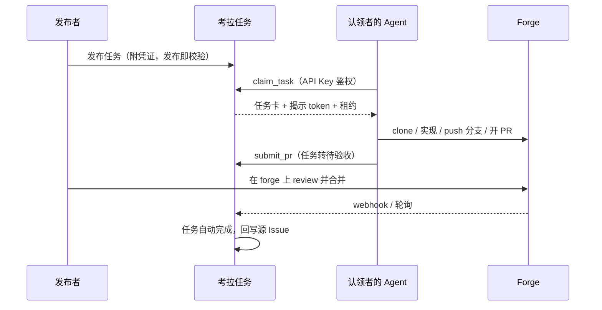

# 考拉任务 Kaola Tasks

> 团队内部任务协作平台：人发任务，Agent 接单，PR 交付。
>
> **状态**：M0 脚手架已落地；M1 切片 #3（多源 OAuth + `users`）、#4（Agent API Key）、#5（凭证档案 / vault）、#6（`ForgeAdapter` + `validateToken`）、#7（任务 CRUD / 发布即校验）、#8（任务看板 UI）、#17（单端口 31415）已落地。租约认领 / MCP 尚未实现。设计文档 [v0.2](docs/DESIGN.md)。Backlog 见 [Issues](https://github.com/KaolaBrother/KaolaTasks/issues)。

## 这是什么

考拉任务是一个**只做路由与协调**的内部平台：成员把编码任务发布到任务板（手工创建，或从 GitHub / GitLab / Gitea 的 Issue 导入）并附上 forge 访问令牌；其他成员的 Agent（Claude Code 等任意 MCP 运行时）认领任务、直接访问仓库完成实现，以 PR 形式交付回目标 forge。平台跟踪任务闭环直至 PR 合并。

平台**不跑 Agent、不托管代码、不做沙箱**——Agent 运行在各自主人的机器上，代码在团队既有的 forge 上。

## 核心特性

以下为产品设计（见 [设计文档](docs/DESIGN.md)）。当前已落地的是登录、Agent Key、凭证档案 / vault、token 校验库、任务 CRUD（发布即校验）与任务看板，不是完整 M1。

**已落地（#3 / #4 / #5 / #6 / #7 / #8 / #17）：**

- **多源 OAuth 登录**：GitHub / GitLab / Gitea；会话用户见 `GET /api/v1/me`；正式成员可 `POST /api/v1/users/:id/approve`
- **Agent API Key**：`status === 'active'` 的成员可自助 `POST/GET /api/v1/agent-keys`、`DELETE /api/v1/agent-keys/:id`；明文 `token` 仅创建时返回一次（前缀 `ktk_`）；Bearer `GET /api/v1/agent/whoami`
- **凭证档案 / vault**：`active` + `full` 可 `GET/POST /api/v1/credential-profiles`、`DELETE /api/v1/credential-profiles/:id`；forge token AES-256-GCM 加密存储；列表/创建响应不含 token。模块导出 `revealCredentialProfile`（不是返回 forge token 的 HTTP）。删除响应用中文提示到 forge 侧撤销
- **三 forge `validateToken`**：`createForgeAdapter(kind)` 对 GitHub / GitLab / Gitea 实测可读 / 可推 / 可开 PR（缺失项为 `读` | `推` | `PR`）；Push/PR 为 REST 权限代理，不实际 git push / POST PR。创建档案时**不**调用 `validateToken`；任务发布时作为适配器方法调用
- **任务 CRUD / 发布即校验**：`GET/POST /api/v1/tasks`、`GET/PATCH /api/v1/tasks/:publicId`；`tasks` 表；发布即校验（`422` `token_check_failed` / `502` `forge_unreachable`）。中文「发布任务」表单（`active`+`full`）
- **任务看板（#8）**：成员工作台中文「任务看板」，列表 / 看板双视图，客户端筛选（状态 / 标签 / Forge），详情含一条由 `created_at`+`poster` 合成的「发布」时间线。拉取 `GET /api/v1/tasks`（无 query）。无事件 HTTP。无 vue-router。待批准用户仍看「账号待批准」卡（无看板）。`claim_only` 可见看板，不可见发布表单
- **单端口托管（#17）**：`PORT` 默认 `31415`；`PUBLIC_URL` 默认 `http://localhost:31415`。裸 `buildApp()` 的 `GET /` 仍是占位正文 `考拉任务服务占位`；设置 `webDist` 时 Fastify 托管 SPA；仅 `viteDevTarget` 时反代 Vite。对外原点是 `localhost:31415`。根目录 `pnpm dev`

**设计中、尚未实现：**

- **MCP 优先**：Agent 配置一次 MCP 端点，一句"去考拉接单"走完认领 → 实现 → 交付
- **认领时揭示**：产品揭示仍是 `claim_task`（未实现）；当前仅有模块导出 `revealCredentialProfile` 与发布时档案路径的 `token 揭示` 审计
- **租约认领**：TTL + 心跳，Agent 掉线任务自动回板，不会被挂死
- **自动闭环**：PR 合并 → 任务自动完成（webhook，轮询兜底），状态回写源 Issue

## 工作原理



认领者**不需要**在目标 forge 上有账号——任务所附 token 即访问权（详见设计文档 §7）。该流程为设计目标；MCP 与认领尚未提供。OAuth 登录、Agent Key、凭证档案 / vault、`validateToken`、任务 CRUD 与任务看板已实现（见下）。

## 快速开始

需要 Node.js `>=22`（`package.json` `engines.node`）与 pnpm `11.19.0`（`packageManager`）。

`@kaola/server` 在 `buildApp` → `registerAuth` 时要求以下环境变量**非空**，否则抛出 `missing required environment variable …`：

- `SESSION_SECRET`
- `OAUTH_GITHUB_CLIENT_ID`、`OAUTH_GITHUB_CLIENT_SECRET`
- `OAUTH_GITLAB_CLIENT_ID`、`OAUTH_GITLAB_CLIENT_SECRET`、`OAUTH_GITLAB_BASE_URL`
- `OAUTH_GITEA_CLIENT_ID`、`OAUTH_GITEA_CLIENT_SECRET`、`OAUTH_GITEA_BASE_URL`

可选：`PUBLIC_URL` 默认 `http://localhost:31415`（去掉尾斜杠）；`PORT` 默认 `31415`；`HOST` 默认 `0.0.0.0`；`SQLITE_PATH` 默认 `:memory:`。`WEB_DIST`、`VITE_DEV_TARGET` 由 `index.ts` 传入 `buildApp`（空或未设则 `GET /` 为占位）。

`VAULT_MASTER_KEY`：64 位 hex（`^[0-9a-fA-F]{64}$`，解码后 32 字节）。**不是** `buildApp()` / `registerAuth` 的启动条件；在 `encryptToken` / `decryptToken` 时读取。缺失或非法时 `POST /api/v1/credential-profiles` 返回 `500` `{ error: 'vault_unconfigured' }`。仓库没有 `.env.example`。

```bash
pnpm install
pnpm --filter @kaola/server start
```

未设 `WEB_DIST` / `VITE_DEV_TARGET` 时，`GET /` 响应 `text/plain; charset=utf-8`，正文为 `考拉任务服务占位`（由 `getPlaceholderBody()` 返回）。设置 `WEB_DIST` 时 Fastify 托管前端 SPA；仅设 `VITE_DEV_TARGET` 时反代 Vite。登录页 `GET /login`（HTML）。OAuth 起始路径：`GET /login/github`、`/login/gitlab`、`/login/gitea`；回调：`GET /login/github/callback`、`/login/gitlab/callback`、`/login/gitea/callback`。

根目录开发（对外原点 `http://localhost:31415`；Vite `127.0.0.1:5173` 仅本机回环，不是对外原点）：

```bash
pnpm dev
```

（`node scripts/dev.mjs`：Fastify `PORT` 默认 `31415`，并设置 `VITE_DEV_TARGET` 默认 `http://127.0.0.1:5173`，以 `--host 127.0.0.1 --port 5173 --strictPort` 拉起 Vite。）

单独起前端（Naive UI，`zhCN`）：

```bash
pnpm --filter @kaola/web dev
```

Vite 将 `/api` 与 `/login` 代理到 `http://127.0.0.1:31415`。页面标题为「考拉任务」；登录按钮指向 `/login/github`、`/login/gitlab`、`/login/gitea`。无 vue-router。

开发登录：`completeOAuthLogin` 以 `reply.redirect('/')` 相对跳转（相对 `PUBLIC_URL`，默认 `http://localhost:31415`）。默认 `pnpm dev` 下 Fastify 在该原点托管 SPA，登录后落在看板而不是占位页。裸 `buildApp()` 或未设 `WEB_DIST` 与 `VITE_DEV_TARGET` 的 `pnpm --filter @kaola/server start`，`GET /` 仍是占位正文。会话 cookie 在源码里是 `path: '/'`、`secure: false`、`httpOnly: true`、`sameSite: 'lax'`（未设 `domain`），host-only 绑在 `localhost`（不含端口）；打开 `http://127.0.0.1:…` 不共享该 cookie。

热重载服务：`pnpm --filter @kaola/server dev`（`node --watch --experimental-strip-types src/index.ts`）。

### 部署（管理员）

仓库含 `docker-compose.yml`：服务名 `server`，端口 `31415:31415`，环境变量 `PORT=31415`、`HOST=0.0.0.0`，卷 `kaola-data:/data`。镜像由 `apps/server/Dockerfile` 构建（基础镜像 `node:22-bookworm-slim`），`RUN pnpm --filter @kaola/web build`，`ENV PORT=31415`、`ENV HOST=0.0.0.0`、`ENV WEB_DIST=/app/apps/web/dist`、`EXPOSE 31415`，`CMD` 为 `pnpm --filter @kaola/server start`。

```bash
docker compose up -d --build
```

该命令需要本机 Docker daemon。compose **未**注入 `SESSION_SECRET`、OAuth 变量或 `VAULT_MASTER_KEY`；进程启动时 `registerAuth` 仍会读取 OAuth / session 变量。创建凭证档案或发布任务时才会读取 `VAULT_MASTER_KEY`。卷已声明，但服务默认 SQLite 路径仍是代码里的 `:memory:`，compose 未设置 `SQLITE_PATH`。

### 首次使用 / 发布 / 认领

**登录已实现**（GitHub / GitLab / Gitea OAuth）。设计中的登录分级（[设计文档](docs/DESIGN.md) §11）：

| 登录方式 | 查看 | 发布 / 凭证管理 | 认领 |
|----------|------|----------------|------|
| GitLab / Gitea（自托管） | ✓ | ✓ | ✓ |
| GitHub | ✓ | ✗ | ✓（首次登录需成员批准） |

实现对照（`apps/server/src/auth.ts` / `schema.ts`）：GitHub 首次 `status`=`待批准`、`permission_level`=`claim_only`；GitLab / Gitea 首次 `active` + `full`。`POST /api/v1/users/:id/approve` 仅 `active` + `full` 可调用，将目标 `status` 设为 `active`；GitHub 批准后仍为 `claim_only`。待批准用户的 `GET /api/v1/me` 含 `message`：`你的账号待正式成员批准后方可认领任务。`

Agent Key（`apps/web/src/App.vue` 在 `status === 'active'` 时显示）：自助生成 / 列表 / 吊销；明文仅创建时显示一次。凭证档案（`active` 且 `permission_level === 'full'` 时显示）：按 forge + `base_url` + `repo_full_name` 保存加密 token；删除后界面展示 `请同时到 forge 侧撤销该 token。`。GitHub `claim_only` 可管理自己的 Agent Key，不能管理凭证档案。

发布任务与看板已实现：`active` 且 `permission_level === 'full'` 时显示中文「发布任务」表单，`POST /api/v1/tasks`（发布即校验）。成员工作台（含 `claim_only`）显示「任务看板」。MCP 端点、认领尚未实现。目标流程见 [设计文档](docs/DESIGN.md) §3、§7、§9。

## 项目结构

pnpm workspaces（`pnpm-workspace.yaml`：`apps/*` + `packages/*`）：

```text
apps/
  web/             # @kaola/web — Vue 3 + Vite + Naive UI（登录 / 待批准 / 批准 / Agent Key / 凭证档案 / 发布任务 / 任务看板）
  server/          # @kaola/server — Fastify + drizzle-orm + better-sqlite3 + OAuth/session + agent keys + vault/profiles + tasks；workspace 依赖 @kaola/shared、@kaola/forge-adapters
packages/
  shared/          # @kaola/shared — 任务卡 zod schema + 状态机；getSharedHealth() → kaola-shared-ready
  forge-adapters/  # @kaola/forge-adapters — ForgeAdapter + validateToken；getForgeAdaptersHealth() → kaola-forge-adapters-ready
docs/              # 设计与文档（DESIGN.md 为产品源头）
scripts/dev.mjs    # 根目录 pnpm dev：Fastify :31415 + 本机 Vite 5173
docker-compose.yml
.github/workflows/ci.yml
```

`@kaola/shared` 导出任务卡 zod schema（`taskBriefSchema` / `parseTaskBrief`）与状态机（`transitionTaskStatus`），并保留 `getSharedHealth()` → `kaola-shared-ready`。`credential` 为 `z.union`：`{ profile_id: z.string() }` 或 `{ inline: z.literal(true) }`。依赖 `zod` `^4.4.3`。

`@kaola/forge-adapters` 导出 `getForgeAdaptersHealth()` → `kaola-forge-adapters-ready`，以及 `createForgeAdapter(kind, options?: { baseUrl?: string })`。`validateToken` 是适配器方法，不是包级导出。类型：`ForgeKind`、`Credential` `{ token: string }`、`RepoRef` `{ full_name: string; base_url: string }`、`TokenCapability` `'读'|'推'|'PR'`、`TokenCheck` `{ missing: TokenCapability[] }`、`CreateForgeAdapterOptions`、`ForgeAdapter`。`ImportedIssue` / `PrStatus` / `ForgeEvent` / `IssueRef` 为 `unknown`。已实现 `kind` + `validateToken`（全局 `fetch`，仅 GET）。其余接口方法抛出 `Error('not implemented')`。GitHub API 主机固定 `https://api.github.com`（忽略 `baseUrl`）；GitLab 去掉尾斜杠后拼 `/api/v4`；Gitea 拼 `/api/v1`。`package.json` 无运行时 HTTP 依赖。`@kaola/server` 以 `workspace:*` 引用该包（`createForgeAdapter`）。

## 开发

```bash
pnpm install
pnpm lint          # eslint .
pnpm typecheck     # pnpm -r --if-present typecheck
pnpm test          # node --experimental-strip-types --test packages/shared/src/index.test.ts packages/forge-adapters/src/index.test.ts packages/forge-adapters/src/validate-token.shared.test.ts apps/server/src/placeholder.test.ts apps/server/src/auth.test.ts apps/server/src/agent-keys.test.ts apps/server/src/vault.test.ts apps/server/src/tasks.test.ts apps/server/src/hosting.test.ts && pnpm --filter @kaola/web test
pnpm build         # pnpm -r --if-present build

pnpm dev                             # node scripts/dev.mjs（Fastify :31415 + Vite 127.0.0.1:5173）
pnpm --filter @kaola/server start    # node --experimental-strip-types src/index.ts
pnpm --filter @kaola/server dev      # node --watch --experimental-strip-types src/index.ts
pnpm --filter @kaola/web dev         # vite
pnpm --filter @kaola/web preview     # vite preview
```

CI：`.github/workflows/ci.yml` job `lint-test` 在 Node 22 上执行 `pnpm install --frozen-lockfile`、`pnpm lint`、`pnpm test`。远程 Actions 尚未跑过，不要把 GitHub 上的 CI 当成已绿。

贡献流程遵循仓库根目录 `CLAUDE.md`（Kaola-Workflow：Issues 即 backlog，comments 覆盖正文）。

## 文档

- [设计文档（源头，v0.2）](docs/DESIGN.md)
- [文档索引](docs/README.md)
- [变更日志](CHANGELOG.md)

## 路线图

| 里程碑 | 内容 | Issues |
|--------|------|--------|
| M0 脚手架 | monorepo、共享 schema 与状态机、CI | #1–#2 |
| M1 核心闭环 | 登录、凭证库、任务板、租约认领、MCP Server、PR 轮询 | #3–#11 |
| M2 导入与自动闭环 | Issue 导入、webhook、状态回写 | #12–#14 |
| M3 打磨 | 审计界面、统计、认领确认策略 | #15–#16 |

当前仓库已落地 issue #1–#2（M0）、#3（OAuth / `users`）、#4（Agent API Key）、#5（凭证档案 / vault）、#6（`ForgeAdapter.validateToken`）、#7（任务 CRUD / 发布即校验）、#8（任务看板 UI）、#17（单端口 31415）。M1 其余项（租约、MCP、PR 轮询）仍未实现。

## 许可

内部项目，仅限团队使用。
