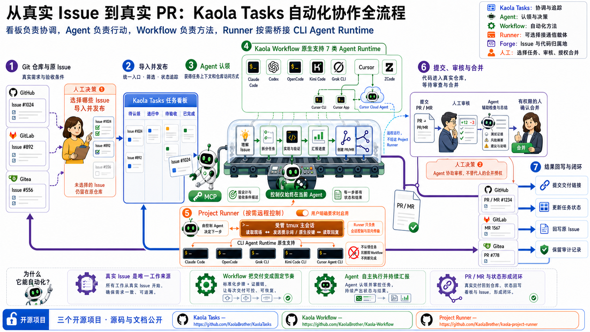
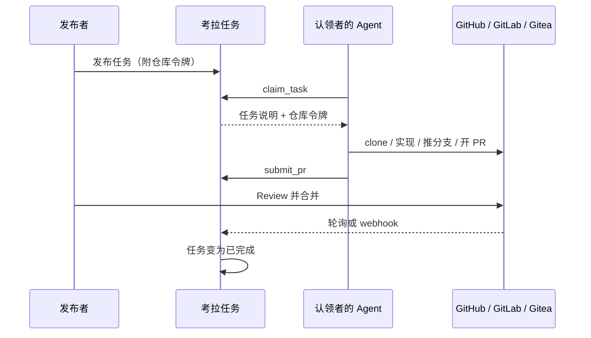

# 考拉任务

团队内部的中文任务板：**人发任务，Agent 接单，PR 交付**。

成员把编码任务发到看板上（手工填写，或从 GitHub / GitLab / Gitea 的 Issue 导入），并附上该仓库的访问令牌。同事的 Agent（Cursor、Claude Code 等任意 MCP 客户端）认领任务后，用揭示出的令牌直接在原仓库上改代码、开 PR。考拉跟踪状态直到 PR 合并。

考拉**只做路由与协调**：不跑 Agent、不托管代码、不做沙箱。Agent 跑在各自主人的电脑上，代码仍在你们现有的 forge 上。



## 一次任务怎么走完



1. 空库先走**初始向导**（用户名/密码）创建本地管理员。之后用本地密码登录，或用 GitLab / Gitea 登录成为发布者。没有 GitHub 登录按钮。
2. 保存一份仓库凭证，填好任务后点「发布」。发布时会校验令牌能否读、推、开 PR。
3. 认领者本机跑 `kaola-mcp --url http://localhost:31415`（或 `KAOLA_URL`）。不要把 token 写进 mcp.json。公网 `https://…` 入口先看「安装与证书信任」，不要为了连上而关闭 TLS。
4. 管理员在工作台 **电脑** 页把 **待授权电脑** 绑到自己或 **认领者**。已绑定后 `claim_task` 才拿到该任务的可复用仓库凭证（并非按次铸造的一次性令牌）；Claim 租约默认 TTL 24 小时，到期只收回考拉侧的认领锁定，不吊销 forge 侧凭证本身。
5. Agent 实现、推分支、开 PR，再 `submit_pr`。任务变为「待验收」。
6. 你在 forge 上 review、合并。考拉默认每分钟看一次 PR；也可以配 webhook。
7. 任务变为「已完成」。从 Issue 导入的会在源 Issue 上留一条状态评论。

页面上没有「认领」按钮。认领只通过 Agent。认领者不必在目标仓库有账号——任务所附令牌就是访问权。

## 登录与权限

封闭加入：空库（无可登录管理员）**只许设置向导**（`POST /api/v1/setup`），OAuth 不得抢权。向导创建 `provider: 'local'`、`permission_level: 'admin'`。已有管理员之后，GitLab / Gitea 登录一律建 `active` + `full` 发布者（管理员可 `POST /api/v1/users/:id/promote` 升级）。`GET /login/github` 为 404。`KAOLA_ADMINS` 若仍设置则**忽略**，不作为邀请名单。`POST /api/v1/users/:id/approve` 已退役（404）。

| | 空库 / 零可登录管理员 | 已有管理员之后 |
|--|--|--|
| 进工作台 | 仅设置向导创建本地管理员 | 本地密码，或 GitLab / Gitea OAuth（发布者） |
| 发任务 / 凭证档案 | 管理员可发 | 管理员或发布者（`admin` 或 `full`） |
| 电脑绑定 / 升级 / 待确认认领 | 仅管理员 | 仅 `admin`；发布者不能绑电脑 |
| 认领 | 电脑绑到该管理员或 **认领者** 后，由 Agent 认领 | 认领者不自助铸 Agent Key |

任务状态：待认领 → 进行中 → 待验收 → 已完成；也可以已退回（可重新打开）或已取消。

## 人在浏览器里做什么

打开 **http://localhost:31415**（开发时请用 `localhost`，不要用 `127.0.0.1`，否则登录 cookie 对不上）。工作台是四栏：**看板 / 发布 / 电脑 / 审计**（窄屏下导航改成横排）。

**发布者（GitLab / Gitea）**

1. 登录后进入工作台（头栏显示「发布者」）。
2. 在「发布」栏保存凭证档案（forge + 仓库地址 + 仓库全名），或在单条任务里临时贴令牌。
3. 「发布」栏：自有任务填标题和说明；从 Issue 导入则点「导入」。共享档案会带出仓库，导入时从下拉选 Issue；一次性 token 仍手填仓库。分支和目录在「高级」里。
4. 「看板」看进度；自己发的任务可「取消」或把已退回的「重新开放」。
5. 「审计」看日志和团队统计。

推荐的仓库令牌（尽量限定单个仓库）：GitHub fine-grained PAT；GitLab Project Access Token（Developer，`api` + `write_repository`）；Gitea 仓库级 token。需要能读仓库、推分支、开 PR。

**认领者**

认领者不是 Web 自助账号，不铸 Agent Key。管理员在 **电脑** 页把 **待授权电脑** 绑到自己（**绑到我自己**）或绑到命名 **认领者**。

若 Agent **自己轮询**去认领，管理员的「电脑」栏可能出现「待确认认领」；批准后才会拿到令牌。你口头让 Agent 去认领时，已绑定即授权。「受信自动化」打开后不再排队确认。

## Agent 怎么接单

本机跑 `kaola-mcp --url http://localhost:31415`（或 `KAOLA_URL`；生产用 `${PUBLIC_URL}`）。桥代签；MCP 配置里不要放 forge token、设备私钥、`ktk_` 或根私钥。换任务不改配置，再调 `claim_task`。未绑定的电脑不能列出或认领，先在工作台「电脑」页绑定。`--url` 为 `https://…` 时保持严格 TLS（运行时默认信任库），不要设 `NODE_TLS_REJECT_UNAUTHORIZED=0`。按下面「安装与证书信任」选择公开 CA 或私有 CA 路径：`STABLE_PUBLIC_CA` 不设 `NODE_EXTRA_CA_CERTS`、不装额外 CA；`DEBUG_PRIVATE_CA` 可在**用户本机、仅该 MCP server 进程**的 env 中设置 `NODE_EXTRA_CA_CERTS`，只指向已核验的公开根 CA 证书（不含私钥）；本机路径和环境值不得提交到仓库共享配置。

```json
{
  "mcpServers": {
    "kaola-tasks": {
      "command": "kaola-mcp",
      "args": ["--url", "http://localhost:31415"]
    }
  }
}
```

| 工具 | 做什么 |
|------|--------|
| `list_tasks` | 列出可接单的 `待认领` 任务（无 token） |
| `get_task_brief` | 看一条任务的完整说明（无 token） |
| `claim_task` | 认领。人指定任务时不要带 `autonomous`；可选 `request_id` 让重试幂等（同一 `(设备, request_id)` 重放拿回同一个 Claim）。成功才拿到**该任务**的仓库令牌，租约里的 `claim_id` 之后心跳/释放/提交都要带上。自主轮询才设 `autonomous: true` |
| `report_progress` | 心跳，可选备注；带过 `request_id` 的新式 Claim 必须带 `claim_id` |
| `release_task` | 放弃，任务回到待认领；同上 `claim_id` 规则，重复释放同一 Claim 是幂等的 |
| `submit_pr` | forge 上已有 PR/MR 后再交 URL；同上 `claim_id` 规则，重复提交同一 Claim + 同一 URL 是幂等的 |

用返回的 `clone` 去克隆：按 `extra_header` 带令牌，不要把 token 写进 remote URL。提交 PR 只有 MCP 的 `submit_pr`。协议细节见 [docs/api.md](docs/api.md)。

## 本机跑起来

需要 Node.js ≥ 22 和 pnpm `11.19.0`。

```bash
pnpm install
```

进程启动时下列变量必须非空（GitHub 客户端仍要占位，即使没有 GitHub 登录）：

- `SESSION_SECRET`
- `OAUTH_GITHUB_CLIENT_ID` / `OAUTH_GITHUB_CLIENT_SECRET`（`registerAuth` 仍 `requireEnv`；登录不用 GitHub OAuth 应用）
- `OAUTH_GITLAB_CLIENT_ID` / `OAUTH_GITLAB_CLIENT_SECRET` / `OAUTH_GITLAB_BASE_URL`
- `OAUTH_GITEA_CLIENT_ID` / `OAUTH_GITEA_CLIENT_SECRET` / `OAUTH_GITEA_BASE_URL`

发任务或保存凭证还需要 `VAULT_MASTER_KEY`：64 位十六进制（32 字节）。缺了会在保存凭证时报错，进程仍能起来。

`KAOLA_ADMINS` 若设置则**忽略**。可选 `KAOLA_HOME` 覆盖设备目录（默认 `~/.kaola`）。

建议一并设置：

| 变量 | 建议 |
|------|------|
| `PUBLIC_URL` | `http://localhost:31415`（OAuth 回调按这个拼） |
| `SQLITE_PATH` | 某个 `.sqlite` 文件。默认是内存库，重启就丢 |
| `POLL_INTERVAL_MS` | 默认 `60000`。`<= 0` 关闭 PR 轮询 |

仓库不读取 `.env` 文件：把变量 `export` 进当前 shell，或用你自己的方式注入后再执行：

```bash
pnpm dev
```

浏览器打开 **http://localhost:31415**。这会同时起 Fastify（默认端口 31415）和本机 Vite（`127.0.0.1:5173`，只给代理用）。

### 配一个登录用的 OAuth 应用

以 GitLab.com 为例（界面是英文）：

1. 打开 <https://gitlab.com/-/user_settings/applications>
2. **Add new application**
3. **Name**：任意，例如 `Kaola Tasks local`
4. **Redirect URI**（必须一字不差）：`http://localhost:31415/login/gitlab/callback`
5. Scopes 只勾 **`read_user`**
6. **Save application**，把 **Application ID** / **Secret** 赋给上面的 GitLab 环境变量

Gitea 回调：`http://localhost:31415/login/gitea/callback`（Scopes 勾 **`read:user`**）  
自托管 GitLab / Gitea 把 `OAUTH_*_BASE_URL` 改成实例根地址即可。没有 GitHub 登录（`GET /login/github` 为 404）；GitHub OAuth 应用对登录是可选的，但 `OAUTH_GITHUB_CLIENT_ID` / `OAUTH_GITHUB_CLIENT_SECRET` 启动时仍必须非空，可填 `unused`。

本机只测 GitLab 登录时，Gitea 的 Client ID 可填 `unused`，不要去点那个按钮。

### 生产向部署

内网跑考拉和本地 GitLab / Gitea；公网 IP（或主机名）当入口。不要把云开发机当生产。本机开发仍用上一节。

浏览器 / `kaola-mcp` → 公网 TLS 反代 `<https-port>` → `127.0.0.1:31415`（不要假设入站 80；HTTP-01 在动态名 + 无 80 时不可行）

1. 复制 `.env.example` 为 `.env`，填密钥和 `PUBLIC_URL`（团队浏览器打开的地址，不带尾斜杠）。`DEBUG_PRIVATE_CA` 用 `https://<public-host>:<https-port>`；`STABLE_PUBLIC_CA` 优先 `https://<production-subdomain>`。真实值只进 gitignore 的 `.env`、操作者配置或用户本机 MCP 配置，不得写进仓库。OAuth 回调、`kaola-mcp --url`、回写链接都跟它。
2. OAuth Redirect URI：`${PUBLIC_URL}/login/gitlab/callback`（Gitea 同形）。可与 localhost 回调并存。`OAUTH_*_BASE_URL` 填服务器访问 forge 的**内网**地址。不要配 GitHub 登录回调（该路径 404）。
3. 反代转到 `127.0.0.1:31415`，不要把 31415 放到公网。HTTPS 时用对外 scheme **覆盖** `X-Forwarded-Proto`。
4. 证书按 [DESIGN §12](docs/DESIGN.md) 双模式：`DEBUG_PRIVATE_CA` 用受控开发根 CA 签发 **SAN 含 `<public-host>`** 的 leaf，只把**公开根 CA 证书（不含私钥）**装进已登记机器，`NODE_EXTRA_CA_CERTS` 仅本机桥；这只证明已登记测试机，不是干净机器公网信任。`STABLE_PUBLIC_CA` 用 ACME **DNS-01**（`<acme-dns-provider>` API；无 API 时手工 DNS-01 仅临时；可选 `_acme-challenge` CNAME 委派）在 `<https-port>` 上发送 fullchain，自动续期，配置测试后再 reload。CN-only 自签名 leaf 不是交付物。禁止 `NODE_TLS_REJECT_UNAUTHORIZED=0` 与把 `curl -k` 当验收。
5. `docker compose up -d --build`。库在卷 `/data/kaola.sqlite`。密钥、主机名、证书、DNS 提供商不要进 git。没有已证明的服务器授权、选定的 `<production-subdomain>` 和 `<acme-dns-provider>` 时，不要在活网上换证。
6. 成员本机：`kaola-mcp --url ${PUBLIC_URL}`，保持严格 TLS。HTTPS 时先按下一节「安装与证书信任」选对证书模式再绑定（`STABLE_PUBLIC_CA` 不设 `NODE_EXTRA_CA_CERTS`；`DEBUG_PRIVATE_CA` 仅本机桥进程）。管理员在「电脑」页绑定设备。同机默认每分钟轮询完结任务。空库只许向导；之后 GitLab / Gitea 登录成为发布者。

Cookie / `trustProxy` / webhook 配置见 [docs/api.md](docs/api.md)。

## 安装与证书信任

公网 HTTPS 入口只有两种模式。**先问管理员当前入口属于哪一种**，再选对应安装路径。模式写在未跟踪的本地运维配置里，不要根据第一次 TLS 报错去下载服务器给出的 CA。

| 模式 | 何时用 | 本机要做什么 |
|------|--------|--------------|
| `STABLE_PUBLIC_CA` | 叶子由公开 CA 签发，操作系统默认根证书库就能验证 | 只装 MCP、只配 `--url`。不装额外 CA，不设 `NODE_EXTRA_CA_CERTS` |
| `DEBUG_PRIVATE_CA` | 入口由受控开发根 CA 签发；默认根证书库不含该根 | **每台纳管电脑**都要信任同一份**公开根证书**（不是根私钥） |

真实域名、服务器名、端口、证书指纹、DNS 提供商和本机路径不得写入本仓库。下文只用占位符：`<kaola-origin>`、`<dev-root-ca.pem>`、`<sha256-fingerprint>`。根私钥永远只留在签发端。

产品合同见 [docs/DESIGN.md](docs/DESIGN.md) §16。服务端怎么签发、续期公网证书由 [#46](https://github.com/KaolaBrother/KaolaTasks/issues/46) 拥有，本节不复制。安装器 CLI 与专用磁盘布局仍是 #48 未交付的 frontier；下面是现在就能执行的操作者步骤。

### 方案 1：公开 CA（默认，干净电脑）

为什么不需要安装证书：操作系统已经内置公开 CA 的根。再装私有根只会扩大信任面。

1. 安装 `kaola-mcp`。
2. 配置 `kaola-mcp --url <kaola-origin>`（或 `KAOLA_URL`）。`PUBLIC_URL` 与这个 origin 一致。
3. 不要设置 `NODE_EXTRA_CA_CERTS`，不要 `NODE_TLS_REJECT_UNAUTHORIZED=0`，不要 `--insecure`，不要 `curl -k`，不要点浏览器证书例外。
4. 若本机 MCP 配置或进程环境还留着 `NODE_EXTRA_CA_CERTS`，或系统信任库还留着测试私有根，说明还没从测试模式迁完，先按下面「卸载、轮换、迁移」清掉再连。

浏览器 OAuth、MCP `authorization_required`、管理员绑定、绑定后 `list_tasks` 都走系统默认信任链。

### 方案 2：私有 CA（测试，每台电脑都要配）

为什么每台电脑都要信任引导：开发根不在操作系统默认库里。只在一台机器上装过，其它电脑照样 TLS 失败。

先从带外材料拿到同一份公开根证书 PEM（`<dev-root-ca.pem>`）和它的 SHA-256（`<sha256-fingerprint>`）。**不要**用第一次连 `<kaola-origin>` 时服务器返回的 CA 当信任锚。

#### 核验指纹（所有电脑，连之前）

```bash
openssl x509 -in <dev-root-ca.pem> -noout -fingerprint -sha256
```

输出必须与带外 `<sha256-fingerprint>` 一致（去掉冒号、大小写不敏感）。PEM 必须恰好一块 `CERTIFICATE`，且是 CA；文件里若出现 `PRIVATE KEY` 立刻丢掉——根私钥不得出现在客户端。

#### 只跑 Agent 的电脑（MCP 进程级信任）

核验通过后，**只**给本机 `kaola-mcp` 进程设置 `NODE_EXTRA_CA_CERTS` 指向该 PEM——这不是系统信任，浏览器读不到。真实路径不得提交进 Git。

本机未跟踪的 MCP 配置可以加 `env`（不要把 PEM 正文、指纹或任何私钥提交进 Git；仓库示例仍只有 `command` + `--url`）：

```json
{
  "mcpServers": {
    "kaola-tasks": {
      "command": "kaola-mcp",
      "args": ["--url", "<kaola-origin>"],
      "env": {
        "NODE_EXTRA_CA_CERTS": "<dev-root-ca.pem>"
      }
    }
  }
}
```

设置或更换该变量之后必须**重启 MCP 客户端**（正在跑的 stdio 桥不会热加载）。然后再以严格 TLS 走设备 pending / 绑定。禁止 `NODE_TLS_REJECT_UNAUTHORIZED=0`。

#### 需要浏览器 / OAuth / 管理员绑定的电脑

进程级 `NODE_EXTRA_CA_CERTS` 不够。还要显式把同一份已核验公开根装进操作系统（或浏览器）信任库。这是第二次授权，涉及提权时不得静默：

- macOS：系统钥匙串 / `security add-trusted-cert`（需管理员认证）
- Windows：本机受信任根 / `certutil -addstore Root`（需 UAC）
- Linux：发行版各异。Debian/Ubuntu 用 `update-ca-certificates`；Fedora/RHEL 用 `trust anchor`。二者不要混用。需 root。

未完成系统信任时，浏览器 / OAuth 必须失败。点证书例外不算通过。

### 卸载、轮换、退出团队、迁到公开 CA

- **核验**：随时用上面的 `openssl` 命令对照带外指纹。不一致就停止连接。
- **卸载 MCP 额外 CA**：去掉 MCP 配置和 shell 里的 `NODE_EXTRA_CA_CERTS`，重启 MCP。不要删 `device.json` / receipts。公开 CA 路径此后不得再读到额外 CA。
- **卸载系统/浏览器信任**：按各 OS 提权命令手工删除该根；撤掉 MCP 环境变量不会同时撤系统信任。
- **根 CA 轮换**：先带外分发新根的指纹；各电脑核验新 PEM，更新 `NODE_EXTRA_CA_CERTS` 指向和（若装过）系统信任，重启 MCP；再作废旧根。新旧根的私钥都不分发。
- **电脑退出团队**：管理员解除该设备；本机卸载 MCP 额外 CA；若曾做系统信任则再撤系统根。
- **迁到 `STABLE_PUBLIC_CA`**：入口改为公开 CA 链之后，每台电脑卸载私有根（MCP 进程级 + 若装过的系统级）、去掉 `NODE_EXTRA_CA_CERTS`、重启 MCP，只保留 `--url <kaola-origin>`。

## 给开发者

```bash
pnpm lint
pnpm typecheck
pnpm test
pnpm build
```

产品契约在 [docs/DESIGN.md](docs/DESIGN.md)。HTTP / MCP 细节在 [docs/api.md](docs/api.md)。实现记录在 [CHANGELOG.md](CHANGELOG.md)。贡献约定见仓库根目录 `AGENTS.md`（Claude 入口仍是 `CLAUDE.md`，只桥接到该合同）。

## 文档

- [设计文档](docs/DESIGN.md) — 产品与架构源头（§16 冻结双模式 MCP 安装与证书信任）
- [GitLab / Gitea 冒烟手册](docs/smoke-test.md) — 浏览器 **配合** vs 脚本 B（B 只模拟考拉进程；`GITLAB_TOKEN` / `GITEA_TOKEN` 仍须真实 PAT）
- [文档索引](docs/README.md)
- [变更日志](CHANGELOG.md)

## 授权与使用

本项目源码公开（source-available），但**不采用 OSI 认可的开源许可证**。你可以为个人学习、研究、评估和其他非商业目的查看、运行和修改本项目。

未经著作权人事先书面授权，不得将本项目或其衍生作品用于商业目的，包括销售、收费服务、SaaS、商业产品集成，或以本项目为核心提供有偿产品或服务。商业授权请联系仓库所有者。

除上述有限许可外，著作权人保留全部权利。本项目按“现状”提供，不作任何明示或默示保证。
