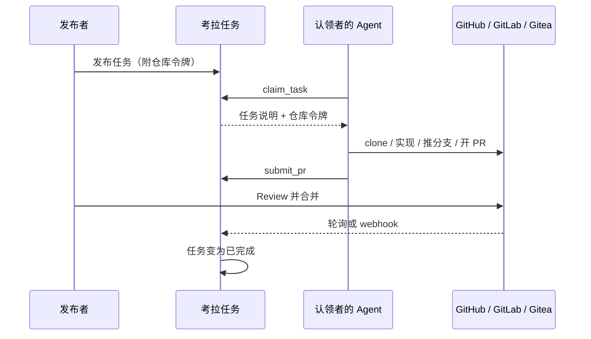

# 考拉任务

团队内部的中文任务板：**人发任务，Agent 接单，PR 交付**。

成员把编码任务发到看板上（手工填写，或从 GitHub / GitLab / Gitea 的 Issue 导入），并附上该仓库的访问令牌。同事的 Agent（Cursor、Claude Code 等任意 MCP 客户端）认领任务后，用揭示出的令牌直接在原仓库上改代码、开 PR。考拉跟踪状态直到 PR 合并。

考拉**只做路由与协调**：不跑 Agent、不托管代码、不做沙箱。Agent 跑在各自主人的电脑上，代码仍在你们现有的 forge 上。

## 一次任务怎么走完



1. 用 GitLab 或 Gitea 登录（正式成员，可发任务）。
2. 保存一份仓库凭证，填好任务后点「发布」。发布时会校验令牌能否读、推、开 PR。
3. 认领者登录后生成 **Agent Key**，配到自己的 MCP 客户端。
4. Agent 调用 `claim_task`，拿到一次性仓库令牌（有效租约默认 24 小时）。
5. Agent 在目标仓库实现、推分支、开 PR，再调用 `submit_pr`。任务变为「待验收」。
6. 你在 forge 上 review、合并。考拉默认每分钟看一次 PR 状态；也可以配 webhook 即时完结。
7. 任务变为「已完成」。从 Issue 导入的任务会在源 Issue 上留一条状态评论。

页面上**没有「认领」按钮**。认领只通过 Agent（MCP）或脚本里的 Bearer API。

认领者不需要在目标仓库上有账号——任务所附的令牌就是访问权。PR 会显示为令牌所属身份（发布者或 bot）。

## 登录与权限

| | GitLab / Gitea 登录 | GitHub 登录 |
|--|--|--|
| 看看板 | 可以 | 可以（待批准时只能看到「账号待批准」） |
| 发任务、管凭证档案 | 可以 | 不可以 |
| 生成 Agent Key、让 Agent 认领 | 可以 | 需先由正式成员在工作台「批准 GitHub 用户」 |

GitHub 账号谁都能注册，而认领会揭示仓库令牌，所以 GitHub 首次登录是「待批准」。同一人的 GitHub 号和 GitLab 号在考拉里是两个用户。

任务状态：待认领 → 进行中 → 待验收 → 已完成；也可以已退回（可重新打开）或已取消。

## 人在浏览器里做什么

打开 **http://localhost:31415**（开发时请用 `localhost`，不要用 `127.0.0.1`，否则登录 cookie 对不上）。工作台是四栏：**看板 / 发布 / 钥匙 / 审计**（窄屏下导航改成横排）。

**发布者（GitLab / Gitea）**

1. 登录后进入工作台。
2. 在「钥匙」栏的「凭证档案」里按 forge + 仓库地址 + 仓库全名保存加密令牌（推荐），或在单条任务里临时贴令牌。GitHub / GitLab 的仓库地址会预填；Gitea 留空自填。
3. 「发布」栏：平台自有填标题、说明；从 Issue 导入则点「导入」，成功后只读卡片展示标题/正文/URL（不收集验收标准等附加项）。凭证选共享档案时，仓库由档案带出（不再手填 Forge / 仓库地址 / 仓库）；来源为导入时从下拉选择 Issue。凭证选一次性 token 时仍手填仓库，并粘贴 Issue URL。分支和目录在「高级」里。
4. 在「看板」里用列表 / 看板查看进度（可按状态、标签、Forge 筛选）。自己发的任务可在详情「取消」，或把已退回的「重新开放」。
5. 「审计」栏看审计日志和团队统计。

推荐的仓库令牌（尽量限定单个仓库）：GitHub fine-grained PAT；GitLab Project Access Token（Developer，`api` + `write_repository`）；Gitea 仓库级 token。需要能读仓库、推分支、开 PR。

**认领者**

1. 登录（GitHub 用户需先被批准）。
2. 在「钥匙」栏生成 Agent Key。明文只显示一次，前缀 `ktk_`，请立刻保存。
3. 按下一节把 Key 配进 MCP 客户端。
4. 若 Agent **自己轮询、主动**去认领，「钥匙」栏会出现「待确认认领」；点批准后 Agent 再认领才会拿到仓库令牌。你口头让 Agent 去认领时，有 Key 即授权，不必再确认。
5. 「受信自动化」打开后，该用户的自主认领不再排队确认。默认关闭。

## Agent 怎么接单

MCP 端点：`POST http://localhost:31415/api/mcp`（Streamable HTTP）  
鉴权：`Authorization: Bearer ktk_你的密钥`

Cursor 可在 MCP 设置里增加类似配置（把 Key 换成你自己的，不要提交进 git）：

```json
{
  "mcpServers": {
    "kaola-tasks": {
      "url": "http://localhost:31415/api/mcp",
      "headers": {
        "Authorization": "Bearer ktk_…"
      }
    }
  }
}
```

六个工具：

| 工具 | 做什么 |
|------|--------|
| `list_tasks` | 列出任务，可按状态 / 标签 / forge 过滤 |
| `get_task_brief` | 看一条任务的完整说明（不含仓库令牌） |
| `claim_task` | 认领；成功时返回仓库令牌。自主轮询请设 `autonomous: true` |
| `report_progress` | 心跳，可选备注 |
| `release_task` | 放弃，任务回到待认领 |
| `submit_pr` | 提交 PR 地址，任务变为待验收 |

认领成功信封里的 `clone` 用 `clone.extra_header` + `clone.remote_url` 克隆，目录是 `clone.suggested_dir`。clone 时请把令牌放在环境变量或 `git -c http.extraHeader` 里按次传递，**不要写进 remote URL**（会落到 `.git/config`）。

没有 MCP 的脚本可以用同一把 Key 调 REST：`POST /api/v1/tasks/:id/claim`、`…/progress`、`…/release`。提交 PR 只有 MCP 的 `submit_pr`。

## 本机跑起来

需要 Node.js ≥ 22 和 pnpm `11.19.0`。

```bash
pnpm install
```

进程启动时下列变量必须非空（即使用不到某个登录按钮，也要填占位）：

- `SESSION_SECRET`
- `OAUTH_GITHUB_CLIENT_ID` / `OAUTH_GITHUB_CLIENT_SECRET`
- `OAUTH_GITLAB_CLIENT_ID` / `OAUTH_GITLAB_CLIENT_SECRET` / `OAUTH_GITLAB_BASE_URL`
- `OAUTH_GITEA_CLIENT_ID` / `OAUTH_GITEA_CLIENT_SECRET` / `OAUTH_GITEA_BASE_URL`

发任务或保存凭证还需要 `VAULT_MASTER_KEY`：64 位十六进制（32 字节）。缺了会在保存凭证时报错，进程仍能起来。

建议一并设置：

| 变量 | 建议 |
|------|------|
| `PUBLIC_URL` | `http://localhost:31415`（OAuth 回调按这个拼） |
| `SQLITE_PATH` | 某个 `.sqlite` 文件。默认是内存库，重启就丢 |
| `POLL_INTERVAL_MS` | 默认 `60000`。`<= 0` 关闭 PR 轮询 |

仓库不读取 `.env` 文件：把变量 `export` 进当前 shell，或用你自己的方式注入后再执行：

```bash
pnpm dev
```

浏览器打开 **http://localhost:31415**。这会同时起 Fastify（默认端口 31415）和本机 Vite（`127.0.0.1:5173`，只给代理用）。

### 配一个登录用的 OAuth 应用

以 GitLab.com 为例（界面是英文）：

1. 打开 <https://gitlab.com/-/user_settings/applications>
2. **Add new application**
3. **Name**：任意，例如 `Kaola Tasks local`
4. **Redirect URI**（必须一字不差）：`http://localhost:31415/login/gitlab/callback`
5. Scopes 只勾 **`read_user`**
6. **Save application**，把 **Application ID** / **Secret** 赋给上面的 GitLab 环境变量

GitHub 回调：`http://localhost:31415/login/github/callback`（Scopes 勾 **`read:user`**）  
Gitea 回调：`http://localhost:31415/login/gitea/callback`（Scopes 勾 **`read:user`**）  
自托管 GitLab / Gitea 把 `OAUTH_*_BASE_URL` 改成实例根地址即可。

本机只测 GitLab 登录时，GitHub / Gitea 的 Client ID 可填 `unused`，不要去点那两个按钮。

### 生产向部署

```bash
docker compose up -d --build
```

镜像会构建前端并由 Fastify 在 **31415** 提供页面。compose **不会**写入 OAuth、`SESSION_SECRET`、`VAULT_MASTER_KEY`；也未设置 `SQLITE_PATH`（代码默认仍是内存库）。上线前请自行注入这些变量，并把 SQLite 指到数据卷里的文件。

可选 `FORGE_INSTANCES`：JSON 数组，用来给某个 forge 实例开 webhook、关掉轮询。不设则所有「待验收」任务都靠轮询完结。格式见 [docs/api.md](docs/api.md)。非法 JSON 会让进程起不来。

## 给开发者

```bash
pnpm lint
pnpm typecheck
pnpm test
pnpm build
```

产品契约在 [docs/DESIGN.md](docs/DESIGN.md)。HTTP / MCP 细节在 [docs/api.md](docs/api.md)。实现记录在 [CHANGELOG.md](CHANGELOG.md)。贡献约定见仓库根目录 `CLAUDE.md`。

## 文档

- [设计文档](docs/DESIGN.md) — 产品与架构源头
- [文档索引](docs/README.md)
- [变更日志](CHANGELOG.md)

内部项目，仅限团队使用。
