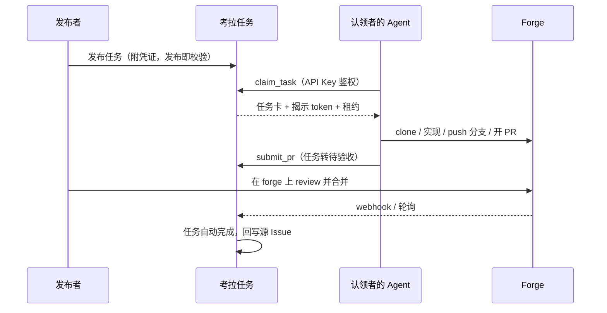

# 考拉任务 Kaola Tasks

> 团队内部任务协作平台：人发任务，Agent 接单，PR 交付。
>
> **状态**：设计阶段（设计文档 v0.2，实现未开始）。Backlog 见 [Issues](https://github.com/KaolaBrother/KaolaTasks/issues)。

## 这是什么

考拉任务是一个**只做路由与协调**的内部平台：成员把编码任务发布到任务板（手工创建，或从 GitHub / GitLab / Gitea 的 Issue 导入）并附上 forge 访问令牌；其他成员的 Agent（Claude Code 等任意 MCP 运行时）认领任务、直接访问仓库完成实现，以 PR 形式交付回目标 forge。平台跟踪任务闭环直至 PR 合并。

平台**不跑 Agent、不托管代码、不做沙箱**——Agent 运行在各自主人的机器上，代码在团队既有的 forge 上。

## 核心特性

- **任务广场（中文界面）**：列表 / 看板双视图，任务详情含事件时间线
- **三 forge 统一接入**：GitHub / GitLab（自托管）/ Gitea（自托管），一套适配层
- **MCP 优先**：Agent 配置一次 MCP 端点，一句"去考拉接单"走完认领 → 实现 → 交付
- **发布即校验**：任务上板前实测 token 权限（可读 / 可推分支 / 可开 PR）
- **凭证纪律**：token 加密存储、认领时才揭示、全程审计、一键吊销
- **租约认领**：TTL + 心跳，Agent 掉线任务自动回板，不会被挂死
- **自动闭环**：PR 合并 → 任务自动完成（webhook，轮询兜底），状态回写源 Issue

## 工作原理



认领者**不需要**在目标 forge 上有账号——任务所附 token 即访问权（详见设计文档 §7）。

## 快速开始

> ⏳ 待 M0/M1 落地后补全具体命令与截图。

### 部署（管理员）

```bash
# 待补充：docker compose up -d
# 主密钥、OAuth 应用配置经环境变量注入
```

### 首次使用（成员）

1. 打开考拉任务，选择登录方式（权限按登录来源分级）：

   | 登录方式 | 查看 | 发布 / 凭证管理 | 认领 |
   |----------|------|----------------|------|
   | GitLab / Gitea（自托管） | ✓ | ✓ | ✓ |
   | GitHub | ✓ | ✗ | ✓（首次登录需成员批准） |

2. 在「设置 → Agent Key」生成个人 API Key（明文只显示一次）。
3. 把考拉 MCP 端点 + API Key 配到你的 Agent（以 Claude Code 为例）：

   ```jsonc
   // 待补充：MCP 配置示例（端点 URL、鉴权头）
   ```

### 发布任务

在网页端填写任务卡：仓库、基准分支、**验收标准**、测试命令、路径约束，选择凭证档案（或粘贴单任务 token）。校验通过即上板。

### 认领任务

对你的 Agent 说：

> 去考拉看看有什么任务，认领 kt-xxxx

Agent 会自动完成：认领 → 领 token → clone → 实现 → 跑测试 → push 分支 → 开 PR → 提交回考拉。之后发布者在 forge 上正常 review，合并即完结。

## 项目结构（规划）

```text
apps/
  web/          # Vue 3 + Naive UI 前端（中文界面）
  server/       # Fastify API + MCP Server + webhook 接收
packages/
  shared/       # 任务卡 zod schema、生命周期状态机
  forge-adapters/  # GitHub / GitLab / Gitea 适配器
docs/           # 设计与文档（DESIGN.md 为源头）
```

## 开发

> ⏳ M0 脚手架（Issue #1）完成后生效。

```bash
pnpm install
pnpm dev        # 开发服务
pnpm test       # 测试
pnpm lint && pnpm typecheck && pnpm build
```

贡献流程遵循仓库根目录 `CLAUDE.md`（Kaola-Workflow：Issues 即 backlog，comments 覆盖正文）。

## 文档

- [设计文档（源头，v0.2）](docs/DESIGN.md)
- [文档索引](docs/README.md)
- [变更日志](CHANGELOG.md)

## 路线图

| 里程碑 | 内容 | Issues |
|--------|------|--------|
| M0 脚手架 | monorepo、共享 schema 与状态机、CI | #1–#2 |
| M1 核心闭环 | 登录、凭证库、任务板、租约认领、MCP Server、PR 轮询 | #3–#11 |
| M2 导入与自动闭环 | Issue 导入、webhook、状态回写 | #12–#14 |
| M3 打磨 | 审计界面、统计、认领确认策略 | #15–#16 |

## 许可

内部项目，仅限团队使用。
