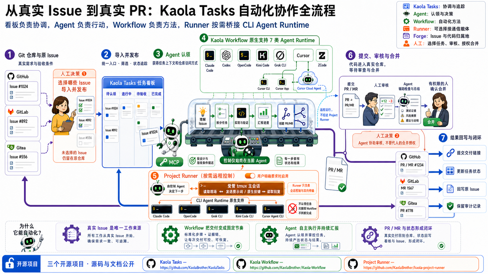
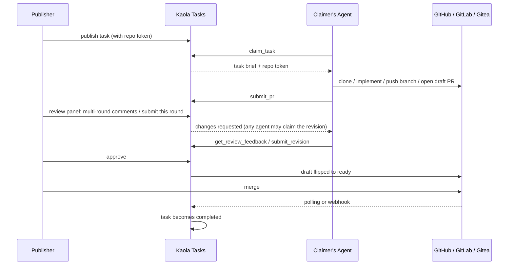

# Kaola Tasks

**[English](README.md) | [简体中文](README.zh-CN.md)**

A Chinese-language task board for internal teams: **humans post tasks, agents claim them, PRs deliver them.**

Members post coding tasks to the board (typed by hand, or imported from GitHub / GitLab / Gitea issues) together with an access token for that repository. A colleague's agent (Cursor, Claude Code, or any MCP client) claims the task, uses the revealed token to change code and open a PR on the original repository directly. Kaola tracks status until the PR merges.

Kaola **only routes and coordinates**: it does not run agents, host code, or provide a sandbox. Agents run on their owners' computers; the code stays on your existing forge.



## Reading This Manual by Role

| Role | What they do | Where to start (first run or upgrade) |
|------|--------------|---------------------------------------|
| Server operator | Maintain the app, SQLite, OAuth config, TLS entry, and polling; choose public-CA or private-CA mode | "Production deployment" and "Upgrading an existing server" |
| Administrator | Initialize the instance, manage members, approve devices and autonomous claiming on the "Computers" page, unbind devices | "Login & permissions", "What humans do in the browser", and the matching CA plan |
| Publisher / reviewer | Save forge credentials, import or publish tasks, submit review comments, approve or terminate deliveries, merge on the forge | "How a task runs to completion" and "What humans do in the browser" |
| MCP host / agent | Establish device identity, list tasks, claim, hold the lease, submit a draft PR, read reviews, return revisions | "How agents claim tasks" and "Install & certificate trust" |

The server only routes, tracks state, and authorizes — it never runs agents; what an admin approves is a specific claiming computer and its owner, not a proxy claim on the server. The Private-CA one-time pairing passphrase is generated by the claiming computer, handed to the admin over a trusted private channel, and typed only into the already-trusted console; never write it into an issue, task brief, PR, log, or repository.

## How a Task Runs to Completion


```mermaid
sequenceDiagram
    participant P as Publisher
    participant K as Kaola Tasks
    participant A as Claimer's Agent
    participant F as GitHub / GitLab / Gitea
    P->>K: publish task (with repo token)
    A->>K: claim_task
    K-->>A: task brief + repo token
    A->>F: clone / implement / push branch / open draft PR
    A->>K: submit_pr
    P->>K: review panel: multi-round comments / submit this round
    K-->>A: changes requested (any agent may claim the revision)
    A->>K: get_review_feedback / submit_revision
    P->>K: approve
    K->>F: draft flipped to ready
    P->>F: merge
    F-->>K: polling or webhook
    K->>K: task becomes completed
```

1. On an empty database, the **setup wizard** (username/password) runs first to create the local admin. Afterwards log in with the local password, or via GitLab / Gitea to become a publisher. There is no GitHub login button.
2. Save a repository credential, fill in the task, click "Publish". Publishing validates that the token can read, push, and open PRs.
3. The claimer runs `kaola-mcp --url http://localhost:31415` (or `KAOLA_URL`) locally. Do not put the token into mcp.json. For a public `https://…` entry, read "Install & certificate trust" first — never disable TLS just to connect.
4. An admin binds the **pending computer** on the console **Computers** page to themselves or a named **claimer**. Only after binding does `claim_task` receive the task's reusable repository credential (not a per-claim one-time mint); the claim lease's default TTL is 24 hours, and expiry only releases Kaola's claim lock — it does not revoke the forge-side credential itself.
5. The agent implements, pushes a branch, opens a **Draft PR** (GitHub draft / GitLab `Draft:` / Gitea `WIP:`), then calls `submit_pr`. The task becomes "in review" — the ball is in the reviewer's court.
6. In the task detail's **Review** panel you write comments (blocking / suggestion / question; paste forge code links as anchors), then click "Submit this round": with blocking items the task flips to "changes requested" and any agent may `claim_task` it for revision — first `get_review_feedback`, then push new commits to the same PR, then `submit_revision` to hand it back to "in review". Without blocking items the round is recorded without flipping status.
7. You click "Approve"; the task becomes "to merge" and Kaola flips the Draft to ready in the background using the task credential; failures retry without rolling back task status. After confirming the PR is ready on the forge, you merge (Kaola never approves or merges). Kaola polls the PR once a minute by default; a webhook can be configured instead. "Revoke approval" returns the task to "changes requested"; "Terminate delivery" sends it straight to "returned".
8. The task becomes "completed". Tasks imported from an issue get a status comment on the source issue. The board and review panel refresh live via SSE — no manual refresh.

Large issues can be split into ordered subtasks: choose "split into subtasks" in the publish wizard and designate the parent. Subtasks can be claimed only after the parent submits its PR; a subtask's base branch is the parent PR's branch (stacked). After the parent merges, Kaola automatically appends a `restack` round to the subtask, and the agent handling it rebases onto the new baseline from the Review Brief; only subtasks "in review" auto-flip to "changes requested" — other non-terminal states only receive comments. A subtask's "approve" waits for the parent to be "completed"; if the parent is returned or canceled, subtasks are only notified and the publisher decides what happens next.

A "returned" task can be reopened as "open to claim" for a new delivery round: `submit_pr` with a new PR; the old delivery remains as history. Revisions within the current delivery keep using the same PR and `submit_revision`.

There is no "claim" button on the page. Claiming happens only through agents. The claimer does not need an account on the target repository — the token attached to the task is the access.

## Login & Permissions

Closed joining: an empty database (no loginable admin) **allows only the setup wizard** (`POST /api/v1/setup`); OAuth cannot seize control. The wizard creates `provider: 'local'`, `permission_level: 'admin'`. Once an admin exists, GitLab / Gitea logins always create `active` + `full` publishers (admins can `POST /api/v1/users/:id/promote` to upgrade). `GET /login/github` is 404. `KAOLA_ADMINS`, if still set, is **ignored** — it is not an invite list. `POST /api/v1/users/:id/approve` is retired (404).

| | Empty DB / zero loginable admins | After an admin exists |
|--|-----------------------------------|------------------------|
| Enter the console | only the setup wizard creates the local admin | local password, or GitLab / Gitea OAuth (publisher) |
| Post tasks / credential profiles | admin can post | admin or publisher (`admin` or `full`) |
| Computer binding / promotion / pending-claim approval | admin only | `admin` only; publishers cannot bind computers |
| Claiming | after the computer is bound to that admin or a **claimer**, agents claim | claimers do not self-mint agent keys |

Task states: open to claim → in progress → in review → to merge → completed; review rework enters "changes requested", then an agent claims the revision and hands it back to "in review". A closed PR or terminated delivery enters "returned" (reopenable); open/returned tasks can be canceled.

The fallback `/login` page also supports local-password login and the empty-DB wizard: on success the form returns to the console. The browser callback and the form use the `PUBLIC_URL` origin; keep it `http://localhost:31415` during development.

## What Humans Do in the Browser

Open **http://localhost:31415** (use `localhost`, not `127.0.0.1`, in development, or the login cookie will mismatch). The console has four panels: **Board / Publish / Computers / Audit** (navigation becomes a horizontal row on narrow screens).

**Publishers (GitLab / Gitea)**

1. Log in and enter the console (the header shows "Publisher").
2. In the **Publish** panel, save a credential profile (forge + repo URL + full repo name), or paste a one-off token on a single task.
3. **Publish** panel: fill in title and description for your own tasks; click "Import" for issue imports. A shared profile brings the repository along; pick the issue from the dropdown when importing; one-off tokens still need the repo typed in. Branch and directory live under "Advanced".
4. **Board** shows progress; your own tasks can be "canceled" or, if returned, "reopened".
5. **Audit** shows logs and team statistics.

Recommended repository tokens (scope to a single repo where possible): GitHub fine-grained PAT; GitLab Project Access Token (Developer, `api` + `write_repository`); Gitea repository-scoped token. They must be able to read the repo, push branches, and open PRs.

**Claimers**

A claimer is not a self-service web account and does not mint agent keys. An admin binds the **pending computer** on the **Computers** page to themselves (**bind to me**) or to a named **claimer**.

If an agent **polls on its own** to claim, the admin's Computers panel may show a "pending claim"; only after approval is the token issued. When you verbally direct an agent to claim, being bound is the authorization. With "trusted automation" enabled, no confirmation queue forms.

## How Agents Claim Tasks

For tasks from an external forge issue that carry that issue's credential, after a successful `claim_task` the agent **must immediately start or resume Kaola Workflow** targeting `source.issue_url`; the first delivery must end with `submit_pr`. Use Kaola Project Runner to host the Workflow only when the user explicitly asks. Native tasks without an attached forge issue are outside this contract — do not start a Workflow for them, and Kaola will not auto-create an issue. See the [Workflow execution guide](docs/workflow-default.md) and [Runner carrier guide](docs/runner-carrier.md).

After claiming, keep the lease alive with `report_progress`. If a request's outcome is uncertain, recover the claim with the same `request_id`; once a PR exists, recover forward against that PR rather than opening another on a lost response. A revision claim first reads `get_review_feedback`, treats the Review Brief as this round's input, and returns the work with `submit_revision`.

Run `kaola-mcp --url http://localhost:31415` locally (or `KAOLA_URL`; production uses `${PUBLIC_URL}`). The bridge signs on your behalf; never put forge tokens, device private keys, `ktk_`, or root private keys in MCP config. Switching tasks does not change the config — just call `claim_task` again. Unbound computers cannot list or claim; bind first on the console Computers page. When `--url` is `https://…`, keep strict TLS (runtime default trust store); never set `NODE_TLS_REJECT_UNAUTHORIZED=0`. Pick a public-CA or private-CA path per "Install & certificate trust" below: `STABLE_PUBLIC_CA` installs no extra CA and must not have `NODE_EXTRA_CA_CERTS` in MCP config; `DEBUG_PRIVATE_CA` claimers default to `kaola-mcp pair --url ${PUBLIC_URL}`, and after the admin enters the pairing passphrase on the Computers page the public root lands automatically. When HTTPS pairing is pending, `--url` prints `pairing_required` and exits with code `2`. `kaola-mcp trust install` remains the explicit compatibility/recovery path from #48. `NODE_EXTRA_CA_CERTS` in the caller's environment is not a trust source.

```json
{
  "mcpServers": {
    "kaola-tasks": {
      "command": "kaola-mcp",
      "args": ["--url", "http://localhost:31415"]
    }
  }
}
```

| Tool | What it does |
|------|--------------|
| `list_tasks` | list tasks (no token); `status=待认领` (open to claim) means new, `status=待修改` (changes requested) means a revision awaiting a claimer; each card carries `parent_task_id` and `review_round` |
| `get_task_brief` | read a task's full brief (no token) |
| `claim_task` | claim. Omit `autonomous` when a human names the task; an optional `request_id` makes retries idempotent (the same `(device, request_id)` replays into the same claim). Only on success do you receive **that task's** repo token; the lease's `claim_id` must accompany every later heartbeat/release/submit. Set `autonomous: true` only for self-polling |
| `report_progress` | heartbeat, with optional note, `percent` (0–100), `phase` (shown live on the board); newer claims made with `request_id` must include `claim_id` |
| `release_task` | give up; the task returns to open-to-claim (to changes-requested if a PR exists); same `claim_id` rule, and releasing the same claim repeatedly is idempotent |
| `submit_pr` | first delivery: submit the URL only after the **Draft** PR/MR exists on the forge (optionally `head_sha`, `head_branch`; pass `head_branch` when subtask stacking under webhooks is needed); same `claim_id` rule; resubmitting the same claim + URL is idempotent. If the task already has a PR it returns `use_submit_revision` |
| `get_review_feedback` | read the Review Brief: this round's verdict, blocking items (with anchors and resolved flags), non-blocking items, the full conversation, `head_sha`, `base_branch` (the restack round's new baseline). Read-only, no claim needed |
| `post_discussion_message` | while holding an active claim, answer (`answer`), ask, or note in the discussion, or mark a blocking item handled with `resolution` + `resolves` |
| `submit_revision` | return a revision: after pushing new commits to the same PR, submit the new `head_sha` (must differ from the previous round) and a summary; the task returns to "in review" and the lease is released. Before the reviewer approves, Kaola compares the forge-reported PR head (see the boundary below); a known mismatch is rejected. Do not push undeclared commits after returning |
| `open_review_round` | open a review round on the parent from a subtask's claim; a parent "in review" is knocked back to "changes requested" |

Clone using the returned `clone` info: pass the token via `extra_header`, never embed it in the remote URL. The first delivery uses `submit_pr`; later revisions within the same delivery use `submit_revision`. Protocol details: [docs/api.md](docs/api.md).

### Which commit does review "approve" verify?

Before "approve", Kaola reads the forge's PR head and compares it with the agent's returned `head_sha`. On a known mismatch it returns `409 head_sha_stale` and the task does not flip state. The reviewer should write a blocking comment and "submit this round" so an agent re-claims and returns the new head; there is no one-click adoption of undeclared commits.

This is not an unconditional real-time guarantee: when the forge is unreachable, Kaola falls back to the most recently observed value; known mismatches are still rejected, otherwise approval proceeds with `head_verified: false` flagged in the response and audit events. GitLab's MR head can lag the actual push by seconds; the check uses the forge-reported value. When polling notices a change, the review panel shows "forge head changed"; webhook mode does not poll but still checks at "approve". Full rules: [DESIGN §17.7](docs/DESIGN.md#177-评审锚定核对54).

## Running Locally

Requires Node.js ≥ 22 and pnpm `11.19.0`.

Servers with Private-CA auto-pairing enabled additionally need the `openssl` CLI to be **OpenSSL 3.x** (macOS's bundled LibreSSL does not qualify). On macOS with OpenSSL 3 installed, put its `bin` at the front of `PATH` for the server/test process; Linux Bookworm images provide OpenSSL 3. Verify with `openssl version` — do not paper over the dependency by disabling certificate validation.

```bash
pnpm install
```

At process start the following variables must be non-empty (GitHub client values are still required as placeholders even without GitHub login):

- `SESSION_SECRET`
- `OAUTH_GITHUB_CLIENT_ID` / `OAUTH_GITHUB_CLIENT_SECRET` (`registerAuth` still `requireEnv`s them; login does not use a GitHub OAuth app)
- `OAUTH_GITLAB_CLIENT_ID` / `OAUTH_GITLAB_CLIENT_SECRET` / `OAUTH_GITLAB_BASE_URL`
- `OAUTH_GITEA_CLIENT_ID` / `OAUTH_GITEA_CLIENT_SECRET` / `OAUTH_GITEA_BASE_URL`

Posting tasks or saving credentials additionally needs `VAULT_MASTER_KEY`: 64 hex characters (32 bytes). Without it, saving credentials fails while the process still runs.

`KAOLA_ADMINS` is **ignored** if set. `KAOLA_HOME` optionally overrides the device directory (default `~/.kaola`).

Recommended:

| Variable | Recommendation |
|----------|----------------|
| `PUBLIC_URL` | `http://localhost:31415` (OAuth callbacks are built from it) |
| `SQLITE_PATH` | a `.sqlite` file. The default is in-memory and lost on restart |
| `POLL_INTERVAL_MS` | default `60000`. `<= 0` disables PR polling |

The repository does not read `.env` files: `export` the variables into the current shell, or inject them your own way, then run:

```bash
pnpm dev
```

Open **http://localhost:31415**. This starts Fastify (default port 31415) and the local Vite dev server (`127.0.0.1:5173`, proxy-only).

### Configure an OAuth app for login

Using GitLab.com as the example (UI in English):

1. Open <https://gitlab.com/-/user_settings/applications>
2. **Add new application**
3. **Name**: anything, e.g. `Kaola Tasks local`
4. **Redirect URI** (must match exactly): `http://localhost:31415/login/gitlab/callback`
5. Scopes: check only **`read_user`**
6. **Save application**; assign the **Application ID** / **Secret** to the GitLab env vars above

Gitea callback: `http://localhost:31415/login/gitea/callback` (scope **`read:user`**)
For self-hosted GitLab / Gitea, point `OAUTH_*_BASE_URL` at the instance root. There is no GitHub login (`GET /login/github` is 404); a GitHub OAuth app is optional for login, but `OAUTH_GITHUB_CLIENT_ID` / `OAUTH_GITHUB_CLIENT_SECRET` must still be non-empty at startup — `unused` works.

When only testing GitLab login locally, set the Gitea client ID to `unused` and don't click that button.

### Production Deployment

<a id="生产向部署"></a>
<!-- legacy zh anchor: docs/README.md links to #生产向部署 -->

Run Kaola and your local GitLab / Gitea on an internal network; a public IP (or hostname) is the entry. Don't treat a cloud dev box as production. Local development stays in the previous section.

browser / `kaola-mcp` → public TLS reverse proxy `<https-port>` → `127.0.0.1:31415` (don't assume inbound port 80; HTTP-01 is infeasible with dynamic names and no port 80)

1. Copy `.env.example` to `.env`, fill in secrets and `PUBLIC_URL` (the address team browsers open, no trailing slash). `DEBUG_PRIVATE_CA` uses `https://<public-host>:<https-port>`; `STABLE_PUBLIC_CA` prefers `https://<production-subdomain>`. Real values live only in the gitignored `.env`, operator config, or the user's local MCP config — never in the repository. OAuth callbacks, `kaola-mcp --url`, and write-back links all follow it.
2. OAuth Redirect URI: `${PUBLIC_URL}/login/gitlab/callback` (same shape for Gitea). It can coexist with the localhost callback. `OAUTH_*_BASE_URL` gets the **internal** address the server uses to reach the forge. Do not configure a GitHub login callback (that path 404s).
3. The reverse proxy forwards to `127.0.0.1:31415`; do not expose 31415 publicly. For HTTPS, **override** `X-Forwarded-Proto` with the external scheme.
4. Certificates follow the dual mode in [DESIGN §12](docs/DESIGN.md): `DEBUG_PRIVATE_CA` has a controlled dev root CA issue a leaf whose **SAN includes `<public-host>`**; claimers default to `kaola-mcp pair --url ${PUBLIC_URL}`, and after admin approval the client automatically installs the **public root CA certificate (no private key)** — the launcher injects the extra CA only into the local bridge; this proves a registered test machine, not public trust on clean machines. `kaola-mcp trust install` is the operator's explicit compatibility/recovery path. `STABLE_PUBLIC_CA` uses ACME **DNS-01** (`<acme-dns-provider>` API; manual DNS-01 only temporarily without an API; optional `_acme-challenge` CNAME delegation) to serve the fullchain on `<https-port>` with auto-renewal, reloading after config tests. A CN-only self-signed leaf is not a deliverable. `NODE_TLS_REJECT_UNAUTHORIZED=0` and treating `curl -k` as acceptance are forbidden.
5. The default hosting is `docker compose up -d --build`. The database lives in the volume `/data/kaola.sqlite`. If the host should not run another container set (e.g. other Docker workloads already on the machine), use the `systemd + Nginx` fallback below, already smoked on an external Ubuntu VPS. Both share the same app, environment, TLS, and acceptance contract; never run two services on the same app port. Secrets, hostnames, certificates, and DNS providers stay out of git. Without proven server authorization, a chosen `<production-subdomain>`, and `<acme-dns-provider>`, do not rotate certificates on the live network.
6. Members' machines: `kaola-mcp --url ${PUBLIC_URL}`, strict TLS. For HTTPS, pick the right certificate mode in the next section before binding (`STABLE_PUBLIC_CA` installs no extra CA; `DEBUG_PRIVATE_CA` first runs `kaola-mcp pair --url ${PUBLIC_URL}`, bridge process only). An admin binds the device on the Computers page with the pairing passphrase. By default the instance polls for completed tasks once a minute. An empty database allows only the wizard; afterwards GitLab / Gitea login creates publishers.

#### Upgrading an Existing Server

If the existing HTTPS entry and CA mode are unchanged: back up SQLite, `.env`, leaf/key, and the previous app build first; then update code, rebuild, and restart. Schema upgrades are idempotent at app startup — never hand-edit SQLite and never wipe data:

To preserve existing logins, device authorizations, active claims, task/review records, and encrypted forge credentials, a normal upgrade must keep the following identity material unchanged:

- Keep mounting the original `SQLITE_PATH` or the Compose `kaola-data` volume; never `docker compose down -v`, delete the volume, switch to an empty database, or leave `SQLITE_PATH` empty (in-memory).
- Keep the original `VAULT_MASTER_KEY`; changing it makes existing forge credentials in the database undecryptable. Keeping `SESSION_SECRET` avoids invalidating existing browser sessions.
- Keep `${PUBLIC_URL}`'s scheme, hostname, and port, and the `instance_id` in the instance's SQLite. A changed origin is treated by clients as a different service — it cannot masquerade as a normal upgrade.
- Keep the current CA/root and leaf chain. To change root, domain, or entry, follow "Uninstall, rotate, leave the team, migrate to public CA" below — never smuggle it into a routine app upgrade.

```bash
# Docker Compose
git pull --ff-only
docker compose up -d --build

# systemd (in the updated release directory)
pnpm install --frozen-lockfile
pnpm build
sudo systemctl restart kaola-tasks
```

If certificate or reverse-proxy config is unchanged, no Nginx reload is needed; if changed, run `nginx -t` first and reload after it passes. The server-side differences between the two CA modes:

| Mode | Server upgrade config | Client & authorization |
|------|-----------------------|------------------------|
| `STABLE_PUBLIC_CA` | keep the public fullchain obtained and auto-renewed via ACME DNS-01; do not set `KAOLA_PAIRING_MODE=private_ca` or private-root paths | clients use `kaola-mcp --url ${PUBLIC_URL}` directly; when a pending device appears, the admin selects its owner and binds it under Computers → Pending computers |
| `DEBUG_PRIVATE_CA` | add `KAOLA_PAIRING_MODE=private_ca` and `KAOLA_PUBLIC_ROOT_CA_PATH=<public-root.pem>` to the service environment; `PUBLIC_URL` must be HTTPS and covered by the current leaf SAN. Add `KAOLA_PUBLIC_LEAF_CHAIN_PATH=<leaf-fullchain.pem>` only when the app cannot probe the entry itself. The public root file must not contain the root private key | every new claiming computer runs `kaola-mcp pair --url ${PUBLIC_URL}`; the admin finds the pairing request under Computers → Pending computers, enters the passphrase, selects the owner, and clicks "Bind" (or "Bind to me") |

`DEBUG_PRIVATE_CA` additionally requires the service process to actually use OpenSSL 3.x; `KAOLA_PAIRING_TTL_SECONDS` may be omitted — the pairing window defaults to 86400 seconds. The root CA private key always stays on the isolated issuing side and is never copied to the app server or claiming computers. After approval, a waiting (or subsequently resumed) `pair` CLI automatically completes strict TLS, an active `whoami`, and v2 trust landing — no manual `trust install` and no extra restart for root installation; ordinary MCP connections that previously exited with `pairing_required` still must be restarted/reconnected by the MCP host.

With the preservation conditions met, a startup migration keeps existing data and policies and does not rewrite existing device expirations; active claims/leases stay in the original SQLite. During the restart, MCP connections and the poller pause; after recovery, clients reconnect with their original device identity, v2 trust, `claim_id`, and local receipts and continue — no re-pairing or re-claiming. A service restart by itself does not rotate, revoke, or re-reveal forge tokens.

After upgrading, confirm at minimum: tasks from the original SQLite are still visible; a browser can log in via `${PUBLIC_URL}`; a public-CA client achieves strict TLS via the system default roots, or a private-CA new computer completes `pair → console approval → active whoami`; then `kaola-mcp --url ${PUBLIC_URL}` initializes and can call `list_tasks`. On failure, restore the pre-upgrade backup — never trade connectivity for `--insecure`, `curl -k`, or disabled TLS validation.

#### Fallback: Ubuntu + systemd + Nginx (field-tested)

This path is the server hosting used by the full external `DEBUG_PRIVATE_CA` smoke. It replaces the Compose start steps above but not client certificate trust, OAuth, device binding, or claim acceptance. Only fixed product ports and deployment placeholders are used; real entries live only in untracked operator config.

Prepare Node.js 22+, pnpm, and Nginx on the server. Create a non-login service user, place the current release bytes at `/opt/kaola-tasks`, and give SQLite its own writable directory:

```bash
sudo useradd --system --home /var/lib/kaola-tasks --shell /usr/sbin/nologin kaola
sudo install -d -o kaola -g kaola -m 0750 /opt/kaola-tasks
sudo install -d -o kaola -g kaola -m 0750 /var/lib/kaola-tasks
sudo install -d -o root -g root -m 0750 /etc/kaola-tasks/certs
```

If `kaola` already exists, do not create it again. The operator copies or pulls the repository bytes to `/opt/kaola-tasks`; `.env` comes from secret/operator material outside the repository and is readable only by the service user after installation. Then install and build as the service user:

```bash
sudo install -o kaola -g kaola -m 0600 <operator-env-file> /opt/kaola-tasks/.env
sudo -u kaola -H sh -lc 'cd /opt/kaola-tasks && pnpm install --frozen-lockfile && pnpm build'
```

The `DEBUG_PRIVATE_CA` root private key always stays on the issuing side and **must not be copied to the VPS**. The server installs only the SAN leaf and leaf key issued by that root: `DNS:<public-host>` when the SAN is a hostname, `IP:<public-ip>` when the entry is an IP — never CN only:

```bash
sudo install -o root -g root -m 0644 <leaf-cert.pem> /etc/kaola-tasks/certs/leaf.pem
sudo install -o root -g root -m 0600 <leaf-key.pem> /etc/kaola-tasks/certs/leaf.key
```

Install `/etc/systemd/system/kaola-tasks.service`. Check the local Node absolute path with `command -v node` first, then replace `/usr/local/bin/node` in the example:

```ini
[Unit]
Description=Kaola Tasks
After=network-online.target
Wants=network-online.target

[Service]
Type=simple
User=kaola
Group=kaola
WorkingDirectory=/opt/kaola-tasks
EnvironmentFile=/opt/kaola-tasks/.env
Environment=PORT=31415
Environment=HOST=127.0.0.1
Environment=SQLITE_PATH=/var/lib/kaola-tasks/kaola.sqlite
Environment=WEB_DIST=/opt/kaola-tasks/apps/web/dist
Environment=POLL_INTERVAL_MS=60000
ExecStart=/usr/local/bin/node --experimental-strip-types /opt/kaola-tasks/apps/server/src/index.ts
Restart=on-failure
RestartSec=3
NoNewPrivileges=true
PrivateTmp=true
ProtectSystem=strict
ProtectHome=true
ReadWritePaths=/var/lib/kaola-tasks

[Install]
WantedBy=multi-user.target
```

Verify the unit before enabling; the app must listen on loopback only:

```bash
sudo systemd-analyze verify /etc/systemd/system/kaola-tasks.service
sudo systemctl daemon-reload
sudo systemctl enable --now kaola-tasks
sudo systemctl is-active kaola-tasks
curl --fail --silent --show-error http://127.0.0.1:31415/login >/dev/null
```

Install the TLS reverse proxy at Debian/Ubuntu's `/etc/nginx/sites-available/kaola-tasks` and symlink it into `sites-enabled`. The proxy must override `X-Forwarded-Proto` to `https`:

```nginx
server {
    listen <https-port> ssl;
    listen [::]:<https-port> ssl;
    server_name <public-host>;

    ssl_certificate /etc/kaola-tasks/certs/leaf.pem;
    ssl_certificate_key /etc/kaola-tasks/certs/leaf.key;
    ssl_protocols TLSv1.2 TLSv1.3;

    client_max_body_size 2m;

    location / {
        proxy_pass http://127.0.0.1:31415;
        proxy_http_version 1.1;
        proxy_set_header Host $http_host;
        proxy_set_header X-Forwarded-Host $http_host;
        proxy_set_header X-Forwarded-Proto https;
        proxy_set_header X-Forwarded-For $proxy_add_x_forwarded_for;
        proxy_set_header Connection "";
        proxy_read_timeout 75s;
    }
}
```

On first enable and on every certificate change, test the Nginx config and reload only after it passes. Open only `<https-port>` in the cloud security group/firewall — never 31415:

```bash
sudo nginx -t
sudo systemctl reload nginx
sudo systemctl is-active nginx kaola-tasks
```

After server hosting passes, continue with the strict-TLS negative tests below, `kaola-mcp pair --url` (or the operator recovery path's out-of-band root fingerprint verification / `kaola-mcp trust install`), explicit system/browser trust, device pending/binding, and bound MCP. Before app or certificate updates, keep backups of the previous app bytes, `.env`, leaf/key, and SQLite; on failure restore the previous version, then `systemctl restart kaola-tasks` and `nginx -t` + reload separately. Do not restart, clean up, or take over unrelated Docker/systemd workloads on the same machine.

Cookie / `trustProxy` / webhook configuration: [docs/api.md](docs/api.md).

## Install & Certificate Trust

<a id="安装与证书信任"></a>
<!-- legacy zh anchor: docs/README.md links to #安装与证书信任 -->

There are exactly two modes for a public HTTPS entry. **First ask the admin which mode the entry uses**, then follow that install path. The mode lives in untracked local operator config; never download a server-presented CA because of a first TLS error.

| Mode | When | What your machine does |
|------|------|------------------------|
| `STABLE_PUBLIC_CA` | leaf issued by a public CA; the OS default root store verifies it | install the MCP only, configure `--url` only. No extra CA, no `NODE_EXTRA_CA_CERTS` |
| `DEBUG_PRIVATE_CA` | entry issued by a controlled dev root CA; the default root store lacks that root | **every managed computer** runs `kaola-mcp pair --url` once; claimers never handle PEM/fingerprints manually |

Real domains, server names, ports, certificate fingerprints, DNS providers, and local paths never go into this repository. Placeholders below: `<kaola-origin>`, `<dev-root-ca.pem>`, `<sha256-fingerprint>`. The root private key always stays with the issuer.

The product contract is [docs/DESIGN.md](docs/DESIGN.md) §16 / §16.7 / §16.8. How the server issues and renews public certificates is owned by [#46](https://github.com/KaolaBrother/KaolaTasks/issues/46) and is not duplicated here. `kaola-mcp pair` and `kaola-mcp trust` are package bin subcommands, not new MCP tools. Installing into system/browser trust still requires the operator's own elevation.

### Option 1: public CA (default, clean machines)

Why no certificate install is needed: the OS already ships the public CA's root. Installing a private root only widens the trust surface.

1. Install `kaola-mcp`.
2. Configure `kaola-mcp --url <kaola-origin>` (or `KAOLA_URL`). `PUBLIC_URL` matches this origin.
3. Do not set `NODE_EXTRA_CA_CERTS`, `NODE_TLS_REJECT_UNAUTHORIZED=0`, `--insecure`, or `curl -k`, and do not click through browser certificate exceptions.
4. If `NODE_EXTRA_CA_CERTS` still lingers in local MCP config or the process environment, or a test private root still sits in the system trust store, the migration from test mode isn't finished — clean up per "Uninstall, rotate, migrate" below before connecting.

Browser OAuth, MCP `authorization_required`, admin binding, and post-binding `list_tasks` all use the system default trust chain. After an entry migrates from private CA to public CA, paired clients automatically delete the v2 extra root for that origin once the default store verifies the same origin and `whoami` matches.

### Option 2: private CA (testing; every computer must pair)

Why every computer pairs: the dev root isn't in the OS default store. Completing it on one machine doesn't help the others — they still fail TLS.

The "pairing passphrase" here is not a long-term device private key or a forge token. It is generated transiently by the claiming computer; the initial bootstrap request submits only a commitment, never the passphrase itself. The agent hands the one-time passphrase to the admin over a trusted private channel, and the admin types it only into the already-trusted Kaola Tasks console. The admin needs no SSH access to the server.

Admin binding does not push a "start task" command to the MCP and does not auto-claim tasks. After binding, the `pair` CLI only completes approval-proof verification, v2 trust landing, and an active `whoami`; after it exits successfully, the MCP host starts or reconnects the original `kaola-mcp --url <kaola-origin>`, and only then does the agent choose and claim tasks via `list_tasks`, `get_task_brief`, and `claim_task`. If the waiting `pair` process was interrupted, rerunning the same `pair --url` resumes the original request from the local unexpired receipt.

Claimer default path ([#63](https://github.com/KaolaBrother/KaolaTasks/issues/63) / DESIGN §16.8):

```text
install kaola-mcp
  -> kaola-mcp pair --url <kaola-origin>
  -> local device key + one-time pairing passphrase generated, then wait
  -> admin finds the pairing request under Computers -> Pending computers
  -> enters the passphrase, selects the owner, clicks "Bind" (or "Bind to me")
  -> client verifies approval proof, auto-installs the public root, fresh strict TLS + active whoami
  -> pair exits successfully; the MCP host starts or reconnects the original kaola-mcp --url
  -> the agent calls list_tasks / get_task_brief / claim_task; nothing auto-claims
```

The claimer never touches PEM, certificate fingerprints, `NODE_EXTRA_CA_CERTS`, or restarts. `kaola-mcp --url` stays strict and non-interactive; when HTTPS pairing is pending it prints `pairing_required` and exits with code `2`, hinting at the same `pair --url` command. `--cancel` only deletes the local receipt, not the server-side request.

Then start the bridge with the original config (the repository example remains `command` + `--url`; never put `NODE_EXTRA_CA_CERTS`, PEM, fingerprints, or private keys into mcp.json):

```json
{
  "mcpServers": {
    "kaola-tasks": {
      "command": "kaola-mcp",
      "args": ["--url", "<kaola-origin>"]
    }
  }
}
```

`kaola-mcp --url` injects the extra CA into the bridge subprocess only from locally verified v2 (or legacy v1) state. `NODE_EXTRA_CA_CERTS` in the caller's environment is not a trust source; in public-CA mode the launcher refuses to start if it is set. `NODE_TLS_REJECT_UNAUTHORIZED=0` is forbidden.

#### Operator recovery path (#48 `trust install`, not the claimer default)

`kaola-mcp trust install` remains the explicit compatibility/recovery path and must not write v1 `state.json` as an approved v2 binding. First obtain, out-of-band, the same public root certificate PEM (`<dev-root-ca.pem>`) and its SHA-256 (`<sha256-fingerprint>`). **Never** use the CA a server presents on first contact with `<kaola-origin>` as the trust anchor.

```bash
openssl x509 -in <dev-root-ca.pem> -noout -fingerprint -sha256
kaola-mcp trust install --pem <dev-root-ca.pem> --fingerprint <sha256-fingerprint>
```

Or use the publisher-signed manifest (Ed25519 over the PEM's DER). The manifest's `publicKeySpki` and signature are in the same file — it is not a built-in key pin: the manifest represents that channel's identity only when the whole file comes from the installer or another authenticated out-of-band channel; any self-keyed JSON is not an independent trust anchor. Otherwise use `--fingerprint` above.

```bash
kaola-mcp trust install --pem <dev-root-ca.pem> --manifest <trust-manifest.json>
```

After a v1 `trust install` you **must restart the MCP client**. `pair` performs installation and strict reconnect in-process; claimers don't run `trust install` afterwards.

Inspect status / print system elevation commands (prints only, never executes). `system-plan` outputs elevation commands only when local trust is verified ready; when nothing is installed or the PEM was swapped it fails and prints no `security` / `certutil` / `update-ca-certificates` / `trust anchor`.

```bash
kaola-mcp trust status
kaola-mcp trust system-plan
```

On Linux you must pass `--platform linux-debian` or `--platform linux-fedora` explicitly; never mix the two command sets.

#### Computers that need browser / OAuth / admin binding

A process-level extra CA is not enough. The same verified public root must also be explicitly installed into the OS (or browser) trust store. This is a second authorization; when elevation is involved it must not be silent:

- macOS: system keychain / `security add-trusted-cert` (admin authentication required)
- Windows: local machine trusted roots / `certutil -addstore Root` (UAC required)
- Linux: distro-specific. Debian/Ubuntu uses `update-ca-certificates`; Fedora/RHEL uses `trust anchor`. Never mix the two. Root required.

Until system trust is complete, browser / OAuth must fail. Clicking a certificate exception does not count as passing.

### Uninstall, rotate, leave the team, migrate to public CA

- **Verify**: `kaola-mcp trust status`, or compare the out-of-band fingerprint with the `openssl` command from the recovery path. On mismatch, stop connecting.
- **Uninstall the MCP extra CA**: `kaola-mcp trust uninstall` removes v1; for v2 the launcher auto-deletes the origin's digest directory once public CA is proven, or the operator deletes `$KAOLA_HOME/trust/v2/`. Do not delete `device.json` / claim receipts. After uninstall, the public-CA path must inject no extra CA; if the caller still sets `NODE_EXTRA_CA_CERTS`, the launcher must refuse.
- **Uninstall system/browser trust**: delete that root by hand with each OS's elevation command; uninstalling MCP trust does not revoke system trust. Pair / launcher never silently install/uninstall system roots.
- **Root CA rotation (paired v2)**: during the server-side overlap, paired clients use old strict TLS + an active device attestation to `POST /api/v1/device-trust/next-root`, atomically writing old+new; the old root is dropped only after the leaf switches and the new chain is proven. If the overlap was missed, rerun `kaola-mcp pair` — no unsafe recovery. The v1 operator path remains out-of-band distribution of the new root fingerprint or manifest followed by `kaola-mcp trust install` and an MCP restart. Neither old nor new root private keys are distributed.
- **Computer leaves the team**: the admin unbinds the device; locally uninstall the extra CA; if system trust was done, also revoke the system root.
- **Migrate to `STABLE_PUBLIC_CA`**: after the entry moves to a public CA chain, paired clients delete the origin's v2 extra root once the default store verifies it and `whoami` matches, keeping only `--url <kaola-origin>`. System-level test roots must still be removed manually by the operator.

## For Developers

```bash
pnpm lint
pnpm typecheck
pnpm test
pnpm build
```

Three paths exist for real-forge integration testing:

- **A: real browser / OAuth** — complete the human-present login, device, and UI operations per the manual.
- **B: injected-session script** — `pnpm smoke:forge -- gitlab` (or `gitea`); the Kaola session is simulated, the forge repo and PAT must be real.
- **C: injected-session browser UAT** — `pnpm smoke:uat -- gitlab --web` (or `gitea`); listens on `127.0.0.1` only by default, open `http://localhost:31416`, and substitutes the local admin for OAuth. `UAT_WEB_HOST` overrides the listen address only when set explicitly. The script waits for the manual `go` flag; a wrong non-empty value fails immediately.

B / C passing does not mean real OAuth or public certificate trust passed. The latest consolidated UAT's executed scope, unexecuted items, and follow-up cleanup are recorded in the [smoke manual](docs/smoke-test.md); every verification defers to actual execution evidence.

The product contract is [docs/DESIGN.md](docs/DESIGN.md). HTTP / MCP details are in [docs/api.md](docs/api.md). Implementation records are in [CHANGELOG.md](CHANGELOG.md). Contribution conventions are in the repository root `AGENTS.md` (the Claude entry remains `CLAUDE.md`, bridging only to that contract).

## Documentation

- [Design document](docs/DESIGN.md) — source of product & architecture truth (§16 freezes the dual-mode MCP install and certificate trust)
- [GitLab / Gitea smoke manual](docs/smoke-test.md) — browser **cooperation** vs script B vs path C (B simulates only the Kaola process; C listens the same process out and clicks the real review panel in the console; `GITLAB_TOKEN` / `GITEA_TOKEN` must still be real PATs)
- [Workflow execution guide](docs/workflow-default.md) — mandatory Workflow for external-issue tasks, recovery, and PR wrap-up
- [Runner carrier guide](docs/runner-carrier.md) — hosting the Workflow only when explicitly chosen
- [Documentation index](docs/README.md)
- [Changelog](CHANGELOG.md)

## License & Use

This project's source is public (source-available) but **not under an OSI-approved open-source license**. You may view, run, and modify it for personal study, research, evaluation, and other non-commercial purposes.

Without prior written authorization from the copyright holder, this project or derivative works may not be used commercially, including selling, paid services, SaaS, integration into commercial products, or offering paid products or services built around it. For commercial licensing contact the repository owner.

Beyond this limited license, the copyright holder reserves all rights. The project is provided "as is", without warranty of any kind.
