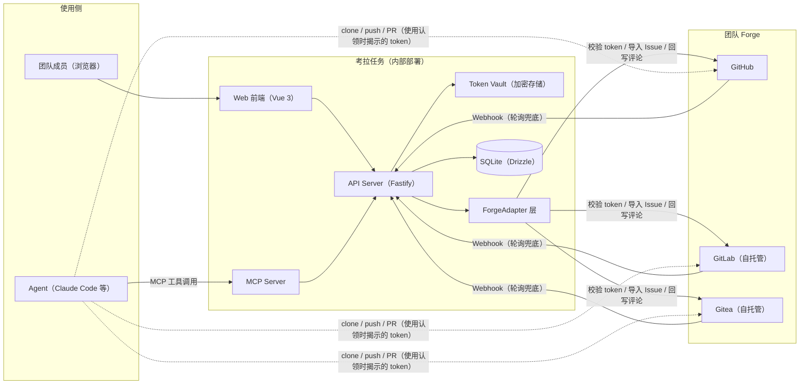
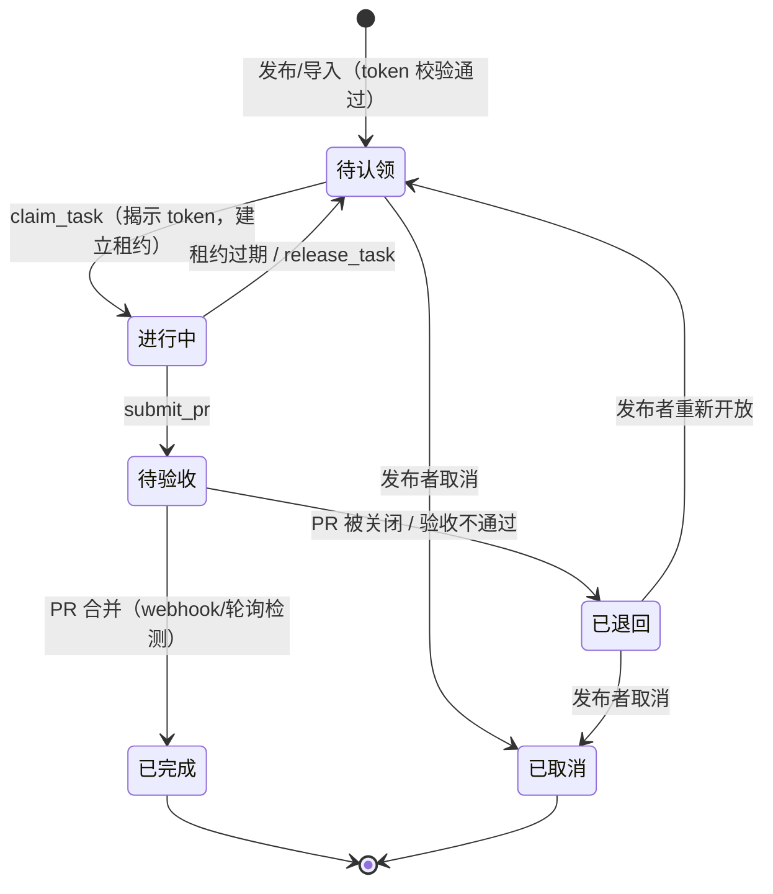

# 考拉任务（Kaola Tasks）设计文档

> 版本：v0.5（2026-09-01）· 状态：草案；v0.5 增补：公网 HTTPS 为双模式合同 `DEBUG_PRIVATE_CA` / `STABLE_PUBLIC_CA`（DNS-01，不依赖入站 80）；`kaola-mcp` 保持严格 TLS 校验；仓库文档只用占位符，不写入真实主机名/端口/证书身份。同版另增补双模式 MCP 安装与证书信任（#48）——`STABLE_PUBLIC_CA` 公开 CA 默认路径严格系统信任、不装额外 CA、不设 `NODE_EXTRA_CA_CERTS`；`DEBUG_PRIVATE_CA` 测试路径每台纳管电脑都要信任同一份公开根证书：MCP 只通过进程级 `NODE_EXTRA_CA_CERTS`，系统/浏览器提权信任另一次显式授权。首次连接不得盲信服务器返回的 CA。服务端公网证书签发/续期由 #46 拥有（§12）；客户端安装与信任由 #48 拥有（§16 / §16.7）：package bin `kaola-mcp trust` 写入 `$KAOLA_HOME/trust/`（`root-ca.pem` + host-neutral `state.json`），`kaola-mcp --url` 只从已核验 state 注入额外 CA。v0.4：Claim MCP 完整生命周期以 Kaola Workflow 为默认工程协议、Kaola Project Runner 为用户显式选择的可选 carrier；兼容层单向归 Kaola Tasks，采用减法设计且不设置版本 hard gate。v0.3：管理员 ≠ 发布者——空库设置向导建 `local` 密码管理员；GitLab / Gitea OAuth 建发布者（可升级）；拿掉 GitHub 登录（适配器与发布表单的 GitHub 仓库仍在）。

---

## 1. 概述

**一句话定义：** 考拉任务是一个团队内部的中文任务协作平台。成员把编码任务发布到任务板上（手工创建，或从 GitHub / GitLab / Gitea 的 Issue 导入），并为任务附上 forge 访问令牌；其他成员的 Agent（Claude Code 等任意运行时）通过 MCP 认领任务、直接访问代码仓库完成实现，最终以 PR 的形式交付回目标 forge。平台全程跟踪任务闭环，直至 PR 合并。

**定位边界（最重要的一条）：** 考拉任务**只做路由与协调**，不做执行。Agent 运行在各自主人的运行时里，代码托管在团队既有的 forge 上。平台不跑 Agent、不托管代码、不做沙箱。

**使用场景：** 团队的代码分散在 GitHub、自托管 GitLab、自托管 Gitea 三种 forge 上。本平台为纯内部工具（inner circle），不对外开放、不做商业分发、无激励/赏金体系。

## 2. 决策记录

头脑风暴阶段已确认的决策：

| # | 决策项 | 结论 |
|---|--------|------|
| D1 | 激励模式 | 纯协调，无积分/赏金（内部工具） |
| D2 | Forge 支持 | GitHub / GitLab / Gitea 三者从第一天起走统一适配层 |
| D3 | 凭证模式 | 发布任务**强制**附带 token；Agent 认领后用该 token 直接访问 forge |
| D4 | 分发方式 | 仅内部部署，不对外分发 |
| D5 | 技术栈 | TypeScript 全栈：Vue 3 前端 + Node API + 官方 MCP TS SDK + Drizzle/SQLite |
| D6 | 登录方式 | 两条进工作台的路，不要混：设置向导创建的考拉用户名/密码（`provider: 'local'`，管理员）；已有管理员之后的 GitLab / Gitea OAuth（发布者，可被升级为管理员）。**没有 GitHub 登录**（GitHub 适配器与发布表单里的 GitHub 仓库仍在） |
| D7 | Token 附着方式 | 凭证档案（Credential Profile）复用为主，允许单任务临时 token 覆盖 |
| D8 | 登录与权限分级 | `permission_level`：`admin`（管理员） / `full`（发布者） / 遗留 `claim_only`（不再新建）。空库（无可登录管理员）只许设置向导；OAuth 不得抢权。已有管理员后，GitLab / Gitea 登录一律建 `active`+`full` 发布者（无 `uninvited`）。管理员可把发布者升级为 `admin`。`KAOLA_ADMINS` 忽略、不炸 boot。认领者不是 Web 账号。Agent 鉴权为本机设备证明，不是自助 Agent Key |

## 3. 角色与核心概念

- **管理员（人）**：设置向导创建的考拉用户名/密码（`provider: 'local'`），或 GitLab / Gitea 发布者被升级后仍走原 OAuth（`permission_level: admin`）。管实例：电脑绑定/解除（含 `bind_to_self`）、认领者、把发布者升为管理员。**兼顾发布**：可绑仓库 PAT、发任务。不是认领者；不另开第二个密码管理员。
- **发布者（人）**：只留 GitLab / Gitea OAuth（`permission_level: full`）。登录后绑仓库 PAT，导入/发布任务卡；看看板与审计。不管实例、不升级别人、**不绑/解除任何电脑**（含不能 `bind_to_self`）。凭证档案仍是团队共享，不按 OAuth 来源硬限制 forge 种类。
- **认领者（命名身份）**：独立于 `users` 的认领身份，**没有 Web 登录**，不能进工作台。由管理员在绑定待授权电脑时命名。不是 OAuth 账号，也不是 `claim_only` 网页用户。
- **Agent**：任意 MCP 兼容运行时。经本机 stdio 桥以设备证明调用考拉 MCP，获取任务、汇报进度、提交 PR 链接。实际的 clone / 编码 / push / 开 PR 都由 Agent 用揭示的 forge token 直接对 forge 完成。
- **任务卡（Task Brief）**：结构化、机器可读的任务契约（见 §6），是平台相对"裸 Issue"的核心增值。
- **租约（Lease）**：认领即租约，带 TTL 与心跳，防止任务被挂死占用。绑定电脑本身不认领任务。

## 4. 系统架构



组件职责：

1. **Web 前端（中文界面）** — 零管理员时为设置向导；有管理员后为直接登录 + GitLab / Gitea（无 GitHub 按钮）。工作台：任务看板、任务详情、发布向导、凭证档案、审计日志。电脑/认领者/升级入口仅管理员。认领者不能登录工作台。
2. **API Server** — 任务生命周期状态机、租约管理、认证鉴权、审计记录。REST 全量镜像 MCP 能力，供非 MCP 运行时或脚本使用。
3. **MCP Server** — Agent 的入口（见 §9）。服务端仍是 Streamable HTTP；本机 `kaola-mcp` 用设备私钥签名后转发。配置一次 stdio `command` + 考拉 URL，之后一句"去考拉接单"即可。身份不是自助 Agent Key Bearer。
4. **ForgeAdapter 层** — 统一接口、三份实现（见 §8）。GitLab / Gitea 均支持自定义 base URL（自托管）。
5. **Token Vault** — 凭证加密存储与"认领时揭示"机制（见 §7）。
6. **同步机制** — Webhook 优先，轮询兜底（自托管 forge 在内网/防火墙后时 webhook 可能打不进来，需可配置）。

## 5. 任务生命周期



规则：

- **发布即校验**：任务发布/导入时，适配层用所附 token 实测权限（能否读仓库、能否推分支、能否创建 PR）。token 失效或权限不足的任务不会出现在看板上。
- **认领即租约**：默认 TTL 建议 24h（可按任务配置）。Agent 通过 `report_progress` 心跳续约；租约过期自动回到"待认领"，只撤销 Kaola Tasks 自身的生命周期权威与 Claim 锁定——揭示的 forge 凭证是可复用的仓库凭证，不因租约过期或释放而被吊销（措辞修正与 per-Claim 铸造/吊销的非目标见 §15「凭证语义」）。
- **验收在 forge 上完成**：发布者在 forge 上按正常流程 review PR，考拉只反映状态（PR 开了 → 待验收；合并 → 已完成）。导入型任务同时把状态以评论形式回写到源 Issue。

## 6. 任务卡（Task Brief）Schema

发布表单与 Agent 拿到的 JSON 是同一份契约（Agent 侧不含 token，token 走认领揭示通道）：

```jsonc
{
  "id": "kt-2026-0142",
  "title": "为订单导出接口增加分页",
  "description_md": "……（Markdown 详述）",
  "source": {                        // native 或 imported
    "type": "imported",
    "issue_url": "https://gitea.internal.example/team/orders/issues/87"
  },
  "repo": {
    "forge": "gitea",                // github | gitlab | gitea
    "base_url": "https://gitea.internal.example",
    "full_name": "team/orders",
    "base_branch": "main",
    "suggested_dir": "orders"      // 建议的本地克隆目录名（Agent 可覆盖）
  },
  "acceptance_criteria": [           // 验收标准，逐条可核对
    "GET /api/orders/export 支持 page/page_size 参数",
    "新增单元测试覆盖分页边界"
  ],
  "test_command": "pnpm test",
  "constraints": {
    "allowed_paths": ["src/api/**", "tests/**"],
    "forbidden_paths": ["migrations/**"]
  },
  "pr_convention": {
    "branch_prefix": "kaola/kt-2026-0142-",
    "title_prefix": "[kt-2026-0142] "
  },
  "credential": { "profile_id": "cp-gitea-orders" },  // 二选一，见下方说明
  "priority": "P1",
  "tags": ["backend", "api"],
  "poster": "zhang.wei",
  "status": "待认领",
  "created_at": "2026-08-20T12:00:00+08:00"
}
```

**`id` 形式**：`kt-<年份>-<四位序号>`（如 `kt-2026-0142`），全局唯一且可读；`pr_convention` 的分支前缀与标题前缀由它派生。平台内部另有自增主键，不对外暴露。

**`credential` 是引用，不是 token 本身**，两种形态二选一：

| 形态 | 含义 |
|------|------|
| `{ "profile_id": "cp-gitea-orders" }` | 引用团队共享的凭证档案（§7） |
| `{ "inline": true }` | 该任务附带单任务临时 token，密文随任务存储 |

两种形态下任务卡都**不含 token 明文**——`inline` 只声明"有一份专属凭证在等着"，不携带任何凭证内容；两者都只在 `claim_task` 成功时经揭示通道下发。

### 发布向导

Web「发布」页的收集规则（HTTP 仍是现有 `POST /api/v1/tasks` / `POST /api/v1/tasks/import`；§6 键集不变，JSON 示例里的 `acceptance_criteria` / `test_command` / `constraints` / `priority` / `tags` 仍属于 Task Brief）：

- **主路径（来源 = 从 Issue 导入）**：选档案 → 选 Issue → 「导入」仍 `POST /api/v1/tasks/import`（不落库、不做发布即校验）。导入成功后**不**展示可编辑的标题/描述输入，改为只读 Issue 卡片：标题为纯文本（不是 input）；`description_md` 以 Markdown 渲染**或**等宽/纯文本预览（当前前端无 Markdown 库，二者均可）；`source.issue_url` 可点击。卡片保留到再次导入或改选另一条 Issue；导入成功前不展示空卡片。「发布」仍 `POST /api/v1/tasks`，请求的 `title` / `description_md` / `source` / `repo` / `credential` 来自导入结果与所选档案（人不能改标题/正文）。
- **不再收集或展示**：验收标准、测试命令、允许路径、禁止路径、优先级、标签。发布请求**省略**这些键；服务端缺省仍为 `acceptance_criteria` `[]`、`test_command` `''`、`constraints` `{ allowed_paths: [], forbidden_paths: [] }`、`priority` `'P2'`、`tags` `[]`。
- **平台自有（来源 = 自有）**：标题与描述仍可编辑（没有可拷贝的 Issue）。上述附加字段同样不收集、不展示，POST 同样省略。
- **回退**：内联 token + 粘贴 Issue URL 仍可导入；成功后同样是只读卡片，不会回到可编辑标题/正文。

## 7. 凭证与安全模型

内部工具不等于不设防——token 会离开平台进入 Agent 侧，纪律要靠平台保证：

- **凭证档案（Credential Profile）**：按"forge + 仓库"维度存储可复用 token，团队连接一次、发布任务时下拉选择；也允许发布者为某个任务粘贴一次性 token（覆盖档案）。钥匙页存好档案之后，发布页的仓库选择**就是**该下拉（选项文案 `{forge} {repo_full_name}`）：选中一行即选定该行的 `forge` / `base_url` / `repo_full_name`，不再手填这三项（平台自有任务与从 Issue 导入都如此；标题/描述在平台自有时仍手填）。
- **从档案列 Issue**：来源 = 从 Issue 导入、凭证 = 共享档案时，选中档案后再加载该仓库的 **open** Issue 下拉（选项 `#{number} {title}`）。人选 Issue **不**自动导入；点「导入」仍走现有 `POST /api/v1/tasks/import`（不落库、不做发布即校验），成功后填入只读 Issue 副本（标题/正文不是可编辑 input，见 §6「发布向导」）；人核对后再点「发布」，仍走现有 `POST /api/v1/tasks`。无档案时仓库下拉为空，提示先去钥匙页添加，**不**请求 Issue 列表。`POST /import` 与 `POST /tasks` 的请求体契约不变（§6 Task Brief 也不变）；UI 只负责把档案行和下拉选中的 `issue_url` 填进现有字段。
- **单任务临时 token（回退）**：该路径没有档案可列 Issue，仍可贴 Issue URL + 手填仓库。不要删这条能力。
- **推荐 token 类型**：GitHub fine-grained PAT（限定单仓库）、GitLab Project Access Token、Gitea 仓库级 scoped token——三者都天然按仓库隔离。
- **加密存储**：AES-256-GCM，主密钥来自环境变量/密钥文件，不入库、不入代码。
- **认领时揭示（reveal-on-claim）**：token 只在 REST `POST /api/v1/tasks/:publicId/claim` `201` 与 MCP `claim_task` 成功时下发给认领 Agent；`list_tasks` / `get_task_brief` / 会话 GET 列表与详情 / `POST /api/v1/tasks/import` `200` 永不含 token。`GET /api/v1/credential-profiles/:id/issues` 是服务端解密后列 Issue（同轮询），**不是**第三条揭示通道：响应、日志、`events.details` 不得出现 token / ciphertext / `access_token`，也**不写** `token 揭示`（对比：现有 import 档案路径在解密后仍写 `token 揭示`，本路由不要照抄）。
- **两类凭证，互不混用**：
  - **考拉设备证明**：每台机器一把 Ed25519 密钥。私钥只在该机 `~/.kaola/`（目录 `0700`、私钥文件 `0600`），**永不**写入 mcp.json，也**不是** forge PAT。服务端只存公钥与指纹。MCP/REST 认领路径用带签名的设备请求，不再用可复制的 Bearer `ktk_`。
  - **Forge token**：仍只在 REST `POST /api/v1/tasks/:publicId/claim` `201` 顶层 `token` 与 MCP `claim_task` 成功顶层 `token` 揭示（见上条「认领时揭示」）。两条通道以外的会话 GET、import `200`、档案列 Issue、设备待授权 `202`、#16 `confirmation_required` `202` 均不含 forge token。
- **MCP 平时无仓库钥匙（用户模型）**：Cursor MCP 配置平时**不含**仓库 / forge token，也不含「这条任务的钥匙」，**也不含**考拉设备私钥或 `ktk_…` / `KAOLA_AGENT_KEY`。认领者不生成仓库钥匙，也不需要在 GitLab/GitHub 上有该仓账号。Agent 对某条任务调用 `claim_task` **成功之后**（REST claim `201` 同此），才从**该任务**拿到 forge token（信封顶层 `token`）以及 `clone`。换一个 `task_id` / `publicId` 拿到的是那条任务自己的 token，禁止把上一把写进 MCP 或 git remote 接着用。仓库内提交的 MCP 示例是 stdio `command` + `--url`，不含任何 secret：

  ```json
  {
    "mcpServers": {
      "kaola-tasks": {
        "command": "kaola-mcp",
        "args": ["--url", "http://localhost:31415"]
      }
    }
  }
  ```

  **forge token 不得出现在任何 mcp.json**。人手不必按任务改 mcp.json。MCP 身份不再是 Agent Key Bearer。`--url` 为 `https://…` 时，`kaola-mcp` 保持严格 TLS 校验（Node/undici 运行时默认信任库，见 §16）。禁止 `NODE_TLS_REJECT_UNAUTHORIZED=0`、`--insecure`、`curl -k`、在源码里跳过证书验证、或把浏览器证书例外当作成功路径。`STABLE_PUBLIC_CA` 入口不设置 `NODE_EXTRA_CA_CERTS`、不安装额外 CA，也不得把额外 CA 当作干净机器的默认方案。`DEBUG_PRIVATE_CA` 入口：先带外核验公开根证书指纹，再**只**给本机 `kaola-mcp` 桥进程设置 `NODE_EXTRA_CA_CERTS` 指向该已核验的**公开根 CA 证书** PEM（可放在用户本机 MCP server 的进程 env 中）；这不是系统信任。环境值和本机路径不得进入仓库共享配置。不得分发根私钥。仓库里提交的 MCP 示例仍只有 `command` + `--url`，不含 `NODE_EXTRA_CA_CERTS`、PEM、指纹或任何私钥。
- **未配对设备**：签名合法但尚未绑定 → HTTP `202` `{ error: 'authorization_required', pending: true, expires_at }`（待授权窗口 1 天），**不**下发 forge token、不建立租约。与 Issue #16 的 `202` `{ error: 'confirmation_required' }` 字符串不同：前者在身份钩子、电脑尚未授权；后者是已授权设备上自主认领等人确认。待授权设备不能 `list_tasks` / `claim_task`。绑定不自动认领、不推送 forge token。
- **解除立即生效**：解除认领者或解除电脑、将 `users.status` 置为 `revoked`，均在**下一次**请求生效。重新登录不得复活 `revoked`。
- **认领即授权（MVP）**：已绑定的设备即该认领身份（或绑到管理员自己时的 `full` 用户）的授权——人明确指示 Agent 认领时无需二次确认；"人确认认领"开关只针对绑到 Web 用户、且开启自主轮询的 Agent（M3，Issue #16）。待授权设备不能认领（见上）。
- **Agent 侧 token 卫生**：REST 认领 `201` 与 MCP `claim_task` 成功共用同一信封；揭示通道仍只有这两处的顶层 `token`。`clone` 恰四键：`suggested_dir`（同 `task.repo.suggested_dir`，相对目录名，不是绝对路径，也不是「在此打开 Cursor」）、`token_usage`（原文：`token 请通过环境变量或 git -c http.extraHeader 按次传递，不要写入 remote URL（会落盘到 .git/config）。`）、`remote_url`（HTTPS git remote，**不含**用户名/密码/token：去掉 `repo.base_url` 末尾斜杠 + `/` + `repo.full_name` + `.git`；GitLab 子组 `full_name` 保留斜杠，如 `https://host/group/subgroup/app.git`；不要用 GitLab API 的 `%2F` 项目路径，也不要用 `api.github.com`）、`extra_header`（`{ "name": string, "value_pattern": string }`；`value_pattern` 含字面量 `${token}`，**不得**嵌入已揭示的 forge token）。Agent 把顶层 `token` 代入 `value_pattern`，等价于 `git -c http.extraHeader="<name>: <value>" clone <remote_url> <suggested_dir>`。token 仍走环境变量或 `git -c http.extraHeader` 按次传递，**不要**拼进 remote URL（会落盘到 `.git/config` 并在任务结束后残留）。不新增 MCP 工具；服务端不执行 git；§6 `repo` 仍五字段；`list_tasks` / `get_task_brief` / 会话 GET 永不带 `clone` 附加键或 token；`202` `confirmation_required` 仍无 `clone`/token。三家 `extra_header`：

  | forge | `name` | `value_pattern` |
  |-------|--------|-----------------|
  | github | Authorization | Bearer ${token} |
  | gitlab | Authorization | Bearer ${token} |
  | gitea | Authorization | token ${token} |

- **全量审计**：每次揭示记录哪台电脑、何时、拿走了哪个档案的 token（认领者为 `claimant` 时无 `users` 行）；档案页提供一键吊销（删除档案 + 提示去 forge 侧撤销）。
- **在用凭证不可删**：被 `待认领`/`进行中`/`待验收`/`已退回` 任一非终态任务引用的凭证档案不能删除（`DELETE` 返回 `409` `credential_profile_in_use`）；只有任务已终态（已完成/已取消）或无引用时才能删——这样一个仍在进行的 Claim 永远能重新解密出它认领时拿到的同一份凭证（#36）。
- **无账号认领者（token 即访问权）**：认领者**不需要**在目标 forge 上有账号。Agent 用揭示的顶层 `token` 按 `clone` 四键克隆：目录 `clone.suggested_dir`，远端 `clone.remote_url`（无凭证的 HTTPS git URL），请求头按 `clone.extra_header`（见上表）把 token 代入 `value_pattern` 后走 `git -c http.extraHeader`，再向**同一仓库**推分支（不走 fork——fork 才需要账号）、再用同一 token 调 API 开 PR/MR。因此发布校验必须包含"能否推分支"。身份归属：PR 显示的是 token 所属身份（发布者或项目 bot），但 commit author 可自由设置为认领者姓名/邮箱（无需账号），PR 描述底部附"claimed by @认领者 via Kaola Tasks"，考拉侧审计日志保存真实认领记录。推荐用 GitLab Project Access Token（Developer 角色，`api` + `write_repository`）/ Gitea 仓库 token / GitHub fine-grained PAT 实现此模式。

  见上表。
- **提示注入提醒**：任务描述是进入 Agent 上下文的非受信文本。即使是内部平台，导入的 Issue 正文也可能包含外部人写的内容，UI 对导入内容打来源标记，默认保留"人确认认领"这一道闸。

## 8. ForgeAdapter 层

```ts
interface ForgeAdapter {
  readonly kind: 'github' | 'gitlab' | 'gitea'

  // 发布/导入时
  validateToken(cred: Credential, repo: RepoRef): Promise<TokenCheck>   // 可读？可开 PR？
  importIssue(cred: Credential, issueUrl: string): Promise<ImportedIssue>
  listIssues(cred: Credential, repo: RepoRef): Promise<ListedIssue[]>

  // 状态闭环
  getPullRequest(cred: Credential, prUrl: string): Promise<PrStatus>    // open/merged/closed
  registerWebhook?(cred: Credential, repo: RepoRef, callback: string): Promise<void>
  parseWebhook(headers: Headers, body: unknown): ForgeEvent | null

  // 回写
  commentOnIssue(cred: Credential, issueRef: IssueRef, body: string): Promise<void>
}

type ListedIssue = { number: number; title: string; issue_url: string }
```

`listIssues` 行为（三份实现相同，纳入同一套共享 spec）：

- 只列 **open** Issue；最多 50 条。厂商查询参数若支持排序，传其 created/updated 降序；否则保持响应顺序，不要在适配层发明无法用桩响应钉死的二次排序。
- GitHub 的 issues API 会夹带 PR：丢掉带 `pull_request` 键的项（过滤后仍不超过 50 条真 Issue）。
- `issue_url` **由适配层按 `repo.base_url` 拼出**，必须能被现有 `parseIssueUrl(kind, issue_url)` 解析：
  - GitHub / Gitea：`{base_url}/{full_name}/issues/{number}`
  - GitLab：`{base_url}/{namespace}/-/issues/{iid}`（用 `iid`）。**禁止**原样返回 GitLab JSON `web_url`（新 UI 常是 `/-/work_items/N`，`parseIssueUrl` 不认）。
- 拉列表的 HTTP 源遵循 `importIssue` / `getPullRequest`：GitHub → `api.github.com`；GitLab / Gitea → 构造函数 `baseUrl`。用 `repo.full_name` 拼 API 路径。禁止拿 Issue / `web_url` 的 host 当 fetch origin，也不走 `validateToken` 的 `options?.baseUrl ?? repo.base_url` 回退。
- 非 OK / 网络失败：像 `importIssue` 一样 throw（`listIssues: ${kind} responded ${status}`），由 HTTP 层映射。适配层本身不映射 HTTP 状态码。

对应 HTTP（会话；门闩与档案 CRUD 相同：`active` + `full`，否则 `403` `{ error: 'forbidden' }`；未登录与 `GET /api/v1/me` 同一套 401/302）：

`GET /api/v1/credential-profiles/:id/issues`

用该档案行的 forge / base_url / repo_full_name 解密后调 `listIssues`。`200` `{ issues: [{ number, title, issue_url }] }`。缺行或非正整数 id → `404` `{ error: 'not_found' }`。`VAULT_MASTER_KEY` 缺失或非法 → `500` `{ error: 'vault_unconfigured' }`。forge HTTP 401 → `422` `{ error: 'token_check_failed', missing: ['读'], message: 'token 无效或无权读取该 Issue。' }`（与 import 同源文案）。其它非 OK 或网络失败 → `502` `{ error: 'forge_unreachable', message: '无法连接 forge 列出 Issue。' }`（并列于 import 的「无法连接 forge 导入 Issue。」，不要共用那一句）。列表路由没有「单条 Issue 找不到」语义，不要把 import 的 404/410 → `issue_not_found` 套过来。

要点：

- 三份实现放在 `packages/forge-adapters`，共享一套集成测试规格（同一组行为断言跑三个后端；`listIssues` 计入该套规格）。
- GitLab / Gitea 构造时接收 `baseUrl`；GitHub 固定 api.github.com（如未来有 GHE 也只是多一个 baseUrl）。
- Webhook 打不进来的实例（内网 Gitea 等）配置为轮询模式：对"待验收"任务定时查 PR 状态即可，量小、代价低。

## 9. MCP 工具面

服务端 MCP 仍是 Streamable HTTP `POST /api/mcp`。鉴权是本机设备证明（stdio 桥 `kaola-mcp` 签名转发），**不是** Web 自助生成的 Agent Key Bearer。待授权设备在钩子层即 `202` `authorization_required`，不能列出或认领任务。`claim_task` 成功顶层信封仍是任务卡 + 顶层 **揭示 token** + 租约 + `clone` 四键；租约新增 `claim_id`（#36，从该 lease 行不可变字段派生的公开编码，不新建表、不落库）。`report_progress` / `release_task` / MCP-only `submit_pr` 随附 `claim_id`，与设备一起做双重锁定（#31）。

| 工具 | 参数 | 行为 |
|------|------|------|
| `list_tasks` | `status?` `tags?` `forge?` | 列出任务（不含 token）；待授权设备不可用 |
| `get_task_brief` | `task_id` | 返回 §6 的完整 JSON（不含 token） |
| `claim_task` | `task_id` `autonomous?` `request_id?` | 建立租约；返回任务卡 + **揭示 token** + 租约（含 `claim_id`、TTL）+ `clone` 四键（`suggested_dir`、`token_usage`、`remote_url`、`extra_header`）。已绑定设备即授权，无需二次确认（自主轮询场景见 M3；#16 仅绑到 Web 用户的路径）。同一 `(device, request_id)` 重放幂等返回同一 Claim，摘要（任务、`autonomous`）不一致时是 `claim_request_conflict`（#36） |
| `report_progress` | `task_id` `note` `claim_id?` | 心跳续约 + 进度记录（展示在任务详情时间线）；曾带 `request_id` 的新式 Claim 必须附 `claim_id`，遗留 Claim 可省（#31） |
| `submit_pr` | `task_id` `pr_url` `summary` `claim_id?` | 提交交付物，任务转"待验收"；`pr_url` 须能解析且属于该任务仓库，同一 Claim + 同一 URL 重复提交幂等（#31） |
| `release_task` | `task_id` `reason` `claim_id?` | 主动放弃，任务回"待认领"；同一 Claim 重复释放幂等（#31） |

REST 认领/进度/释放与 MCP 同一套设备证明。另加 Web 端专用的档案管理、审计查询、OAuth 回调等接口。

## 10. 数据模型（Drizzle / SQLite）

| 表 | 关键字段 |
|----|----------|
| `users` | 身份：`provider`（`local` / `gitlab` / `gitea` / leftover `github`）、`remote_id`（本地账号固定 `'local'`）、`username`（`local` 下唯一、非空、trim）、显示名、可空 `password_hash`（仅 `local`；Argon2id 或 `node:crypto` scrypt；明文永不进响应/日志/`events.details`）、状态（`active` / 遗留 `待批准` / `revoked`）、权限级（`admin` / `full` / 遗留 `claim_only`）；策略列 `device_max_age_days`（默认 30，范围 1–365，无永久）、`max_devices`（默认 5）、`device_idle_days`（默认 0）。UNIQUE `(provider, remote_id)`。新 GitLab / Gitea OAuth 插入 `active`+`full`（已有可登录管理员之后）；不再插入 `待批准`/`claim_only`。重新登录不得把 `revoked` 改回 `active`。开库迁移：若无可登录管理员（`active`+`admin` 且 provider 为 `local`/`gitlab`/`gitea`；**GitHub 行不算**），取最早一条 `active`+`full` 且 provider 属 gitlab/gitea/local 改为 `admin`；若没有这样的行（只有 GitHub `full` 或空库）仍走向导 |
| `claimants` | 无 Web 登录的认领身份：display_name、status（`active` / `revoked`）、同上三列策略默认值 |
| `devices` | fingerprint、公钥、hostname（不可信）、status（`pending` / `active` / `expired` / `revoked`）。**活跃**设备的所有者恰好是 `claimant_id` 或 `user_id` 之一；**待授权**两者皆空。待授权窗口 `pending_expires_at`（首次见到起 1 天）；绑定后 `expires_at` 由所有者 `device_max_age_days` 自 `paired_at` 计算 |
| `agent_keys` | 遗留：user_id、key_hash、label、last_used_at。MCP / 认领 / whoami 不再用 Agent Key Bearer |
| `credential_profiles` | forge、base_url、repo_full_name、token_encrypted、scopes_checked、created_by |
| `tasks` | §6 各字段 + status、credential_profile_id / inline_token_encrypted（二选一） |
| `leases` | task_id、claimer 为 `claimer_user_id` 或 `claimer_claimant_id`、**`device_id`**、claimed_at、expires_at、last_heartbeat、state、**`request_id`**（可空，`(device_id, request_id)` 部分唯一索引，#36 幂等 Claim 身份键）。`claim_id` 不落库，是该行不可变字段（`id`/`task_id`/`device_id`/`claimed_at`/`request_id`/claimer）派生的公开编码（见 §9、§15） |
| `claim_confirmations` | #16：task_id、user_id（仅绑到 Web 用户）、**`device_id`**、state、created_at |
| `submissions` | task_id、**`lease_id`**（唯一索引，一 Claim 一次提交，#31）、**`pr_url`**（规范化后的绝对 URL，同一 URL 不得被另一任务的进行中提交占用）、summary、pr_state |
| `events` | 审计与时间线：类型（状态迁移 / token 揭示 / 心跳 / 回写 / 管理员创建 / 权限变更）、主体、时间、详情 JSON。向导成功 `管理员创建`，`details` 恰好 `{ user_id }`；升级 `权限变更`，`details` `{ target_user_id, from, to }`。两者不得有密码、哈希、token |

SQLite 足够内部团队规模；Drizzle 之上留好升级 Postgres 的余地（不用 SQLite 特有特性）。

## 11. 认证

- **可登录管理员**：`status === 'active'` 且 `permission_level === 'admin'` 且 `provider` 为 `local` | `gitlab` | `gitea`。GitHub 行不算（登录按钮已拿掉）。
- **人（Web）**：两条路。考拉登录密码 ≠ forge 仓库 PAT。PAT 只用来绑档案、发任务；仍只在 REST claim `201` 顶层 `token` 与 MCP `claim_task` 成功 `token` 揭示。

  - **空库 / 零可登录管理员**：只许设置向导。`POST /api/v1/setup` `{ username, password }`（`display_name` 可省，默认等于 username）→ `201` + 会话；第一个人成为 `local` 管理员。向导只跑一次。并发第二次 → `409` `{ error: 'setup_complete' }`。缺字段/空用户名 → `400`。GitLab / Gitea / GitHub OAuth **不得**插 `users`、不得发会话。回调只重定向向导/登录页。
  - **已有管理员之后**：`POST /api/v1/login` `{ username, password }` → `200` + 会话；失败一律 `401`（不透露用户是否存在）。所有 GitLab / Gitea 登录都建发布者（`active`+`full`），不再 `/login?reason=uninvited`，不再插 `待批准` / `claim_only`。
  - **`GET /login/github` 与 callback 404**（不注册 OAuth start）。不删 GitHub 适配器。
  - **升级**：任何管理员 `POST /api/v1/users/:id/promote` 把 GitLab/Gitea 的 `active`+`full` 升为 `admin`（同一 OAuth 身份，不另开密码号）。已是 `admin` → 幂等 `200`。GitHub / local / 缺失 → `404` 或 `400`。不再用向导开第二个密码管理员。本条不做降级、删用户、改密、自助找回。
  - **`GET /api/v1/users`**：仅管理员 → `{ users: [{ id, provider, username, display_name, status, permission_level }] }`，无哈希。
  - **`GET /api/v1/me`**：现有字段 + `permission_level` 为 `admin` | `full` | leftover `claim_only`；`provider` 可为 `local`。从不带密码/哈希/代币。不另加 `is_admin`。
  - **`GET /api/v1/setup`**（公开）：`{ setup_complete: boolean }`，供 SPA 在向导与登录卡之间切换（无会话）。
  - 退役 `POST /api/v1/users/:id/approve`。`KAOLA_ADMINS` 若仍设置：**忽略**，不炸 boot。
  - 重新登录不得复活 `revoked`。
  - **发布 / 导入 / 档案 / 自己任务 PATCH**：`admin` **或** `full`。
  - **待授权电脑、绑定/解除、认领者、升级、受信自动化 + 待确认认领**：**仅** `admin`。发布者不能绑任何电脑。绑定不自动认领、不推送 forge token。认领者没有会话，不能进工作台。
  - **看板 / 审计 events+stats**：任何 `active` Web 用户；`待批准` 仍 401 events。
  - UI：零管理员只展示向导（不把三家 OAuth 当可用入口）。有管理员后：直接登录表单 + GitLab / Gitea；**没有 GitHub 按钮**。服务端 `GET /login` HTML 与 Vue 登录卡同步。头栏：`admin` → 管理员；`full` → 发布者。

  | 能力 | `admin` | `full`（发布者） | 认领者（无 Web 登录） |
  |------|---------|-----------------|------------------------|
  | 查看任务板 / 发布 / 凭证档案 | ✓ | ✓ | ✗ |
  | 绑定电脑 / 认领者 / 升级 | ✓ | ✗ | ✗ |
  | 经 Agent 认领任务 | 冒烟：电脑绑到自己 | ✗（无设备） | ✓（电脑绑到该认领者） |

- **Agent（MCP/REST）**：每请求 Ed25519 设备签名，不是复制粘贴的 Bearer `ktk_`。未配对的合法签名 → `202` `authorization_required`（见 §7）。解除人或电脑在下一次请求生效。
- **Webhook**：各 forge 的签名校验（GitHub HMAC、Gitea/GitLab secret token）。

## 12. 技术选型与仓库结构

- 前端：Vue 3 + Vite + Naive UI（或 Element Plus，中文生态一线组件库）
- 后端：Node 22 + Fastify + Drizzle ORM + SQLite
- MCP：官方 `@modelcontextprotocol/sdk`（TS），与 API Server 同进程或独立进程均可，首选同进程挂载
- Monorepo：pnpm workspaces

```
KaolaTasks/
├─ apps/
│  ├─ web/          # Vue 3 前端
│  ├─ server/       # Fastify API + MCP Server + webhook 接收
│  └─ mcp/          # kaola-mcp：本机 stdio 桥，签名后转发 POST /api/mcp
├─ packages/
│  ├─ shared/       # 类型、任务卡 schema（zod）、状态机定义
│  └─ forge-adapters/
├─ docs/
│  └─ DESIGN.md     # 本文档
└─ docker-compose.yml
```

**部署**（仍是 D4 内部部署，不对外分发）：一种拓扑——内网服务器跑考拉和本地 GitLab / Gitea；公网入口是主机名（或 IP）上的 TLS 反代，云开发机不是生产原点。浏览器与 `kaola-mcp` 打到 `PUBLIC_URL`，宿主机反代 `<https-port>` → `127.0.0.1:31415`（compose 端口绑环回，不把 31415 直接放公网）。不要假设入站 80 可用：动态主机名加上禁止入站 80 时，HTTP-01 / standalone webroot **不可行**。`PUBLIC_URL` 是团队浏览器真正打开的地址（`https://<public-host>:<https-port>` 或稳定名 `https://<production-subdomain>`，不带尾斜杠），OAuth 回调、MCP `--url`、回写评论里的链接都跟它；`OAUTH_*_BASE_URL` 用服务器访问 forge 的内网地址。真实主机名、公网 HTTPS 端口、IP、DNS 提供商、证书指纹只写在 gitignore 的 `.env`、操作者配置或用户本机 MCP 配置中；不得进入 git、可提交补丁或仓库共享 MCP 示例。docker-compose 单机：镜像内 SPA + Fastify，`env_file: .env` 注入密钥与 `PUBLIC_URL`，SQLite 文件 `/data/kaola.sqlite`（卷 `kaola-data` → `/data`）。同机时默认轮询完结「待验收」；webhook 可后补。登录：空库只许设置向导建最初管理员；之后 GitLab / Gitea 登录成为发布者（可被升级），不是对外开放注册。操作步骤见根目录 [README.md](../README.md)「生产向部署」与「安装与证书信任」。服务端公网证书签发、反代 fullchain、DNS-01 与续期由本节（[#46](https://github.com/KaolaBrother/KaolaTasks/issues/46)）拥有；客户端 MCP 安装与证书信任（公开 CA 默认路径 vs 私有 CA 测试路径）见 §16（#48）。仓库文档只用占位符（`<kaola-origin>`、`<public-host>`、`<https-port>`、`<production-subdomain>`、`<acme-dns-provider>`、`<dev-root-ca.pem>`、`<sha256-fingerprint>`）；真实域名、服务器名、端口、证书指纹、DNS 提供商和本机路径不得进入 Git。

**公网 HTTPS 证书（#46），两种模式（二选一，由操作者在本地配置声明；仓库只描述合同）：**

1. **`DEBUG_PRIVATE_CA`（已登记测试机，不是干净机器的公网信任）**
   使用受控的**开发根 CA**（不是当前这种仅 CN、无 SAN 的自签名 leaf）。由该根签发的 leaf，其 SAN 必须包含 `<public-host>`。`PUBLIC_URL` 仍是 `https://<public-host>:<https-port>`。只把**公开根 CA 证书（不含私钥）**装进受管 macOS / Windows / Linux / 浏览器信任库；`NODE_EXTRA_CA_CERTS` 只给本机 `kaola-mcp` 桥进程（Node 需要时），指向同一份已核验指纹的公开根 CA 证书文件。根私钥永不进入 git、mcp.json、Task Brief、或分发给认领电脑。禁止把 `NODE_TLS_REJECT_UNAUTHORIZED=0` 或 `curl -k` 当作验收。本模式只证明**已登记测试机**上的浏览器 / OAuth / MCP / 设备绑定功能，**不**证明干净机器的默认公网信任。客户端如何安装与（或不）信任见 §16。

2. **`STABLE_PUBLIC_CA`（干净机器默认信任）**
   优先使用专用名 `<production-subdomain>`（不要沿用动态 `<public-host>` 当稳定生产名）。用公开 ACME CA 经 **DNS-01** 签发（DNS API 自动化，占位 `<acme-dns-provider>`），不依赖入站 80。反代在 `<https-port>` 上发送 **fullchain**（leaf + intermediates）。自动续期，续期后先做反代配置测试再 reload，不中断 Fastify。若 DNS 提供商没有 API，手工 DNS-01 只可作临时；可选把 `_acme-challenge.<production-subdomain>` CNAME 委派到由自动化管理的 zone。干净 macOS / Windows / Linux 的系统 TLS 必须能链到内置根。客户端不装额外 CA、不设 `NODE_EXTRA_CA_CERTS`（见 §16）。

**验收拆开：** `DEBUG_PRIVATE_CA` → 已登记设备冒烟（配合）；`STABLE_PUBLIC_CA` → 干净 macOS / Windows / Linux 默认信任冒烟（配合）。未实际执行的平台检查不得写成已通过。

**活网变更前置：** 已证明的服务器授权，加上已选定的 `<production-subdomain>` 与 `<acme-dns-provider>` 细节。缺任一项则不做 live 换证 / reload。仓库不提交针对某一套主机的反代脚本或证书。CN-only 自签名 leaf 不是任何一种模式的交付物。`kaola-mcp` 保持严格 TLS（见 §7、§16）。本条不改变 MCP 工具面、Claim/Lease、设备签名、GitLab/Gitea OAuth 身份、token 揭示通道或 Task 状态机。

## 13. 里程碑

- **M0 — 脚手架**：monorepo 初始化、CI（lint + test）、shared 包内的任务卡 zod schema 与状态机、docker-compose 骨架。
- **M1 — 核心闭环（可用版）**：设置向导 + GitLab / Gitea OAuth 登录、凭证档案 + 发布即校验、任务 CRUD 与看板、租约式认领、**MCP Server 六个工具全量可用**、`submit_pr` 手动闭环（PR 状态先靠轮询）。此时"发布 → Agent 认领 → PR 交付"的主循环已经跑通。
- **M2 — 导入与自动闭环**：三 forge 的 Issue 导入、webhook 接入（含签名校验）+ 轮询兜底配置化、PR 合并自动完结、状态回写源 Issue 评论。
- **M3 — 打磨**：审计日志界面、任务时间线、团队完成统计、认领确认策略配置、（可选）竞技模式——同一任务允许 N 个 Agent 并行尝试、发布者择优合并。

## 14. 风险与开放问题

1. **token 外泄面**：token 到达 Agent 侧后平台无法控制其存储环境。缓解：仓库级细粒度 token + 审计 + 易吊销；团队约定 Agent 侧不落盘。
2. **内网 webhook 可达性**：部署位置需与三个 forge 网络互通；不通的实例走轮询（已设计）。
3. **提示注入**：导入 Issue 的正文可能含诱导 Agent 的内容。缓解：来源标记 + 人确认认领；后续可加简单的注入模式扫描。
4. **待定**：租约 TTL 默认值（暂定 24h）；是否需要"补丁文件"作为 PR 之外的备用交付通道（当前范围内暂不做）。

## 15. Claim 执行兼容层（规划）

完整决策见 [0030 — Claim MCP lifecycle with default Workflow and optional Project Runner](decisions/0030-claim-mcp-workflow-runner-compatibility.md) 与 [Issue #30](https://github.com/KaolaBrother/KaolaTasks/issues/30)。本节冻结产品边界：

- Kaola Tasks 单向适配两个独立 Repo；Workflow 和 Runner 不知道 Kaola Tasks 存在。
- 本节适用范围是来自外部 forge Issue、随任务携带该 Issue 凭证的任务；该 Issue（`source.issue_url`）就是 Workflow 目标。对这类任务，`claim_task` 成功后，当前 MCP Agent 必须直接启动并运行 Kaola Workflow 处理该任务——这是强制要求，不再只是默认值；只有用户显式指定时才使用 Project Runner，当前 Agent 仍是 Claim controller/monitor。Kaola Workflow 完成后提交 PR/MR 是默认且必须的收尾动作，Agent 必须调用 submit_pr，不允许省略这一步。若认领到的任务没有随附的 forge Issue（例如 native 任务），则不在本节范围内：Kaola Workflow 本身启动要求至少一个 Issue 编号（已实测 `no_target` / `claim_issue_numbers_invalid` 拒绝），因此无法为其启动 Workflow。
- 服务端保持现有六个 MCP 工具且不运行外部进程；只给现有 lease 补 request id、公开 Claim identity、精确 device fence、事务和幂等。
- `kaola-mcp` bridge 只保存无密 Claim recovery receipt：服务端身份为 request/claim，carrier 与精确 Runner session 仅留在本地回执；不保存 token、prompt、Workflow 内容或 Runner transcript。
- Workflow/Runner capability 与版本探测只提供 advisory evidence，不形成 allowlist hard gate；身份、合法状态迁移、Claim fence、token 解密和 PR repo 绑定仍 fail closed。
- 当前 forge PAT 是 claim 时揭示的可复用仓库凭证，并非 lease-scoped token；真正 per-Claim mint/revoke 是独立后续能力。
- 实现顺序与逐项验收由 [#36](https://github.com/KaolaBrother/KaolaTasks/issues/36) → [#31](https://github.com/KaolaBrother/KaolaTasks/issues/31) → [#32](https://github.com/KaolaBrother/KaolaTasks/issues/32) → [#33](https://github.com/KaolaBrother/KaolaTasks/issues/33) → [#34](https://github.com/KaolaBrother/KaolaTasks/issues/34) → [#35](https://github.com/KaolaBrother/KaolaTasks/issues/35) 承接；Issue 编号不代表执行顺序。

## 16. 双模式 MCP 安装与证书信任（#48）

本节冻结**客户端**安装、信任启动、权限边界、卸载与轮换。它不改变六个 MCP 工具、设备签名/绑定协议、Claim/Lease、OAuth 身份、token 揭示通道或 Task 状态机。证书引导发生在 MCP 协议连接之前。

操作者在未跟踪的本地配置里声明入口属于哪一种模式。模式名与 [#46](https://github.com/KaolaBrother/KaolaTasks/issues/46) 的两阶段 TLS 划分对齐（`STABLE_PUBLIC_CA` / `DEBUG_PRIVATE_CA`），但职责分开：#46 拥有签发、反代、续期和公网跨平台实测（见 §12）；#48 拥有每台电脑怎么安装 `kaola-mcp` 以及如何（或不）信任证书。本节不重复服务器签发/DNS-01/fullchain/续期合同。

可执行入口是 `@kaola/mcp` 的 package bin `kaola-mcp`。`kaola-mcp trust …` 在 MCP 协议之外完成信任引导（不是新的 MCP 工具）。`kaola-mcp --url <kaola-origin>` 由同一 bin 启动 stdio 桥，且只从本机已核验的信任 state 注入额外 CA。提交进 Git 的示例仍是 `command` + `--url`，不含 `env`、PEM、指纹、清单或任何私钥。磁盘布局见 §16.7。

### 16.1 方案 1：`STABLE_PUBLIC_CA`（公开 CA 默认安装）

适用：服务器证书链能被操作系统默认根证书库验证。

这是面向干净电脑和长期稳定入口的默认方案。

- 安装 `kaola-mcp` 后只配置 `PUBLIC_URL` / `kaola-mcp --url <kaola-origin>`。
- 不安装额外 CA，不设置 `NODE_EXTRA_CA_CERTS`，不关闭严格 TLS。
- 浏览器 OAuth、MCP `authorization_required`、管理员绑定、绑定后 `list_tasks` 全部使用系统默认信任链。
- 若本机 MCP 配置或进程环境仍带 `NODE_EXTRA_CA_CERTS`，或系统信任库仍留着测试私有根，视为未完成从测试模式的迁移。

为什么不需要安装证书：叶子由公开 CA 签发，操作系统已内置对应根。再装私有根只会扩大信任面。

### 16.2 方案 2：`DEBUG_PRIVATE_CA`（私有 CA 测试安装）

适用：已纳管测试电脑；入口由受控开发根 CA 签发（不是把裸自签叶子当根分发）。**每台电脑**都要完成信任引导，因为默认根证书库不包含该开发根。只在一台机器上装过，其它电脑照样 TLS 失败。

分发物是同一份**公开根证书 PEM**（占位 `<dev-root-ca.pem>`），外加带外 SHA-256（占位 `<sha256-fingerprint>`）。根私钥不得离开签发端，不得进入服务器 Web 根、客户端、Git、Task Brief、mcp.json、MCP 环境变量或日志。`NODE_EXTRA_CA_CERTS` 指向的是这份公开根**证书**，不是公钥文件，更不是私钥。

默认 MCP 路径是**进程级**信任，与系统/浏览器信任分开：

1. 从安装包或带外材料取得 PEM，以及固定 SHA-256 指纹或发布者签名清单。禁止用第一次连 `<kaola-origin>` 时服务器返回的 CA 当信任锚。
2. 运行 `kaola-mcp trust install`（§16.7）核验并原子写入用户级 `$KAOLA_HOME/trust/` 下的公开根 PEM 与 host-neutral 验证 state。核验通过之前，不得启动带额外 CA 的 HTTPS 连接。
3. 之后用 `kaola-mcp --url <kaola-origin>` 启动桥。launcher **只**从已核验 state 给桥子进程注入 `NODE_EXTRA_CA_CERTS`（指向已安装的公开根 PEM）。调用方环境里的 `NODE_EXTRA_CA_CERTS` 不是信任源，不得作为成功路径。真实路径不得提交进 Git。Node 把该根**加到**运行时默认根证书库，而不是替换默认库。不得关闭严格 TLS。
4. 不把该根写入系统信任库，除非操作者另走 §16.3 的显式提权。`NODE_EXTRA_CA_CERTS` 不是浏览器信任。
5. 安装、轮换或卸载之后必须**重启 MCP 客户端**，再以严格 TLS 发起设备 pending / 绑定。正在跑的 stdio 桥不会热加载新根。

只跑 Agent、不打开工作台/OAuth 的电脑：做完进程级信任即可。需要浏览器、OAuth 或管理员绑定的电脑：进程级信任不够，必须另做 §16.3。

### 16.3 系统 / 浏览器信任（显式提权，不得静默）

浏览器读操作系统（或浏览器自己的）信任库，不读 `NODE_EXTRA_CA_CERTS`。

- 用户级 MCP 信任与系统级浏览器信任是两次授权，分开描述、分开执行。
- 涉及 macOS 管理员认证、Windows UAC 或 Linux root 时，任何考拉进程都**不得**静默执行装证命令。
- 文档使用占位符 `<dev-root-ca.pem>`。三种操作系统的证书命令不得假定相同：
  - macOS：系统钥匙串 / `security add-trusted-cert`（需管理员认证）。
  - Windows：本机受信任根 / `certutil -addstore Root`（需 UAC）。
  - Linux：发行版各异（Debian/Ubuntu `update-ca-certificates` 与 Fedora/RHEL `trust anchor` 不要混用），需 root。
- 未完成系统信任时，浏览器 / OAuth 必须失败。点证书例外、忽略警告或 `curl -k` 不算通过。

### 16.4 信任启动（fail closed）

禁止 TOFU：客户端不得在第一次未信任连接上「下载到什么 CA 就自动信任什么」。服务器可以另外提供 CA 下载通道，但操作者**不**从 `<kaola-origin>` 抓 CA 并据此建立对该 origin 的 TLS 信任——那会用未信任的连接给自己发根。先核验、再设置 `NODE_EXTRA_CA_CERTS`、再连接。

本版冻结的带外材料是：**本地 PEM + 带外 SHA-256**，或 **本地 PEM + 发布者签名清单**。操作者从安装包或其它可信渠道拿到材料，用 `kaola-mcp trust install` 核验后再启用。手工对照：

```bash
openssl x509 -in <dev-root-ca.pem> -noout -fingerprint -sha256
```

输出必须与带外 `<sha256-fingerprint>` 一致（去掉冒号、大小写不敏感）。PEM 必须恰好一块 `CERTIFICATE`，且是 CA；文件中出现任何私钥块（`PRIVATE KEY`）则拒绝。错误指纹、错误签名、无法解析、非 CA、含私钥、state 缺失/损坏/权限不合、或磁盘上的 PEM 被替换导致与 state 中的指纹不再匹配：`trust install` / `trust status` / `kaola-mcp --url` launcher 一律 fail closed，不得给桥注入额外 CA，不得连接，不得降级为「先连上再说」。只对内部 `exportMcpTrustEnv(expectedFingerprint)` 证明替换失败、而不证明真实 bin 启动链，不算验收通过。

下列路径不是成功：

- `NODE_TLS_REJECT_UNAUTHORIZED` 为 `0` / `false`
- `--insecure`、`curl -k`、浏览器证书例外
- `STABLE_PUBLIC_CA` 下安装私有根、或调用方设置 `NODE_EXTRA_CA_CERTS` 仍被 launcher 接受
- `DEBUG_PRIVATE_CA` 下未核验、指纹不匹配、签名不匹配、非 CA、含私钥、或 PEM 被替换后仍启动桥
- 未核验就从 origin 下载 CA 并写入信任目录或 `NODE_EXTRA_CA_CERTS`

### 16.5 卸载、轮换、退出团队、迁移到公开 CA

- **核验**：`kaola-mcp trust status`，或用上面的 `openssl` 命令对照带外 `<sha256-fingerprint>`。不一致就停止连接。
- **卸载 MCP 额外 CA**：`kaola-mcp trust uninstall`，然后重启 MCP。不要删 `device.json` 或 Claim receipts。卸载后公开 CA 路径不得再注入额外 CA；调用方若仍设置 `NODE_EXTRA_CA_CERTS`，launcher 必须拒绝。
- **卸载系统/浏览器信任**：按各 OS 提权命令手工删除该根。卸载 MCP 信任不等于系统信任已撤。
- **根 CA 轮换**：先带外分发新根的指纹或签名清单；各电脑再跑 `kaola-mcp trust install`（原子替换 PEM + state），重启 MCP；若曾做系统信任则同步替换；再作废旧根。新旧根的私钥都不分发。
- **电脑退出团队**：管理员解除该设备；本机 `kaola-mcp trust uninstall`；若曾做系统信任则再撤系统根。
- **从 `DEBUG_PRIVATE_CA` 迁到 `STABLE_PUBLIC_CA`**：入口改为公开 CA 链之后，各电脑卸载私有根（MCP 进程级 + 若装过的系统级）、重启 MCP，只保留 `--url <kaola-origin>`。

### 16.6 验收边界

`kaola-mcp trust` 与 launcher 是本 Issue 的用户路径，必须从 package bin 可调用。内部库函数不是安装器。系统/浏览器装证命令从不由考拉进程执行。不新增 MCP 工具。

必须证明（自动化，针对真实 bin / 子进程桥，而不是只调用 `exportMcpTrustEnv`）：公开 CA 默认无额外 CA，调用方设置 `NODE_EXTRA_CA_CERTS` 时 fail closed；私有 CA 在指纹或签名清单匹配时严格 TLS 成功；错误指纹、错误签名、替换证书、缺失/权限/state 不一致时 fail closed；卸载不留下 MCP 额外 CA 且不删 `device.json` / receipts；轮换后须重启才生效。macOS / Windows / Linux 浏览器与 OAuth 的系统信任、以及干净机器对真实公开 CA 入口的活测，标为 **配合**，未实际执行不得写成已通过。真实环境标识与根私钥扫描必须为零。

### 16.7 客户端 CLI 与信任 state（package bin，非 MCP 工具）

`kaola-mcp` 由 `@kaola/mcp` 的 `bin` 提供。成功退出码 `0`，fail-closed 非 `0`。

信任子命令：

- `kaola-mcp trust install --pem <dev-root-ca.pem> --fingerprint <sha256-fingerprint>`
- `kaola-mcp trust install --pem <dev-root-ca.pem> --manifest <trust-manifest.json>`
- `kaola-mcp trust status`
- `kaola-mcp trust uninstall`
- `kaola-mcp trust system-plan`（可选 `--platform darwin|win32|linux-debian|linux-fedora`）。省略时：`darwin` / `win32` 按 `process.platform`；Linux 必须显式传发行版，不得把 Debian 与 Fedora 命令混用。只打印操作者命令，从不执行。仅当本机信任 **ready**（PEM + state 核验通过）时才打印提权命令，目标必须是已核验的 `$KAOLA_HOME/trust/root-ca.pem`。未安装、PEM/state 不一致或磁盘 PEM 被替换：退出非 0，且不得输出 `security add-trusted-cert` / `certutil` / `update-ca-certificates` / `trust anchor`。win32 用 Windows 命令行引号（不是 POSIX 单引号），路径含空格或 `"` 时仍是一条可解析参数。

`--fingerprint` 与 `--manifest` 必须恰好提供一个。清单 JSON：

```json
{
  "v": 1,
  "fingerprintSha256": "<sha256-fingerprint>",
  "signature": "<ed25519-signature-base64>",
  "publicKeySpki": "<ed25519-spki-base64>"
}
```

`signature` 是对证书 DER 的 Ed25519 签名。清单里的指纹必须与 PEM 的 SHA-256 一致，且验签必须通过。`publicKeySpki` 与 `signature` **同在这份操作者提供的文件里**：它不是产品内置的发布者公钥钉，也不能把任意自带密钥的 JSON 当成独立信任锚。只有当整份清单来自与带外指纹相同的可信渠道（安装包或已认证分发，而不是第一次连 origin 下载到的东西）时，验签才代表该渠道的发布者身份。否则用 `--fingerprint` 对照带外 SHA-256。

安装成功后写入 `$KAOLA_HOME/trust/`（`KAOLA_HOME` 或默认 `~/.kaola`）：

- 目录模式 `0700`
- `root-ca.pem`：单块公开根 CA，`0600`
- `state.json`：host-neutral，`0600`，至少 `{ "v": 1, "alg": "sha256", "fingerprintSha256": "<lowercase hex without colons>" }`。不含主机名、本机绝对路径、PEM 正文或私钥。经清单安装时另含 `"kind": "publisher-signature-manifest"` 与 `"publicKeySpki"`
- PEM 与 state 必须原子写入（先写临时文件再 rename）。只存在其一、JSON 无法解析、指纹与 PEM 不一致、权限不合或不可读：视为未就绪，fail closed。POSIX 模式位在 `win32` 上不强制（平台无 0700/0600）；就绪性仍要求 PEM 与 state 可读且指纹一致。

桥启动 `kaola-mcp --url <kaola-origin>`（同一 bin）：

1. 无 PEM 且无 state：公开 CA 默认，不注入额外 CA。若调用方环境已设 `NODE_EXTRA_CA_CERTS`，fail closed，不启动桥。
2. PEM 与 state 齐全且核验通过：只把已核验 PEM 路径注入桥**子进程**的 `NODE_EXTRA_CA_CERTS`；调用方该变量不是信任源。
3. 其它任何不一致：fail closed，不启动桥。

`trust status` 用同一套规则报告是否 ready。`trust uninstall` 删除该目录下的 PEM 与 state，不删 `device.json` 或 Claim receipts。
