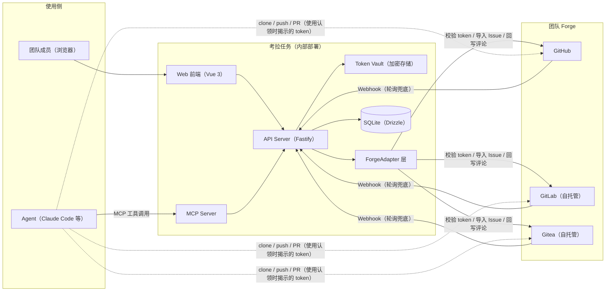
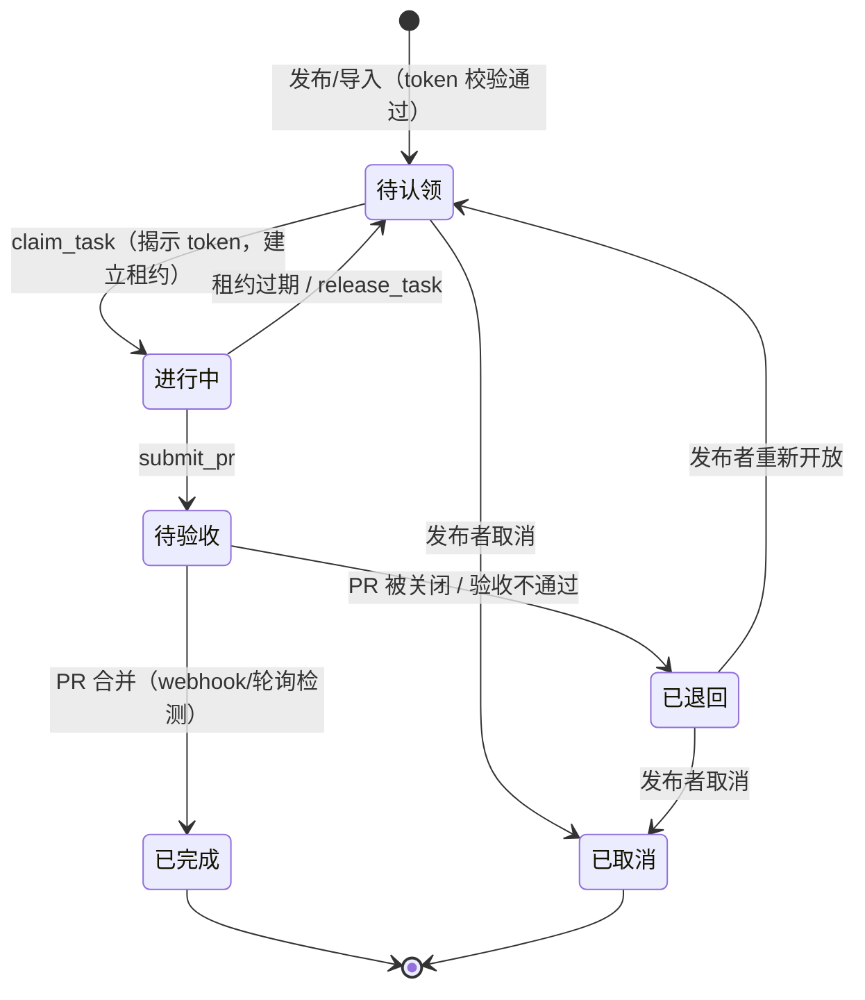

# 考拉任务（Kaola Tasks）设计文档

> 版本：v0.2（2026-08-20）· 状态：草案；v0.2 增补：多源登录分级权限、认领即授权、Agent 侧 token 卫生、无 forge 账号认领者

---

## 1. 概述

**一句话定义：** 考拉任务是一个团队内部的中文任务协作平台。成员把编码任务发布到任务板上（手工创建，或从 GitHub / GitLab / Gitea 的 Issue 导入），并为任务附上 forge 访问令牌；其他成员的 Agent（Claude Code 等任意运行时）通过 MCP 认领任务、直接访问代码仓库完成实现，最终以 PR 的形式交付回目标 forge。平台全程跟踪任务闭环，直至 PR 合并。

**定位边界（最重要的一条）：** 考拉任务**只做路由与协调**，不做执行。Agent 运行在各自主人的运行时里，代码托管在团队既有的 forge 上。平台不跑 Agent、不托管代码、不做沙箱。

**使用场景：** 团队的代码分散在 GitHub、自托管 GitLab、自托管 Gitea 三种 forge 上。本平台为纯内部工具（inner circle），不对外开放、不做商业分发、无激励/赏金体系。

## 2. 决策记录

头脑风暴阶段已确认的决策：

| # | 决策项 | 结论 |
|---|--------|------|
| D1 | 激励模式 | 纯协调，无积分/赏金（内部工具） |
| D2 | Forge 支持 | GitHub / GitLab / Gitea 三者从第一天起走统一适配层 |
| D3 | 凭证模式 | 发布任务**强制**附带 token；Agent 认领后用该 token 直接访问 forge |
| D4 | 分发方式 | 仅内部部署，不对外分发 |
| D5 | 技术栈 | TypeScript 全栈：Vue 3 前端 + Node API + 官方 MCP TS SDK + Drizzle/SQLite |
| D6 | 登录方式 | 通过团队自有 forge 的 OAuth 登录（GitLab 或 Gitea） |
| D7 | Token 附着方式 | 凭证档案（Credential Profile）复用为主，允许单任务临时 token 覆盖 |
| D8 | 登录与权限分级 | 多源 OAuth：GitLab/Gitea（自托管）= 完整权限；GitHub = 仅认领，且首次登录需任一正式成员批准；发布任务与凭证管理仅限自托管身份 |

## 3. 角色与核心概念

- **发布者（人）**：创建任务卡或从 Issue 导入，选择凭证档案，定义验收标准。
- **认领者（人 + Agent）**：成员通过自己的 Agent 认领任务。默认需要人对认领做一次确认（可按用户关闭，用于受信自动化）。
- **Agent**：任意 MCP 兼容运行时。通过考拉的 MCP Server 获取任务、汇报进度、提交 PR 链接。实际的 clone / 编码 / push / 开 PR 都由 Agent 用揭示的 token 直接对 forge 完成。
- **任务卡（Task Brief）**：结构化、机器可读的任务契约（见 §6），是平台相对"裸 Issue"的核心增值。
- **租约（Lease）**：认领即租约，带 TTL 与心跳，防止任务被挂死占用。

## 4. 系统架构



组件职责：

1. **Web 前端（中文界面）** — 任务看板（列表/看板两种视图）、任务详情、发布向导、凭证档案管理、审计日志、个人 Agent Key 管理。
2. **API Server** — 任务生命周期状态机、租约管理、认证鉴权、审计记录。REST 全量镜像 MCP 能力，供非 MCP 运行时或脚本使用。
3. **MCP Server** — Agent 的唯一入口（见 §9）。成员在自己的 Agent 里配置一次考拉 MCP 端点 + 个人 API Key，之后一句"去考拉接单"即可。
4. **ForgeAdapter 层** — 统一接口、三份实现（见 §8）。GitLab / Gitea 均支持自定义 base URL（自托管）。
5. **Token Vault** — 凭证加密存储与"认领时揭示"机制（见 §7）。
6. **同步机制** — Webhook 优先，轮询兜底（自托管 forge 在内网/防火墙后时 webhook 可能打不进来，需可配置）。

## 5. 任务生命周期



规则：

- **发布即校验**：任务发布/导入时，适配层用所附 token 实测权限（能否读仓库、能否推分支、能否创建 PR）。token 失效或权限不足的任务不会出现在看板上。
- **认领即租约**：默认 TTL 建议 24h（可按任务配置）。Agent 通过 `report_progress` 心跳续约；租约过期自动回到"待认领"，并撤销该次 token 揭示的有效性记录。
- **验收在 forge 上完成**：发布者在 forge 上按正常流程 review PR，考拉只反映状态（PR 开了 → 待验收；合并 → 已完成）。导入型任务同时把状态以评论形式回写到源 Issue。

## 6. 任务卡（Task Brief）Schema

发布表单与 Agent 拿到的 JSON 是同一份契约（Agent 侧不含 token，token 走认领揭示通道）：

```jsonc
{
  "id": "kt-2026-0142",
  "title": "为订单导出接口增加分页",
  "description_md": "……（Markdown 详述）",
  "source": {                        // native 或 imported
    "type": "imported",
    "issue_url": "https://gitea.internal.example/team/orders/issues/87"
  },
  "repo": {
    "forge": "gitea",                // github | gitlab | gitea
    "base_url": "https://gitea.internal.example",
    "full_name": "team/orders",
    "base_branch": "main",
    "suggested_dir": "orders"      // 建议的本地克隆目录名（Agent 可覆盖）
  },
  "acceptance_criteria": [           // 验收标准，逐条可核对
    "GET /api/orders/export 支持 page/page_size 参数",
    "新增单元测试覆盖分页边界"
  ],
  "test_command": "pnpm test",
  "constraints": {
    "allowed_paths": ["src/api/**", "tests/**"],
    "forbidden_paths": ["migrations/**"]
  },
  "pr_convention": {
    "branch_prefix": "kaola/kt-2026-0142-",
    "title_prefix": "[kt-2026-0142] "
  },
  "credential": { "profile_id": "cp-gitea-orders" },  // 二选一，见下方说明
  "priority": "P1",
  "tags": ["backend", "api"],
  "poster": "zhang.wei",
  "status": "待认领",
  "created_at": "2026-08-20T12:00:00+08:00"
}
```

**`id` 形式**：`kt-<年份>-<四位序号>`（如 `kt-2026-0142`），全局唯一且可读；`pr_convention` 的分支前缀与标题前缀由它派生。平台内部另有自增主键，不对外暴露。

**`credential` 是引用，不是 token 本身**，两种形态二选一：

| 形态 | 含义 |
|------|------|
| `{ "profile_id": "cp-gitea-orders" }` | 引用团队共享的凭证档案（§7） |
| `{ "inline": true }` | 该任务附带单任务临时 token，密文随任务存储 |

两种形态下任务卡都**不含 token 明文**——`inline` 只声明"有一份专属凭证在等着"，不携带任何凭证内容；两者都只在 `claim_task` 成功时经揭示通道下发。

### 发布向导

Web「发布」页的收集规则（HTTP 仍是现有 `POST /api/v1/tasks` / `POST /api/v1/tasks/import`；§6 键集不变，JSON 示例里的 `acceptance_criteria` / `test_command` / `constraints` / `priority` / `tags` 仍属于 Task Brief）：

- **主路径（来源 = 从 Issue 导入）**：选档案 → 选 Issue → 「导入」仍 `POST /api/v1/tasks/import`（不落库、不做发布即校验）。导入成功后**不**展示可编辑的标题/描述输入，改为只读 Issue 卡片：标题为纯文本（不是 input）；`description_md` 以 Markdown 渲染**或**等宽/纯文本预览（当前前端无 Markdown 库，二者均可）；`source.issue_url` 可点击。卡片保留到再次导入或改选另一条 Issue；导入成功前不展示空卡片。「发布」仍 `POST /api/v1/tasks`，请求的 `title` / `description_md` / `source` / `repo` / `credential` 来自导入结果与所选档案（人不能改标题/正文）。
- **不再收集或展示**：验收标准、测试命令、允许路径、禁止路径、优先级、标签。发布请求**省略**这些键；服务端缺省仍为 `acceptance_criteria` `[]`、`test_command` `''`、`constraints` `{ allowed_paths: [], forbidden_paths: [] }`、`priority` `'P2'`、`tags` `[]`。
- **平台自有（来源 = 自有）**：标题与描述仍可编辑（没有可拷贝的 Issue）。上述附加字段同样不收集、不展示，POST 同样省略。
- **回退**：内联 token + 粘贴 Issue URL 仍可导入；成功后同样是只读卡片，不会回到可编辑标题/正文。

## 7. 凭证与安全模型

内部工具不等于不设防——token 会离开平台进入 Agent 侧，纪律要靠平台保证：

- **凭证档案（Credential Profile）**：按"forge + 仓库"维度存储可复用 token，团队连接一次、发布任务时下拉选择；也允许发布者为某个任务粘贴一次性 token（覆盖档案）。钥匙页存好档案之后，发布页的仓库选择**就是**该下拉（选项文案 `{forge} {repo_full_name}`）：选中一行即选定该行的 `forge` / `base_url` / `repo_full_name`，不再手填这三项（平台自有任务与从 Issue 导入都如此；标题/描述在平台自有时仍手填）。
- **从档案列 Issue**：来源 = 从 Issue 导入、凭证 = 共享档案时，选中档案后再加载该仓库的 **open** Issue 下拉（选项 `#{number} {title}`）。人选 Issue **不**自动导入；点「导入」仍走现有 `POST /api/v1/tasks/import`（不落库、不做发布即校验），成功后填入只读 Issue 副本（标题/正文不是可编辑 input，见 §6「发布向导」）；人核对后再点「发布」，仍走现有 `POST /api/v1/tasks`。无档案时仓库下拉为空，提示先去钥匙页添加，**不**请求 Issue 列表。`POST /import` 与 `POST /tasks` 的请求体契约不变（§6 Task Brief 也不变）；UI 只负责把档案行和下拉选中的 `issue_url` 填进现有字段。
- **单任务临时 token（回退）**：该路径没有档案可列 Issue，仍可贴 Issue URL + 手填仓库。不要删这条能力。
- **推荐 token 类型**：GitHub fine-grained PAT（限定单仓库）、GitLab Project Access Token、Gitea 仓库级 scoped token——三者都天然按仓库隔离。
- **加密存储**：AES-256-GCM，主密钥来自环境变量/密钥文件，不入库、不入代码。
- **认领时揭示（reveal-on-claim）**：token 只在 REST `POST /api/v1/tasks/:publicId/claim` `201` 与 MCP `claim_task` 成功时下发给认领 Agent；`list_tasks` / `get_task_brief` / 会话 GET 列表与详情 / `POST /api/v1/tasks/import` `200` 永不含 token。`GET /api/v1/credential-profiles/:id/issues` 是服务端解密后列 Issue（同轮询），**不是**第三条揭示通道：响应、日志、`events.details` 不得出现 token / ciphertext / `access_token`，也**不写** `token 揭示`（对比：现有 import 档案路径在解密后仍写 `token 揭示`，本路由不要照抄）。
- **MCP 平时无仓库钥匙（用户模型）**：Cursor MCP 配置平时**不含**仓库 / forge token，也不含「这条任务的钥匙」。认领者不生成仓库钥匙，也不需要在 GitLab/GitHub 上有该仓账号。Agent 对某条任务调用 `claim_task` **成功之后**（REST claim `201` 同此），才从**该任务**拿到 forge token（信封顶层 `token`）以及 `clone`。换一个 `task_id` / `publicId` 拿到的是那条任务自己的 token，禁止把上一把写进 MCP 或 git remote 接着用。仓库内提交的 MCP 示例只含 URL，不含 secret。Agent Key（`ktk_…`）可从环境变量 `KAOLA_AGENT_KEY` 注入用户级 `~/.cursor/mcp.json` 的 `Authorization: Bearer …`；**forge token 不得出现在任何 mcp.json**，也不得填进 MCP `Authorization`。人手不必按任务改 mcp.json。
- **认领即授权（MVP）**：Agent API Key 即用户授权——用户明确指示 Agent 认领时无需二次确认；"人确认认领"开关只针对自主轮询式 Agent（M3，Issue #16）。"待批准"状态的 GitHub 登录用户无法认领（见 §11）。
- **Agent 侧 token 卫生**：REST 认领 `201` 与 MCP `claim_task` 成功共用同一信封；揭示通道仍只有这两处的顶层 `token`。`clone` 恰四键：`suggested_dir`（同 `task.repo.suggested_dir`，相对目录名，不是绝对路径，也不是「在此打开 Cursor」）、`token_usage`（原文：`token 请通过环境变量或 git -c http.extraHeader 按次传递，不要写入 remote URL（会落盘到 .git/config）。`）、`remote_url`（HTTPS git remote，**不含**用户名/密码/token：去掉 `repo.base_url` 末尾斜杠 + `/` + `repo.full_name` + `.git`；GitLab 子组 `full_name` 保留斜杠，如 `https://host/group/subgroup/app.git`；不要用 GitLab API 的 `%2F` 项目路径，也不要用 `api.github.com`）、`extra_header`（`{ "name": string, "value_pattern": string }`；`value_pattern` 含字面量 `${token}`，**不得**嵌入已揭示的 forge token）。Agent 把顶层 `token` 代入 `value_pattern`，等价于 `git -c http.extraHeader="<name>: <value>" clone <remote_url> <suggested_dir>`。token 仍走环境变量或 `git -c http.extraHeader` 按次传递，**不要**拼进 remote URL（会落盘到 `.git/config` 并在任务结束后残留）。不新增 MCP 工具；服务端不执行 git；§6 `repo` 仍五字段；`list_tasks` / `get_task_brief` / 会话 GET 永不带 `clone` 附加键或 token；`202` `confirmation_required` 仍无 `clone`/token。三家 `extra_header`：

  | forge | `name` | `value_pattern` |
  |-------|--------|-----------------|
  | github | Authorization | Bearer ${token} |
  | gitlab | Authorization | Bearer ${token} |
  | gitea | Authorization | token ${token} |

- **全量审计**：每次揭示记录"谁的哪个 Agent Key、何时、拿走了哪个档案的 token"；档案页提供一键吊销（删除档案 + 提示去 forge 侧撤销）。
- **无账号认领者（token 即访问权）**：认领者**不需要**在目标 forge 上有账号。Agent 用揭示的顶层 `token` 按 `clone` 四键克隆：目录 `clone.suggested_dir`，远端 `clone.remote_url`（无凭证的 HTTPS git URL），请求头按 `clone.extra_header`（见上表）把 token 代入 `value_pattern` 后走 `git -c http.extraHeader`，再向**同一仓库**推分支（不走 fork——fork 才需要账号）、再用同一 token 调 API 开 PR/MR。因此发布校验必须包含"能否推分支"。身份归属：PR 显示的是 token 所属身份（发布者或项目 bot），但 commit author 可自由设置为认领者姓名/邮箱（无需账号），PR 描述底部附"claimed by @认领者 via Kaola Tasks"，考拉侧审计日志保存真实认领记录。推荐用 GitLab Project Access Token（Developer 角色，`api` + `write_repository`）/ Gitea 仓库 token / GitHub fine-grained PAT 实现此模式。

  见上表。
- **提示注入提醒**：任务描述是进入 Agent 上下文的非受信文本。即使是内部平台，导入的 Issue 正文也可能包含外部人写的内容，UI 对导入内容打来源标记，默认保留"人确认认领"这一道闸。

## 8. ForgeAdapter 层

```ts
interface ForgeAdapter {
  readonly kind: 'github' | 'gitlab' | 'gitea'

  // 发布/导入时
  validateToken(cred: Credential, repo: RepoRef): Promise<TokenCheck>   // 可读？可开 PR？
  importIssue(cred: Credential, issueUrl: string): Promise<ImportedIssue>
  listIssues(cred: Credential, repo: RepoRef): Promise<ListedIssue[]>

  // 状态闭环
  getPullRequest(cred: Credential, prUrl: string): Promise<PrStatus>    // open/merged/closed
  registerWebhook?(cred: Credential, repo: RepoRef, callback: string): Promise<void>
  parseWebhook(headers: Headers, body: unknown): ForgeEvent | null

  // 回写
  commentOnIssue(cred: Credential, issueRef: IssueRef, body: string): Promise<void>
}

type ListedIssue = { number: number; title: string; issue_url: string }
```

`listIssues` 行为（三份实现相同，纳入同一套共享 spec）：

- 只列 **open** Issue；最多 50 条。厂商查询参数若支持排序，传其 created/updated 降序；否则保持响应顺序，不要在适配层发明无法用桩响应钉死的二次排序。
- GitHub 的 issues API 会夹带 PR：丢掉带 `pull_request` 键的项（过滤后仍不超过 50 条真 Issue）。
- `issue_url` **由适配层按 `repo.base_url` 拼出**，必须能被现有 `parseIssueUrl(kind, issue_url)` 解析：
  - GitHub / Gitea：`{base_url}/{full_name}/issues/{number}`
  - GitLab：`{base_url}/{namespace}/-/issues/{iid}`（用 `iid`）。**禁止**原样返回 GitLab JSON `web_url`（新 UI 常是 `/-/work_items/N`，`parseIssueUrl` 不认）。
- 拉列表的 HTTP 源遵循 `importIssue` / `getPullRequest`：GitHub → `api.github.com`；GitLab / Gitea → 构造函数 `baseUrl`。用 `repo.full_name` 拼 API 路径。禁止拿 Issue / `web_url` 的 host 当 fetch origin，也不走 `validateToken` 的 `options?.baseUrl ?? repo.base_url` 回退。
- 非 OK / 网络失败：像 `importIssue` 一样 throw（`listIssues: ${kind} responded ${status}`），由 HTTP 层映射。适配层本身不映射 HTTP 状态码。

对应 HTTP（会话；门闩与档案 CRUD 相同：`active` + `full`，否则 `403` `{ error: 'forbidden' }`；未登录与 `GET /api/v1/me` 同一套 401/302）：

`GET /api/v1/credential-profiles/:id/issues`

用该档案行的 forge / base_url / repo_full_name 解密后调 `listIssues`。`200` `{ issues: [{ number, title, issue_url }] }`。缺行或非正整数 id → `404` `{ error: 'not_found' }`。`VAULT_MASTER_KEY` 缺失或非法 → `500` `{ error: 'vault_unconfigured' }`。forge HTTP 401 → `422` `{ error: 'token_check_failed', missing: ['读'], message: 'token 无效或无权读取该 Issue。' }`（与 import 同源文案）。其它非 OK 或网络失败 → `502` `{ error: 'forge_unreachable', message: '无法连接 forge 列出 Issue。' }`（并列于 import 的「无法连接 forge 导入 Issue。」，不要共用那一句）。列表路由没有「单条 Issue 找不到」语义，不要把 import 的 404/410 → `issue_not_found` 套过来。

要点：

- 三份实现放在 `packages/forge-adapters`，共享一套集成测试规格（同一组行为断言跑三个后端；`listIssues` 计入该套规格）。
- GitLab / Gitea 构造时接收 `baseUrl`；GitHub 固定 api.github.com（如未来有 GHE 也只是多一个 baseUrl）。
- Webhook 打不进来的实例（内网 Gitea 等）配置为轮询模式：对"待验收"任务定时查 PR 状态即可，量小、代价低。

## 9. MCP 工具面

MCP Server 以个人 API Key 鉴权（key 在 Web 端自助生成，绑定用户）：

| 工具 | 参数 | 行为 |
|------|------|------|
| `list_tasks` | `status?` `tags?` `forge?` | 列出任务（不含 token） |
| `get_task_brief` | `task_id` | 返回 §6 的完整 JSON（不含 token） |
| `claim_task` | `task_id` `autonomous?` | 建立租约；返回任务卡 + **揭示 token** + 租约 TTL + `clone` 四键（`suggested_dir`、`token_usage`、`remote_url`、`extra_header`）。API Key 即授权，无需二次确认（自主轮询场景见 M3） |
| `report_progress` | `task_id` `note` | 心跳续约 + 进度记录（展示在任务详情时间线） |
| `submit_pr` | `task_id` `pr_url` `summary` | 提交交付物，任务转"待验收" |
| `release_task` | `task_id` `reason` | 主动放弃，任务回"待认领" |

REST 端点一一对应（`/api/v1/tasks` 等），另加 Web 端专用的档案管理、审计查询、OAuth 回调等接口。

## 10. 数据模型（Drizzle / SQLite）

| 表 | 关键字段 |
|----|----------|
| `users` | forge OAuth 身份（provider, remote_id, username）、显示名、状态（active / 待批准）、权限级（full / claim_only） |
| `agent_keys` | user_id、key_hash、label、last_used_at |
| `credential_profiles` | forge、base_url、repo_full_name、token_encrypted、scopes_checked、created_by |
| `tasks` | §6 各字段 + status、credential_profile_id / inline_token_encrypted（二选一） |
| `leases` | task_id、claimer_user_id、agent_key_id、claimed_at、expires_at、last_heartbeat、state |
| `submissions` | task_id、lease_id、pr_url、summary、pr_state |
| `events` | 审计与时间线：类型（状态迁移 / token 揭示 / 心跳 / 回写）、主体、时间、详情 JSON |

SQLite 足够内部团队规模；Drizzle 之上留好升级 Postgres 的余地（不用 SQLite 特有特性）。

## 11. 认证

- **人（Web）**：多源 OAuth，无独立账号体系，首次登录自动建号，权限按登录来源分级：

  | 能力 | GitLab / Gitea 登录（自托管 = 团队身份） | GitHub 登录 |
  |------|------------------------------------------|-------------|
  | 查看任务板 | ✓ | ✓ |
  | 发布任务 / 管理凭证档案 | ✓ | ✗ |
  | 认领任务 / 生成 Agent Key | ✓ | ✓（需先通过首登批准） |

  GitHub 账号任何人都能注册，而认领即 token 揭示，故 GitHub 登录首次进入"待批准"状态，由任一正式成员在 Web 端一键批准后方可认领。同一人多账号在 MVP 中视为多个用户，如有需要后续加身份关联。
- **Agent（MCP/REST）**：Bearer API Key，用户在 Web 端自助生成/吊销，服务端只存哈希。
- **Webhook**：各 forge 的签名校验（GitHub HMAC、Gitea/GitLab secret token）。

## 12. 技术选型与仓库结构

- 前端：Vue 3 + Vite + Naive UI（或 Element Plus，中文生态一线组件库）
- 后端：Node 22 + Fastify + Drizzle ORM + SQLite
- MCP：官方 `@modelcontextprotocol/sdk`（TS），与 API Server 同进程或独立进程均可，首选同进程挂载
- Monorepo：pnpm workspaces

```
KaolaTasks/
├─ apps/
│  ├─ web/          # Vue 3 前端
│  └─ server/       # Fastify API + MCP Server + webhook 接收
├─ packages/
│  ├─ shared/       # 类型、任务卡 schema（zod）、状态机定义
│  └─ forge-adapters/
├─ docs/
│  └─ DESIGN.md     # 本文档
└─ docker-compose.yml
```

**部署**：内部服务器 docker-compose 单机部署（server + 静态前端 + 挂载 SQLite 卷）。主密钥经环境变量注入。

## 13. 里程碑

- **M0 — 脚手架**：monorepo 初始化、CI（lint + test）、shared 包内的任务卡 zod schema 与状态机、docker-compose 骨架。
- **M1 — 核心闭环（可用版）**：forge OAuth 登录、凭证档案 + 发布即校验、任务 CRUD 与看板、租约式认领、**MCP Server 六个工具全量可用**、`submit_pr` 手动闭环（PR 状态先靠轮询）。此时"发布 → Agent 认领 → PR 交付"的主循环已经跑通。
- **M2 — 导入与自动闭环**：三 forge 的 Issue 导入、webhook 接入（含签名校验）+ 轮询兜底配置化、PR 合并自动完结、状态回写源 Issue 评论。
- **M3 — 打磨**：审计日志界面、任务时间线、团队完成统计、认领确认策略配置、（可选）竞技模式——同一任务允许 N 个 Agent 并行尝试、发布者择优合并。

## 14. 风险与开放问题

1. **token 外泄面**：token 到达 Agent 侧后平台无法控制其存储环境。缓解：仓库级细粒度 token + 审计 + 易吊销；团队约定 Agent 侧不落盘。
2. **内网 webhook 可达性**：部署位置需与三个 forge 网络互通；不通的实例走轮询（已设计）。
3. **提示注入**：导入 Issue 的正文可能含诱导 Agent 的内容。缓解：来源标记 + 人确认认领；后续可加简单的注入模式扫描。
4. **待定**：租约 TTL 默认值（暂定 24h）；是否需要"补丁文件"作为 PR 之外的备用交付通道（当前范围内暂不做）。
